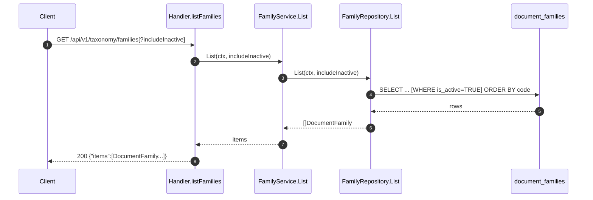
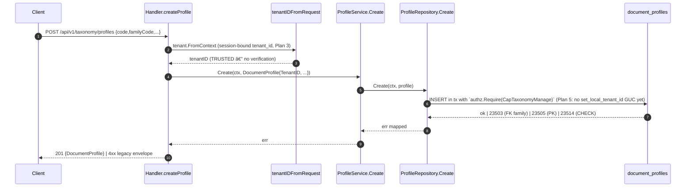

# Module: taxonomy

> Living architecture doc. Arc42 (12 sections) + C4 (Context / Container) Mermaid diagrams + ADR links.

**Last verified:** 2026-05-12 (Plan 8 baseline) | **Owner:** unassigned | **Status:** active (intrinsic gaps; see §11) | **Maturity:** L3

> **Key files:**
> - `internal/modules/taxonomy/domain/family.go:8` — `DocumentFamily` aggregate
> - `internal/modules/taxonomy/domain/profile.go:8` — `DocumentProfile` aggregate
> - `internal/modules/taxonomy/domain/area.go:8` — `ProcessArea` aggregate
> - `internal/modules/taxonomy/domain/port.go:1` — repository ports + `GovernanceEvent`
> - `internal/modules/taxonomy/application/family_service.go:11` — `FamilyService` (constructor takes no govLogger)
> - `internal/modules/taxonomy/application/profile_service.go:14` — `ProfileService` (panics if govLogger nil; Create/Update do not call it)
> - `internal/modules/taxonomy/application/area_service.go:14` — `AreaService` (Archive logs; Create/Update do not)
> - `internal/modules/taxonomy/delivery/http/handler.go:51-68` — 16 routes mounted on raw `net/http.ServeMux`
> - `internal/modules/taxonomy/delivery/http/routes_profiles.go:230-231` — `tenantIDFromRequest` (delegates to `tenant.FromContext`; Plan 3 removed header trust)
> - `internal/modules/taxonomy/infrastructure/repository.go:102` — `ProfileRepository.Create` (now in tx + `authz.Require(CapTaxonomyManage)` — Plan 5 wired)
> - `internal/modules/taxonomy/infrastructure/family_repository.go:91-99` — `HasActiveProfiles` (no tenant predicate; TOCTOU race with `Update`)
> - `apps/api/cmd/metaldocs-api/permissions.go:158-180` — path-prefix capability dispatcher (PATCH /families/{code} not matched → falls through)
> - `apps/api/cmd/metaldocs-api/main.go:197-201,225,508-524` — module wiring + standalone `ProfileRepository` + `profileDefaultsAdapter` for documents_v2
> - `migrations/0023_init_document_family_and_profile_registry.sql` · `0025_init_document_taxonomy.sql` · `0122_taxonomy_extend_document_profiles.sql` · `0123_taxonomy_extend_process_areas.sql` · `0161_grant_families_write_privileges.sql` · `0175_documents_area_name_snapshot.sql`

---

## 1. Introduction & Goals

`internal/modules/taxonomy` owns the **flat, code-keyed classification catalog** that other modules bind controlled documents to: 3 entities — `DocumentFamily`, `DocumentProfile`, `ProcessArea` — each a row in its own Postgres table. Profiles bind to families; areas are flat with optional `parent_code` self-FK and cycle prevention. The module exposes 16 HTTP routes under `/api/v1/taxonomy/*` and serves three downstream consumers: registry (CD code prefix `{profile}-{area}-{seq}`), documents_v2 (template defaults via `profileDefaultsAdapter`), documents (live read of `process_areas.name` for snapshot).

### 1.1 Requirements overview

- **Catalog CRUD** with code immutability post-create (CHECK + trigger on profile/area; handler-overwrite on family).
- **Per-tenant scoping for profiles + areas** — `tenant_id UUID NOT NULL DEFAULT DevTenantID` (`0122:4-6`, `0123:3-5`).
- **Global family catalog** — `document_families` has no `tenant_id` (`0023:1-7`); shared across tenants (no ADR; see T-002).
- **Soft-archive** for profiles + areas via `archived_at TIMESTAMPTZ NULL` (`0122:13`, `0123:8`).
- **Area hierarchy** — self-FK `(tenant_id, parent_code) → (tenant_id, code)` with application-layer cycle detection (`area_service.go:SetParent` → `ListAncestors`).
- **Capability gate** — tier-1 only: `taxonomy.manage` for writes, `doc.view` for reads (`permissions.go:158-180`).

### 1.2 Quality Goals

| Rank | Goal | How verified |
|---|---|---|
| 1 | **Multi-tenant isolation** of profiles + areas | per-tenant unique `(tenant_id, code)` indexes; **FAILS** — tenant_id sourced from client header without verification (T-001); families have no tenant scoping at all (T-002) |
| 2 | **Regulated-mutation traceability** | govLogger emits to `governance_events` on selected ops — **PARTIAL**: `FamilyService` has no govLogger field; `ProfileService.Create/Update` and `AreaService.Create/Update` do not emit (T-004, T-005) |
| 3 | **Code immutability post-create** | DB trigger `trg_document_profiles_code_immutable` (`0122:33-39`) + `trg_process_areas_code_immutable` (`0123:33-37`) + `trg_reject_families_code_update` (migration 0188, Plan 5 — T-013 closed) — PASSES for all 3 entities |

### 1.3 Stakeholders

| Role | Expectation |
|---|---|
| Admin / QMS | CRUD profiles + areas + families with audit trail; immutable codes once published. |
| Registry module | `document_profiles.code` and `process_areas.code` as stable FKs for CD code generation. |
| documents_v2 wizard | `profile.default_template_version_id` resolved via `profileDefaultsAdapter`. |
| documents module | `process_areas.name` resolvable at document-create time for snapshot column. |

---

## 2. Architecture Constraints

- Language / runtime: Go 1.25
- Persistence: Postgres; 3 owned tables in schema `metaldocs` (forward-only migrations, `0023`/`0025` base + `0122`/`0123` tenant-extension)
- HTTP routing: raw `net/http.ServeMux` (`handler.go:51-68`). **No OpenAPI spec**, no oapi-codegen — divergence from ADR 0012 (T-009)
- Error envelope: **RFC 9457** `application/problem+json` via `writeError = httpresponse.WriteError` alias (`routes_profiles.go:19`) which cascades to `problem.Write` — T-008 closed Plan 7
- Authz: tier-1 path-prefix dispatcher (T-003 PATCH bypass closed Plan 5); **Plan 5 wired `authz.Require(CapTaxonomyManage)` in `FamilyRepository.Create/Update`, `ProfileRepository.Create/Update`, `AreaRepository.Create/Update`; tripwire on all 3 tables via migration 0188 (T-006 partially closed)**; archive/deactivate paths still tier-1 only
- Tenant scoping: application-layer only via `tenant.FromContext` (Plan 3 replaced `X-Tenant-ID` header reads; no `set_local_tenant_id` GUC anywhere in `internal/`)

---

## 3. System Scope & Context (C4 Level 1)

```mermaid
C4Context
    title System Context — taxonomy
    Person(admin, "Admin / QMS user", "Web UI")
    System_Boundary(b1, "MetalDocs") {
        System(taxonomy, "taxonomy", "Catalog of families, profiles, areas")
        System_Ext(registry, "registry", "Reads profile + area codes for CD prefix")
        System_Ext(documents_v2, "documents_v2", "Reads profile.default_template_version_id via adapter")
        System_Ext(documents, "documents", "Reads process_areas.name for snapshot")
        System_Ext(templates, "templates", "Owns templates_template_version (FK target)")
    }
    System_Ext(pg, "Postgres", "metaldocs.document_families · _profiles · _process_areas")
    Rel(admin, taxonomy, "HTTP /api/v1/taxonomy/*")
    Rel(taxonomy, pg, "SQL (sql.DB; no tx)")
    Rel(registry, pg, "Direct SQL on _profiles + _process_areas (TaxonomyProfileReader / TaxonomyAreaReader)")
    Rel(documents_v2, taxonomy, "Go: profileDefaultsAdapter.GetDefaultTemplateVersionID")
    Rel(documents, pg, "Direct SQL: SELECT name FROM _process_areas at document-create")
    Rel(taxonomy, templates, "READ join: _template_version for IsPublished check")
```

### 3.1 Business Context

A QMS admin needs a stable catalog so every controlled document carries a profile (what kind of doc) and a process area (which part of the operation it governs). The taxonomy module is that catalog. Family-level deactivation is the rare global lever; profile + area archive is the common per-tenant lever. Code immutability is the QMS contract — once a code is in circulation, it does not change.

### 3.2 Technical Context

Inbound interfaces (Go):
- `taxonomyapp.NewDBGovernanceLogger(db)` — reused by `registry/module.go:31` to write to `governance_events` from outside the module.
- `taxonomydomain.{DocumentProfile, ProcessArea, GovernanceEvent, GovernanceLogger, sentinel errors}` — consumed by `registry/application/service.go:13`, `registry/delivery/http/routes.go:17`, `registry/infrastructure/repository.go:15`.
- `taxonomyinfra.NewProfileRepository(db)` — constructed standalone in `main.go:225` for `profileDefaultsAdapter`.
- `taxonomyinfra.NewTemplateVersionChecker(db)` — joins to `templates_template{_version}` for `IsPublished` (`template_version_checker.go:14-17`).

Inbound interfaces (HTTP) — 16 routes (full table in §5.3).

Outbound interfaces:
- DB: 3 owned tables; READ join to `templates_template_version` + `templates_template`.
- Go: `internal/platform/authn` (UserID), `internal/platform/httpresponse` (envelope), `internal/platform/tenant` (DevTenantID fallback). No `internal/platform/authz`, no `internal/audit`, no `internal/modules/iam`.

---

## 4. Solution Strategy

- **Per-aggregate repository + service split.** Each of the 3 entities has its own service + repository pair. Driver: simplicity; cost: govLogger wired inconsistently (FamilyService omits it — T-004).
- **DB-level code immutability for profile + area + family.** Triggers `trg_document_profiles_code_immutable` (`0122:33-39`) and `trg_process_areas_code_immutable` (`0123:33-37`) raise on `NEW.code <> OLD.code`. Family immutability added by migration 0188 via `trg_reject_families_code_update` (Plan 5, T-013 closed). Handler still overwrites body `code` with path param as an additional guard.
- **Tenant scoping on profile + area only; families are global.** `0122:4-6` and `0123:3-5` add `tenant_id`. `document_families` has no `tenant_id` (`0023:1-7`). No ADR justifies the asymmetry (T-002).
- **Application-layer cycle prevention for area parents.** `AreaService.SetParent` walks `ListAncestors` to reject cycles. Self-FK is structural; acyclicity is application-only.
- **Two-tier authz now wired for Create/Update paths (Plan 5).** `authz.Require(CapTaxonomyManage)` in FamilyRepository + ProfileRepository + AreaRepository write methods; tripwire on all 3 taxonomy tables (migration 0188). PATCH dispatcher bypass fixed (T-003). Archive/deactivate + FamilyService govLogger gap remain (T-004, T-005, T-006 partial).
- **Raw `net/http.ServeMux` routes.** No OpenAPI spec, no codegen. Driver: pre-dates contract-first migration (ADR 0012). Cost: client codegen cannot bind taxonomy methods (T-009).

---

## 5. Building Block View (C4 Level 2 — Container)

### 5.1 Whitebox — taxonomy

```mermaid
C4Container
    title Container View — taxonomy
    Container(http, "HTTP Handler", "Go (http.ServeMux)", "16 routes: /api/v1/taxonomy/{profiles,areas,families}")
    Container(svc, "Service Layer", "Go", "FamilyService · ProfileService · AreaService")
    Container(domain, "Domain", "Go", "DocumentFamily · DocumentProfile · ProcessArea · GovernanceEvent · sentinel errors")
    Container(repo, "Repository Layer", "Go + database/sql", "FamilyRepository · ProfileRepository · AreaRepository · TemplateVersionChecker · DBGovernanceLogger")
    ContainerDb(db, "metaldocs.document_*", "Postgres", "document_families · document_profiles · document_process_areas (+ governance_events)")
    System_Ext(tplv2, "templates_template_version", "Postgres (templates)", "READ join for IsPublished")
    Rel(http, svc, "calls")
    Rel(svc, domain, "uses")
    Rel(svc, repo, "calls (repository interfaces)")
    Rel(repo, db, "SQL (no tx; one *sql.DB per repo)")
    Rel(repo, tplv2, "READ join (TemplateVersionChecker)")
```

### 5.2 Public surface

| File | Symbol | Kind | Purpose |
|---|---|---|---|
| `domain/family.go:8` | `DocumentFamily` | struct | family aggregate (`Code, Name, Description, IsActive, CreatedAt`) |
| `domain/family.go:22` | `(*DocumentFamily).Deactivate` | method | in-memory state transition; returns `ErrFamilyAlreadyInactive` |
| `domain/family.go` | `ErrFamilyNotFound · ErrFamilyAlreadyInactive · ErrFamilyHasProfiles` | sentinels | |
| `domain/profile.go:8` | `DocumentProfile` | struct | profile aggregate (12 fields incl. `TenantID`, `DefaultTemplateVersionID`, `ArchivedAt`) |
| `domain/profile.go` | `ErrProfileNotFound · ErrProfileArchived · ErrProfileCodeImmutable · ErrTemplateNotPublished · ErrTemplateProfileMismatch` | sentinels | |
| `domain/area.go:8` | `ProcessArea` | struct | area aggregate (incl. `TenantID`, `ParentCode`, `ArchivedAt`) |
| `domain/area.go` | `ErrAreaNotFound · ErrAreaArchived · ErrAreaCodeImmutable · ErrAreaParentCycle` | sentinels | |
| `domain/port.go` | `FamilyRepository · ProfileRepository · AreaRepository · TemplateVersionChecker · GovernanceLogger` | ifaces | repository ports |
| `domain/port.go` | `GovernanceEvent` | struct | governance log row (`ActorID, EntityType, EntityCode, Action, BeforeJSON, AfterJSON, OccurredAt`) |
| `application/family_service.go:11` | `FamilyService` | struct | List · Get · Create · Update · Deactivate (no govLogger) |
| `application/profile_service.go:14` | `ProfileService` | struct | List · Get · Create · Update · Archive · SetDefaultTemplate (Archive + SetDefaultTemplate emit) |
| `application/area_service.go:14` | `AreaService` | struct | List · Get · Create · Update · Archive · SetParent (Archive emits; cycle check via `ListAncestors`) |
| `application/governance.go` | `NewDBGovernanceLogger` | func | re-exported by registry (`registry/module.go:31`) |
| `infrastructure/family_repository.go:11` | `FamilyRepository` | struct | `*sql.DB`-backed; no tx; `HasActiveProfiles` cross-tenant SELECT |
| `infrastructure/repository.go:14,180` | `ProfileRepository · AreaRepository` | structs | `*sql.DB`-backed; no tx |
| `infrastructure/template_version_checker.go:11` | `TemplateVersionChecker` | struct | READ join: `_template + _template_version` |
| `delivery/http/handler.go:15` | `Handler` | struct | HTTP wrapper |
| `delivery/http/handler.go:51-68` | `Handler.RegisterRoutes` | method | mounts 16 routes |
| `module.go:11` | `Module · Dependencies` | struct | composition root |

(Phase 1 surface scan: 80 exported symbols total — all without Go doc comments; tracked as T-014.)

### 5.3 HTTP operations

| Method | Path | OperationID | Handler | Authz cap |
|---|---|---|---|---|
| GET | `/api/v1/taxonomy/profiles` | _missing_ | `listProfiles` | `doc.view` |
| POST | `/api/v1/taxonomy/profiles` | _missing_ | `createProfile` | `taxonomy.manage` |
| GET | `/api/v1/taxonomy/profiles/{code}` | _missing_ | `getProfile` | `doc.view` |
| PATCH | `/api/v1/taxonomy/profiles/{code}` | _missing_ | `updateProfile` | `taxonomy.manage` |
| DELETE | `/api/v1/taxonomy/profiles/{code}` | _missing_ | `archiveProfile` | `taxonomy.manage` |
| PUT | `/api/v1/taxonomy/profiles/{code}/default-template` | _missing_ | `setDefaultTemplate` | `taxonomy.manage` |
| GET | `/api/v1/taxonomy/areas` | _missing_ | `listAreas` | `doc.view` |
| POST | `/api/v1/taxonomy/areas` | _missing_ | `createArea` | `taxonomy.manage` |
| GET | `/api/v1/taxonomy/areas/{code}` | _missing_ | `getArea` | `doc.view` |
| PUT | `/api/v1/taxonomy/areas/{code}` | _missing_ | `updateArea` | `taxonomy.manage` |
| DELETE | `/api/v1/taxonomy/areas/{code}` | _missing_ | `archiveArea` | `taxonomy.manage` |
| GET | `/api/v1/taxonomy/families` | _missing_ | `listFamilies` | `doc.view` |
| POST | `/api/v1/taxonomy/families` | _missing_ | `createFamily` | `taxonomy.manage` |
| GET | `/api/v1/taxonomy/families/{code}` | _missing_ | `getFamily` | `doc.view` |
| **PATCH** | `/api/v1/taxonomy/families/{code}` | _missing_ | `updateFamily` | `taxonomy.manage` (T-003 closed Plan 5 — PATCH added to dispatcher) |
| DELETE | `/api/v1/taxonomy/families/{code}` | _missing_ | `deactivateFamily` | `taxonomy.manage` |

## API Route Truth Table (Plan 8 Baseline)

| Method | Path | Runtime owner (file:line) | Handler method | Spec path | operationId | Codegen method | Status | Notes |
|---|---|---|---|---|---|---|---|---|
| GET | `/api/v1/taxonomy/profiles` | `internal/modules/taxonomy/delivery/http/handler.go:51` | `listProfiles` | — | — | — | Spec missing | Runtime mounted; no taxonomy OpenAPI path yet. |
| POST | `/api/v1/taxonomy/profiles` | `internal/modules/taxonomy/delivery/http/handler.go:52` | `createProfile` | — | — | — | Spec missing | Runtime mounted; no taxonomy OpenAPI path yet. |
| GET | `/api/v1/taxonomy/profiles/{code}` | `internal/modules/taxonomy/delivery/http/handler.go:53` | `getProfile` | — | — | — | Spec missing | Runtime mounted; no taxonomy OpenAPI path yet. |
| PATCH | `/api/v1/taxonomy/profiles/{code}` | `internal/modules/taxonomy/delivery/http/handler.go:54` | `updateProfile` | — | — | — | Spec missing | Runtime mounted; no taxonomy OpenAPI path yet. |
| DELETE | `/api/v1/taxonomy/profiles/{code}` | `internal/modules/taxonomy/delivery/http/handler.go:55` | `archiveProfile` | — | — | — | Spec missing | Runtime mounted; no taxonomy OpenAPI path yet. |
| PUT | `/api/v1/taxonomy/profiles/{code}/default-template` | `internal/modules/taxonomy/delivery/http/handler.go:56` | `setDefaultTemplate` | — | — | — | Spec missing | Runtime mounted; no taxonomy OpenAPI path yet. |
| GET | `/api/v1/taxonomy/areas` | `internal/modules/taxonomy/delivery/http/handler.go:58` | `listAreas` | — | — | — | Spec missing | Runtime mounted; no taxonomy OpenAPI path yet. |
| POST | `/api/v1/taxonomy/areas` | `internal/modules/taxonomy/delivery/http/handler.go:59` | `createArea` | — | — | — | Spec missing | Runtime mounted; no taxonomy OpenAPI path yet. |
| GET | `/api/v1/taxonomy/areas/{code}` | `internal/modules/taxonomy/delivery/http/handler.go:60` | `getArea` | — | — | — | Spec missing | Runtime mounted; no taxonomy OpenAPI path yet. |
| PUT | `/api/v1/taxonomy/areas/{code}` | `internal/modules/taxonomy/delivery/http/handler.go:61` | `updateArea` | — | — | — | Spec missing | Runtime mounted; no taxonomy OpenAPI path yet. |
| DELETE | `/api/v1/taxonomy/areas/{code}` | `internal/modules/taxonomy/delivery/http/handler.go:62` | `archiveArea` | — | — | — | Spec missing | Runtime mounted; no taxonomy OpenAPI path yet. |
| GET | `/api/v1/taxonomy/families` | `internal/modules/taxonomy/delivery/http/handler.go:64` | `listFamilies` | — | — | — | Spec missing | Runtime mounted; no taxonomy OpenAPI path yet. |
| POST | `/api/v1/taxonomy/families` | `internal/modules/taxonomy/delivery/http/handler.go:65` | `createFamily` | — | — | — | Spec missing | Runtime mounted; no taxonomy OpenAPI path yet. |
| GET | `/api/v1/taxonomy/families/{code}` | `internal/modules/taxonomy/delivery/http/handler.go:66` | `getFamily` | — | — | — | Spec missing | Runtime mounted; no taxonomy OpenAPI path yet. |
| PATCH | `/api/v1/taxonomy/families/{code}` | `internal/modules/taxonomy/delivery/http/handler.go:67` | `updateFamily` | — | — | — | Spec missing | Runtime mounted; no taxonomy OpenAPI path yet. |
| DELETE | `/api/v1/taxonomy/families/{code}` | `internal/modules/taxonomy/delivery/http/handler.go:68` | `deactivateFamily` | — | — | — | Spec missing | Runtime mounted; no taxonomy OpenAPI path yet. |

- Module contract status: Wrapper-only
- Owner: leandro

---

## 6. Runtime View (selected scenarios)

### 6.1 listFamilies — read path

No tenant predicate (table is global). Tier-1 cap: `doc.view`. No tier-2; no DB tripwire. See `_artifacts/02-flow-list-families.md`.

### 6.2 createProfile — write path

Trust chain: client header → SQL `tenant_id` value. No verification that the authenticated user belongs to the named tenant (T-001). No govLogger emission on Create (T-005). See `_artifacts/02-flow-create-profile.md`.

### 6.3 deactivateFamily — state transition

```mermaid
sequenceDiagram
    autonumber
    participant C as Client
    participant H as Handler.deactivateFamily
    participant S as FamilyService.Deactivate
    participant R as FamilyRepository
    participant DB as Postgres
    C->>H: DELETE /api/v1/taxonomy/families/{code}
    H->>S: Deactivate(ctx, code)
    S->>R: GetByCode(ctx, code)
    R->>DB: SELECT FROM document_families
    DB-->>R: family
    R-->>S: DocumentFamily
    S->>R: HasActiveProfiles(ctx, code)
    R->>DB: SELECT EXISTS FROM document_profiles WHERE family_code=$1 AND archived_at IS NULL
    Note over R,DB: NO tenant predicate — scans every tenant's profiles
    DB-->>R: bool
    R-->>S: bool
    S->>S: (*DocumentFamily).Deactivate
    S->>R: Update(ctx, family)
    R->>DB: UPDATE document_families SET is_active=FALSE WHERE code=$4
    Note over S,DB: NO tx · NO row lock · TOCTOU race window (T-007)
    DB-->>R: ok
    R-->>S: nil
    S-->>H: nil
    H-->>C: 204
```

| From | To | Trigger | Cap |
|---|---|---|---|
| `is_active=TRUE` | `is_active=FALSE` | `DELETE /families/{code}` + no active profiles | `taxonomy.manage` |

`FamilyService` has no govLogger field — no governance event emitted on this regulated mutation (T-004). See `_artifacts/02-flow-deactivate-family.md`.

Failure modes — reference `wiki/concepts/error-ux.md`:

| Condition | HTTP | Envelope `code` |
|---|---|---|
| family not found | 404 | `FAMILY_NOT_FOUND` |
| already inactive | 409 | `FAMILY_ALREADY_INACTIVE` |
| has active profiles | 409 | `FAMILY_HAS_PROFILES` |
| internal | 500 | `INTERNAL_ERROR` |

(RFC 9457 `application/problem+json` — T-008 closed Plan 7.)

---

## 7. Deployment View

- Binary: single Go server (`apps/api/cmd/metaldocs-api`)
- Process: one container, port `:8081`
- Migrations: forward-only; 19 migrations touch taxonomy tables (see `_artifacts/04-persistence.md` §6)
- Environment: **no taxonomy-specific env vars or config keys** (Phase 3 §4); tenant scoping is header-driven, not config-driven; `DevTenantID` is a compile-time constant (`internal/platform/tenant/const.go:1-4`)

---

## 8. Cross-cutting Concepts

### 8.1 Authentication & Authorization
- **Tier 1 (HTTP edge):** path-prefix dispatcher (`apps/api/cmd/metaldocs-api/permissions.go:158-180`). Profiles branch matches GET + POST/PATCH/PUT/DELETE. Areas branch matches GET + POST/PUT/DELETE. Families branch now matches GET + POST/PATCH/PUT/DELETE (T-003 closed Plan 5 — PATCH added).
- **Tier 2 (in-tx):** `authz.Require(CapTaxonomyManage)` wired in `FamilyRepository.Create` (`:77`) / `Update` (`:96`); `ProfileRepository.Create` / `Update`; `AreaRepository.Create` / `Update`. Archive/deactivate paths still tier-1 only (T-006 partial). `internal/modules/iam/authz` import now present in taxonomy infrastructure.
- **Postgres tripwire:** `migrations/0188_tripwire_extend.sql:211-224` attaches `trg_require_cap_asserted` to `document_profiles`, `document_process_areas`, `document_families`.
- See `wiki/decisions/0007-two-tier-authz.md` — taxonomy partially conformant as of Plan 5 (T-006 partially closed).

### 8.2 Tenant scoping
- Tenant now sourced from `tenant.FromContext` (`routes_profiles.go:230-231`). Plan 3 replaced the `X-Tenant-ID` header reads; `tenant.DevTenantID` is no longer a fallback at this layer — if context lacks a tenant, `ErrTenantMissing` returns 500. T-001 (header trust) is resolved; see `taxonomy-tech-debt.md` T-001.
- `document_families` has no `tenant_id` — globally shared across tenants. Mutation blast radius extends to every tenant's UI/registry (T-002).
- No DB-level tenant predicate guard: `HasActiveProfiles` scans across all tenants (T-007 cross-tenant probe surface).

### 8.3 Error envelope
- RFC 9457 `application/problem+json` via `writeError` package alias at `routes_profiles.go:19` (`var writeError = httpresponse.WriteError`). `httpresponse.WriteError` at `internal/platform/httpresponse/response.go:16-18` delegates to `problem.Write`. No direct taxonomy handler changes were required — T-008 closed via cascade (Plan 7, commit `11589032` + test fix `f0bb64c0`).

### 8.4 Idempotency
- No `Idempotency-Key` handling on any write route. Duplicate POST `/profiles` with same code returns PG `23505` → currently maps to `INTERNAL_ERROR 500` (unmapped). Latent — see refactor backlog R-008.

### 8.5 Pagination
- No pagination. `listProfiles`, `listAreas`, `listFamilies` return full ordered slices. Catalog cardinality expected to stay small (< 1k rows per tenant). Latent risk; tracked as T-015.

### 8.6 Logging & Observability
- No structured logging in module. `DBGovernanceLogger` writes to `metaldocs.governance_events` — a module-local parallel sink to `audit.Writer`. Same gap as audit T-007 (two parallel sinks; not unified).
- No trace-id propagation; no metrics.

### 8.7 Concurrency / Transactions
- Repositories hold `*sql.DB`, not `*sql.Tx`. No service-layer tx boundary. `FamilyService.Deactivate` runs `GetByCode` + `HasActiveProfiles` + `Update` as three discrete connections — TOCTOU race window (T-007).
- `ProfileService.Create` similarly: pre-INSERT lookup + INSERT on separate connections. `ProfileRepository.Create` also calls `TemplateVersionChecker` outside any tx.

### 8.8 Code immutability
- Profile + area: DB-enforced via `reject_code_update()` function + BEFORE-UPDATE trigger (`0122:25-39`, `0123:23-37`).
- Family: DB-enforced by `trg_reject_families_code_update` trigger (migration 0188, Plan 5 — T-013 closed). Handler also overwrites body `code` with path-param `code` as a defense-in-depth layer.

### 8.9 Cross-module data contracts
- `document_profiles.code` + `process_areas.code` → CD code prefix (`{profile}-{area}-{seq}`) in `registry/domain/controlled_document.go:48`.
- `document_profiles.default_template_version_id` → documents_v2 wizard via `profileDefaultsAdapter` (`main.go:508-524`).
- `process_areas.name` → snapshotted live by documents (`internal/modules/documents/repository/repository.go:94-101`) into `documents.area_name_snapshot`.
- `document_profiles.family_code` → FK to `document_families.code`.

---

## 9. Architecture Decisions

| Decision | Link / Status |
|---|---|
| Two-tier authz (referenced; taxonomy non-conformant) | `wiki/decisions/0007-two-tier-authz.md` |
| Soft-archive via timestamp (`archived_at`) | `wiki/decisions/0010-soft-archive-via-timestamp.md` |
| Contract-first API (referenced; taxonomy never migrated) | `wiki/decisions/0012-contract-first-api.md` |
| `document_families` global (no `tenant_id`) by design | `tech-debt: missing-ADR` (T-002) |
| Application-layer cycle prevention on area parents | `tech-debt: missing-ADR` (T-016) |
| Same `*sql.DB` (no tx) across three repositories | `tech-debt: missing-ADR` (T-007 sub-bullet) |
| `DBGovernanceLogger` as a module-local audit sink parallel to `audit.Writer` | `tech-debt: missing-ADR` (T-004 sub-bullet) |
| Raw `http.ServeMux` instead of oapi-codegen | `tech-debt: missing-ADR` (T-009) |

---

## 10. Quality Requirements

| Goal | Scenario | Pass criteria | Current state |
|---|---|---|---|
| Multi-tenant isolation | Authn'd user in tenant A POSTs `/profiles` with forged `X-Tenant-ID` header | 403; no insert | **PASSES** after Plan 3 — header stripped by auth middleware; tenant from session (`tenant.FromContext`) |
| Authz on regulated mutations | Authn'd user without `taxonomy.manage` PATCHes `/families/{code}` | 403 | **PASSES** — PATCH added to dispatcher Plan 5 (T-003 closed) |
| Regulated-mutation traceability | `Create`/`Update`/`Deactivate` on family/profile/area emits a governance event | grep shows ≥1 govLogger call per mutating service method | **FAILS** — FamilyService has no govLogger; Profile/Area Create + Update do not emit (T-004, T-005) |
| Code immutability | Direct UPDATE to `document_profiles.code` raises | trigger fires | PASSES (`0122:33-39`) |
| Family code immutability | Direct UPDATE to `document_families.code` raises | trigger fires | **PASSES** — `trg_reject_families_code_update` added migration 0188 Plan 5 (T-013 closed) |
| Concurrency on Deactivate | Concurrent INSERT into `_profiles` during Deactivate cannot bypass `HasActiveProfiles` | row lock or single tx | **FAILS** — no tx, no lock (T-007) |
| Migration discipline | Schema changes appended forward-only | grep migrations | PASSES (19 sequential migrations; IP-006 conformant) |
| `(tenant_id, code)` uniqueness | Two profiles with same code in same tenant rejected | unique index | PASSES (`ux_document_profiles_tenant_code`) |

---

## 11. Risks & Technical Debt

Pointer-only. Body in `wiki/modules/taxonomy-tech-debt.md`. Severity rubric: see that file.

- Critical: 5
- Major: 5
- Minor: 6

Top 3 (by severity, then by blast-radius):

1. **Tenant header trust removed (Plan 3)** — `tenantIDFromRequest` now calls `tenant.FromContext`; `X-Tenant-ID` header is stripped by auth middleware before reaching taxonomy handlers. T-001 resolved. Residual: no GUC-based row-level isolation (T-006 partial).
2. **`document_families` is globally shared with no ADR** — any caller with `taxonomy.manage` (held by `qms_admin` + `system_admin` in any tenant) mutates a row visible to every tenant. Cross-tenant blast on a regulated catalog. See tech-debt T-002. Still open.
3. **Plan 5 closures** — T-003 (PATCH dispatcher bypass fixed in `permissions.go`); T-006 partially closed (Create/Update paths now have `authz.Require` + DB tripwire on all 3 taxonomy tables); T-013 (families code immutability trigger added, migration 0188).

---

## 12. Glossary

| Term | Definition |
|---|---|
| `document_family` | Top-level catalog grouping ("Procedimento", "Instrução"). Global across tenants; no `tenant_id`. |
| `document_profile` | Per-tenant document type bound to a family. Has `default_template_version_id` for documents_v2 wizard. |
| `process_area` | Per-tenant operational area with optional `parent_code` self-FK. Cycle prevention is application-layer. |
| `taxonomy.manage` | IAM capability gating writes on all 16 taxonomy routes; held by `system_admin` (migration 0165) + `qms_admin` (migration 0169). |
| `governance_events` | Module-local audit sink written via `DBGovernanceLogger`. Parallel to `audit.Writer`; not unified. |
| `DevTenantID` | Compile-time UUID constant (`ffffffff-...`). After Plan 3, this is no longer the fallback in taxonomy handlers — `tenant.FromContext` errors out if no session tenant is present. Still used in auth's `AllowDevTenantFallback` mode for dev-only login. |
| `archived_at` | Soft-archive timestamp on profile + area (per ADR 0010). Families use `is_active` boolean (predates ADR 0010). |
| `code` | Primary key in all three entities; CHECK `^[a-z][a-z0-9_-]{1,63}$` (profile + area only). Immutable via trigger (profile + area only). |

---

## Cross-links

- Related ADRs: `wiki/decisions/0007-two-tier-authz.md`, `wiki/decisions/0010-soft-archive-via-timestamp.md`, `wiki/decisions/0012-contract-first-api.md`
- Related concepts: `wiki/concepts/authz-tiers.md`, `wiki/concepts/controlled-documents.md`, `wiki/concepts/iso-segregation.md`, `wiki/concepts/error-ux.md`
- Cross-module: `wiki/modules/registry.md` (CD code prefix consumer), `wiki/modules/documents.md` (live area-name read), `wiki/modules/templates.md` (template-version FK target), `wiki/modules/audit.md` (parallel sink rationale)
- Backlog: `wiki/backlog/taxonomy-refactor.md`
- Tech debt: `wiki/modules/taxonomy-tech-debt.md`
- Artifacts: `wiki/modules/taxonomy/_artifacts/`

## Changelog (this doc)

- 2026-05-11 — initial publish (metaldocs-module-doc skill v1.2). Supersedes the 2026-05-02 stub which incorrectly claimed `ErrFamilyCodeImmutable` exists.

