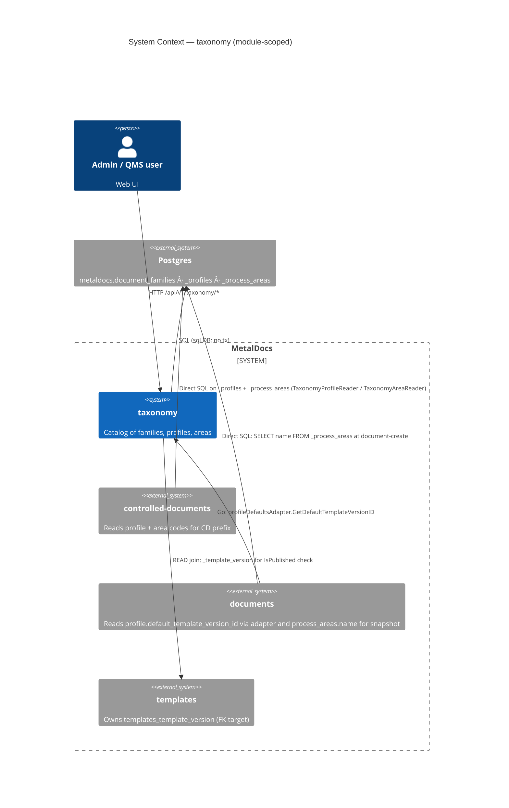
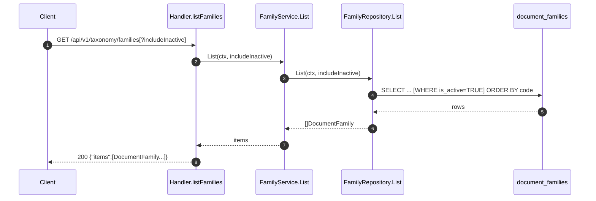
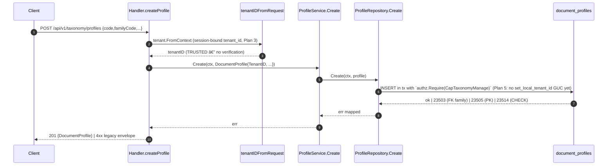
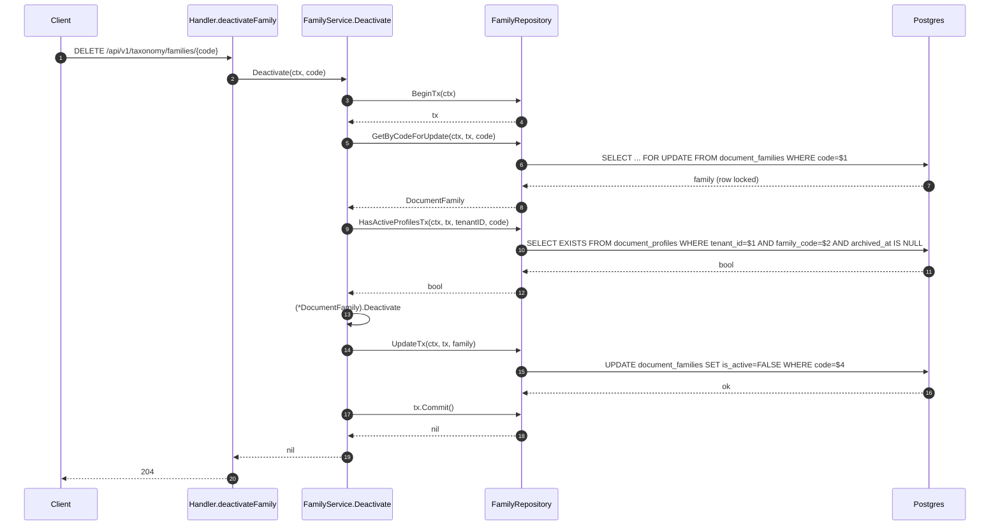

# Module: taxonomy

> Living architecture doc. Arc42 (12 sections) + C4 (Context / Container) Mermaid diagrams + ADR links.

**Last verified:** 2026-06-12 (Wave 2 module sync — GovernanceLogger.LogTx/RecordTx in-tx governance writes; CreateTx on repos; Unwrap() *sql.Tx on tx types; AreaService.SetParent DELETED; DBGovernanceLogger nil-tx guard; deferred removal recorded) | **Owner:** unassigned | **Status:** active (intrinsic gaps; see §11) | **Maturity:** L3

> **Key files:**
> - `internal/modules/taxonomy/domain/family.go:8` — `DocumentFamily` aggregate
> - `internal/modules/taxonomy/domain/profile.go:8` — `DocumentProfile` aggregate
> - `internal/modules/taxonomy/domain/area.go:8` — `ProcessArea` aggregate
> - `internal/modules/taxonomy/domain/port.go:1` — repository ports + `GovernanceEvent`
> - `internal/modules/taxonomy/application/family_service.go:13-19` — `FamilyService` (struct has `govLogger domain.GovernanceLogger`; `NewFamilyService` takes `govLogger` param; Create/Update/Deactivate all call `s.govLogger.Log` — T-004 closed)
> - `internal/modules/taxonomy/application/profile_service.go:16-20` — `ProfileService` (panics if govLogger nil; Create `:70` and Update `:96` both call `s.govLogger.Log` — T-005 closed)
> - `internal/modules/taxonomy/application/area_service.go:13-17` — `AreaService` (Create `:59` and Update `:98` both call `s.govLogger.Log`; Archive also emits — T-005 closed; `SetParent` DELETED Wave 2 — dead code)
> - `internal/modules/taxonomy/delivery/http/handler.go:42-51` — `RegisterRoutes` calls `taxonomyapi.HandlerWithOptions`; routes mounted via oapi-codegen generated router (T-009 closed)
> - `internal/modules/taxonomy/delivery/http/routes_profiles.go:255-257` — `tenantIDFromRequest` (delegates to `tenant.FromContext`; Plan 3 removed header trust)
> - `internal/modules/taxonomy/infrastructure/repository.go:152` — `ProfileRepository.Create` (now in tx + `authz.Require(CapTaxonomyManage)` at `:162` — Plan 5 wired)
> - `internal/modules/taxonomy/domain/port.go` -- `GovernanceLogger.LogTx(ctx, *sql.Tx, event)` (Wave 2: in-tx governance writes; `AuditGovernanceAdapter.RecordTx` routes to audit writer inside caller tx; tx types expose `Unwrap() *sql.Tx`)
> - `internal/modules/taxonomy/infrastructure/repository.go` -- `ProfileRepository.CreateTx` / `AreaRepository.CreateTx` (Wave 2: transactional create variants added to all three repo pairs)
> - `internal/modules/taxonomy/infrastructure/family_repository.go:218-240` — `HasActiveProfilesTx` (takes `tenantID string`; WHERE `tenant_id=$1 AND family_code=$2` — tenant predicate present; T-007 TOCTOU resolved: `Deactivate` now uses `GetByCodeForUpdate` + `HasActiveProfilesTx` inside a single tx)
> - `apps/api/cmd/metaldocs-api/permissions.go:165-181` — path-prefix capability dispatcher (taxonomy profiles/areas/families; F-001 split applied)
> - `apps/api/cmd/metaldocs-api/main.go:314-315,358,412,908-924` — module wiring (`buildTaxonomyModule` call `:314-315`) + standalone `ProfileRepository` (`:358`) + `profileDefaultsAdapter` use (`:412`) + type definition (`:908-924`)
> - `db/baseline/0001_current_schema.sql:1028-1034` — `document_families` table definition
> - `db/baseline/0001_current_schema.sql:1056-1069` — `document_process_areas` table definition
> - `db/baseline/0001_current_schema.sql:1121-1138` — `document_profiles` table definition
> - `db/baseline/0001_current_schema.sql:3678-3716` — code-immutability triggers + `trg_require_cap_asserted` on all 3 taxonomy tables

---

## 1. Introduction & Goals

`internal/modules/taxonomy` owns the **flat, code-keyed classification catalog** that other modules bind controlled documents to: 3 entities — `DocumentFamily`, `DocumentProfile`, `ProcessArea` — each a row in its own Postgres table. Profiles bind to families; areas are flat with optional `parent_code` self-FK and cycle prevention. The module exposes 16 HTTP routes under `/api/v1/taxonomy/*` and serves downstream consumers: controlled-documents (legacy literal module id/code path: `registry`, CD code prefix `{profile}-{area}-{seq}`), documents (template defaults via `profileDefaultsAdapter`), and documents snapshot creation (live read of `process_areas.name`).

### 1.1 Requirements overview

- **Catalog CRUD** with code immutability post-create (CHECK + trigger on profile/area; handler-overwrite on family).
- **Per-tenant scoping for profiles + areas** — `tenant_id UUID NOT NULL DEFAULT DevTenantID` (`db/baseline/0001_current_schema.sql:1062`, `:1130` — added in the curated baseline, no discrete forward migration).
- **Global family catalog** — `document_families` has no `tenant_id` (`db/baseline/0001_current_schema.sql:1028-1034`); shared across tenants (no ADR; see T-002).
- **Soft-archive** for profiles + areas via `archived_at TIMESTAMPTZ NULL` (`db/baseline/0001_current_schema.sql:1066`, `:1134` — part of the curated baseline).
- **Area hierarchy** — self-FK `(tenant_id, parent_code) → (tenant_id, code)` with application-layer cycle detection (`area_service.go:SetParent` → `ListAncestors`).
- **Capability gate** — tier-1 only: `taxonomy.manage` for writes, `taxonomy.view` for reads (`permissions.go:165-181`; F-001 split applied).

### 1.2 Quality Goals

| Rank | Goal | How verified |
|---|---|---|
| 1 | **Multi-tenant isolation** of profiles + areas | per-tenant unique `(tenant_id, code)` indexes; **FAILS** — tenant_id sourced from client header without verification (T-001); families have no tenant scoping at all (T-002) |
| 2 | **Regulated-mutation traceability** | govLogger emits to `governance_events` / `audit_events` on all regulated ops — **PASSES** for Create/Update/Deactivate on all three services (T-004 closed commit `115cb635`; T-005 closed commit `20bf2067`); archive paths also emit |
| 3 | **Code immutability post-create** | DB trigger `trg_document_profiles_code_immutable` (`db/baseline/0001_current_schema.sql:3681`) + `trg_process_areas_code_immutable` (`:3688`) + `trg_reject_families_code_update` (`:3695`) — all three in the curated baseline; T-013 closed — PASSES for all 3 entities |

### 1.3 Stakeholders

| Role | Expectation |
|---|---|
| Admin / QMS | CRUD profiles + areas + families with audit trail; immutable codes once published. |
| controlled-documents module | `document_profiles.code` and `process_areas.code` as stable FKs for CD code generation. |
| documents wizard | `profile.default_template_version_id` resolved via `profileDefaultsAdapter`. |
| documents module | `process_areas.name` resolvable at document-create time for snapshot column. |

---

## 2. Architecture Constraints

- Language / runtime: Go 1.25
- Persistence: Postgres; 3 owned tables in schema `metaldocs` (all 3 tables delivered in the curated baseline `db/baseline/0001_current_schema.sql`; no discrete forward migrations for the core taxonomy schema; forward migrations start at 0203)
- HTTP routing: oapi-codegen generated router; `handler.go:42-51` calls `taxonomyapi.HandlerWithOptions`; spec lives at `internal/modules/taxonomy/api/` (`api.gen.go`, `cfg.yaml`, `gen.go`); `routes_generated.go:10` has compile-time `ServerInterface` assertion (T-009 closed)
- Error envelope: **RFC 9457** `application/problem+json` via `writeError = httpresponse.WriteError` alias (`routes_profiles.go:19`) which cascades to `problem.Write` — T-008 closed Plan 7
- Authz: tier-1 path-prefix dispatcher (T-003 PATCH bypass closed Plan 5); **Plan 5 wired `authz.Require(CapTaxonomyManage)` in `FamilyRepository.Create/Update`, `ProfileRepository.Create/Update`, `AreaRepository.Create/Update`; tripwire on all 3 taxonomy tables via `trg_require_cap_asserted` (`db/baseline/0001_current_schema.sql:3699-3716`; T-006 partially closed)**; archive/deactivate paths still tier-1 only
- Tenant scoping: application-layer only via `tenant.FromContext` (Plan 3 replaced `X-Tenant-ID` header reads; no `set_local_tenant_id` GUC anywhere in `internal/`)

---

## 3. System Scope & Context — module-scoped (C4 Level 1)

> System-level context lives in [`wiki/diagrams/c4-context.md`](../diagrams/c4-context.md). The diagram below is **module-scoped**: it shows taxonomy's consumers (controlled-documents, documents, templates) and the 3 owned Postgres tables.

### 3.1 Business Context

A QMS admin needs a stable catalog so every controlled document carries a profile (what kind of doc) and a process area (which part of the operation it governs). The taxonomy module is that catalog. Family-level deactivation is the rare global lever; profile + area archive is the common per-tenant lever. Code immutability is the QMS contract — once a code is in circulation, it does not change.

### 3.2 Technical Context

Inbound interfaces (Go):
- `taxonomyapp.NewDBGovernanceLogger(db)` — reused by `internal/modules/controlleddocuments/module.go:12,37` (controlled-documents module) as a fallback when no `AuditWriter` is injected; primary path uses `NewAuditGovernanceAdapter`.
- `taxonomydomain.{DocumentProfile, ProcessArea, GovernanceEvent, GovernanceLogger, sentinel errors}` — consumed by legacy literal code paths `registry/application/service.go:13`, `registry/delivery/http/routes.go:17`, `registry/infrastructure/repository.go:15`.
- `taxonomyinfra.NewProfileRepository(db)` — constructed standalone in `main.go:225` for `profileDefaultsAdapter`.
- `taxonomyinfra.NewTemplateVersionChecker(db)` — joins to `templates_template{_version}` for `IsPublished` (`template_version_checker.go:14-17`).

Inbound interfaces (HTTP) — 16 routes (full table in §5.3).

Outbound interfaces:
- DB: 3 owned tables; READ join to `templates_template_version` + `templates_template`.
- Go: `internal/platform/authn` (UserID), `internal/platform/httpresponse` (envelope), `internal/platform/tenant` (DevTenantID fallback). No `internal/platform/authz`, no `internal/audit`, no `internal/modules/iam`.

---

## 4. Solution Strategy

- **Per-aggregate repository + service split.** Each of the 3 entities has its own service + repository pair. Driver: simplicity; cost: govLogger wired inconsistently (FamilyService omits it — T-004).
- **DB-level code immutability for profile + area + family.** Triggers `trg_document_profiles_code_immutable` (`db/baseline/0001_current_schema.sql:3681`) and `trg_process_areas_code_immutable` (`:3688`) raise on `NEW.code <> OLD.code` via `public.reject_code_update()` (`:805-816`). Family immutability enforced by `trg_reject_families_code_update` (`:3695`) via `public.reject_families_code_update()` (`:823-834`); all triggers are in the curated baseline (Plan 5, T-013 closed). Handler still overwrites body `code` with path param as an additional guard.
- **Tenant scoping on profile + area only; families are global.** `tenant_id` is present on `document_process_areas` (`db/baseline/0001_current_schema.sql:1062`) and `document_profiles` (`:1130`) but absent from `document_families` (`:1028-1034`); the asymmetry is baked into the curated baseline with no discrete migration history. No ADR justifies it (T-002).
- **Application-layer cycle prevention for area parents.** `AreaService.SetParent` was DELETED (Wave 2, dead-code removal). The `SetParent` handler and service method were unreachable — no HTTP route was wired for the operation. Cycle check via `ListAncestors` is preserved as internal logic; the public `SetParent` entrypoint no longer exists.
- **Two-tier authz now wired for Create/Update paths (Plan 5).** `authz.Require(CapTaxonomyManage)` in FamilyRepository + ProfileRepository + AreaRepository write methods; `trg_require_cap_asserted` on all 3 taxonomy tables (`db/baseline/0001_current_schema.sql:3699-3716`). PATCH dispatcher bypass fixed (T-003). Archive/deactivate + FamilyService govLogger gap remain (T-004, T-005, T-006 partial).
- **oapi-codegen generated router.** `internal/modules/taxonomy/api/` ships `api.gen.go` + `cfg.yaml`; `handler.go:42-51` mounts via `taxonomyapi.HandlerWithOptions`; compile-time `ServerInterface` assertion at `routes_generated.go:10`. T-009 closed.

---

## 5. Building Block View — module-scoped (C4 Level 2 — Container)

> System-level container topology lives in [`wiki/diagrams/c4-container-backend.md`](../diagrams/c4-container-backend.md). The diagram below decomposes the internal Go packages of taxonomy (handler/services/repositories/template-version checker/governance logger).

### 5.1 Whitebox — taxonomy

```mermaid
C4Container
    title Container View — taxonomy (module-internal packages)
    Container(http, "HTTP Handler", "Go (http.ServeMux)", "16 routes: /api/v1/taxonomy/{profiles,areas,families}")
    Container(svc, "Service Layer", "Go", "FamilyService · ProfileService · AreaService")
    Container(domain, "Domain", "Go", "DocumentFamily · DocumentProfile · ProcessArea · GovernanceEvent · sentinel errors")
    Container(repo, "Repository Layer", "Go + database/sql", "FamilyRepository · ProfileRepository · AreaRepository · TemplateVersionChecker · DBGovernanceLogger")
    ContainerDb(db, "metaldocs.document_*", "Postgres", "document_families · document_profiles · document_process_areas (+ governance_events)")
    System_Ext(tplv2, "templates_template_version", "Postgres (templates)", "READ join for IsPublished")
    Rel(http, svc, "calls")
    Rel(svc, domain, "uses")
    Rel(svc, repo, "calls (repository interfaces)")
    Rel(repo, db, "SQL (no tx; one *sql.DB per repo)")
    Rel(repo, tplv2, "READ join (TemplateVersionChecker)")
```

### 5.2 Public surface

| File | Symbol | Kind | Purpose |
|---|---|---|---|
| `domain/family.go:8` | `DocumentFamily` | struct | family aggregate (`Code, Name, Description, IsActive, CreatedAt`) |
| `domain/family.go:22` | `(*DocumentFamily).Deactivate` | method | in-memory state transition; returns `ErrFamilyAlreadyInactive` |
| `domain/family.go` | `ErrFamilyNotFound · ErrFamilyAlreadyInactive · ErrFamilyHasProfiles` | sentinels | |
| `domain/profile.go:8` | `DocumentProfile` | struct | profile aggregate (12 fields incl. `TenantID`, `DefaultTemplateVersionID`, `ArchivedAt`) |
| `domain/profile.go` | `ErrProfileNotFound · ErrProfileArchived · ErrProfileCodeImmutable · ErrTemplateNotPublished · ErrTemplateProfileMismatch` | sentinels | |
| `domain/area.go:8` | `ProcessArea` | struct | area aggregate (incl. `TenantID`, `ParentCode`, `ArchivedAt`) |
| `domain/area.go` | `ErrAreaNotFound · ErrAreaArchived · ErrAreaCodeImmutable · ErrAreaParentCycle` | sentinels | |
| `domain/port.go` | `FamilyRepository · ProfileRepository · AreaRepository · TemplateVersionChecker · GovernanceLogger` | ifaces | repository ports |
| `domain/port.go` | `GovernanceEvent` | struct | governance log row (`ActorID, EntityType, EntityCode, Action, BeforeJSON, AfterJSON, OccurredAt`) |
| `application/family_service.go:13-19` | `FamilyService` | struct | List · Get · Create · Update · Deactivate; all mutating methods call `s.govLogger.Log` (T-004 closed) |
| `application/profile_service.go:16-20` | `ProfileService` | struct | List · Get · Create · Update · Archive · SetDefaultTemplate; Create `:70`, Update `:96`, Archive, SetDefaultTemplate all emit govLogger events (T-005 closed) |
| `application/area_service.go:13-17` | `AreaService` | struct | List · Get · Create · Update · Archive; Create `:59`, Update `:98`, Archive all emit govLogger events (T-005 closed); `SetParent` DELETED (Wave 2 — dead code, no HTTP route wired) |
| `application/governance.go` | `NewDBGovernanceLogger` | func | reused by `internal/modules/controlleddocuments/module.go:37` as fallback when no `AuditWriter` injected |
| `infrastructure/family_repository.go:11` | `FamilyRepository` | struct | `*sql.DB`-backed; `HasActiveProfilesTx` takes `tenantID` + wraps in tx (T-007 resolved) |
| `infrastructure/repository.go:14,180` | `ProfileRepository · AreaRepository` | structs | `*sql.DB`-backed; no tx |
| `infrastructure/template_version_checker.go:11` | `TemplateVersionChecker` | struct | READ join: `_template + _template_version` |
| `delivery/http/handler.go:36-40` | `Handler` | struct | HTTP wrapper |
| `delivery/http/handler.go:42-51` | `Handler.RegisterRoutes` | method | mounts 16 routes via `taxonomyapi.HandlerWithOptions` |
| `module.go:11` | `Module · Dependencies` | struct | composition root |

(Phase 1 surface scan: 80 exported symbols total — all without Go doc comments; tracked as T-014.)

### 5.3 HTTP operations

| Method | Path | OperationID | Handler | Authz cap |
|---|---|---|---|---|
| GET | `/api/v1/taxonomy/profiles` | `listTaxonomyProfiles` | `h.ListTaxonomyProfiles` | `doc.view` |
| POST | `/api/v1/taxonomy/profiles` | `createTaxonomyProfile` | `h.CreateTaxonomyProfile` | `taxonomy.manage` |
| GET | `/api/v1/taxonomy/profiles/{code}` | `getTaxonomyProfile` | `h.GetTaxonomyProfile` | `doc.view` |
| PATCH | `/api/v1/taxonomy/profiles/{code}` | `updateTaxonomyProfile` | `h.UpdateTaxonomyProfile` | `taxonomy.manage` |
| DELETE | `/api/v1/taxonomy/profiles/{code}` | `archiveTaxonomyProfile` | `h.ArchiveTaxonomyProfile` | `taxonomy.manage` |
| PUT | `/api/v1/taxonomy/profiles/{code}/default-template` | `setTaxonomyProfileDefaultTemplate` | `h.SetTaxonomyProfileDefaultTemplate` | `taxonomy.manage` |
| GET | `/api/v1/taxonomy/areas` | `listTaxonomyAreas` | `h.ListTaxonomyAreas` | `doc.view` |
| POST | `/api/v1/taxonomy/areas` | `createTaxonomyArea` | `h.CreateTaxonomyArea` | `taxonomy.manage` |
| GET | `/api/v1/taxonomy/areas/{code}` | `getTaxonomyArea` | `h.GetTaxonomyArea` | `doc.view` |
| PUT | `/api/v1/taxonomy/areas/{code}` | `updateTaxonomyArea` | `h.UpdateTaxonomyArea` | `taxonomy.manage` |
| DELETE | `/api/v1/taxonomy/areas/{code}` | `archiveTaxonomyArea` | `h.ArchiveTaxonomyArea` | `taxonomy.manage` |
| GET | `/api/v1/taxonomy/families` | `listTaxonomyFamilies` | `h.ListTaxonomyFamilies` | `doc.view` |
| POST | `/api/v1/taxonomy/families` | `createTaxonomyFamily` | `h.CreateTaxonomyFamily` | `taxonomy.manage` |
| GET | `/api/v1/taxonomy/families/{code}` | `getTaxonomyFamily` | `h.GetTaxonomyFamily` | `doc.view` |
| **PATCH** | `/api/v1/taxonomy/families/{code}` | `updateTaxonomyFamily` | `h.UpdateTaxonomyFamily` | `taxonomy.manage` (T-003 closed Plan 5 — PATCH added to dispatcher) |
| DELETE | `/api/v1/taxonomy/families/{code}` | `deactivateTaxonomyFamily` | `h.DeactivateTaxonomyFamily` | `taxonomy.manage` |

## API Route Truth Table (Plan 8 Baseline)

| Method | Path | Runtime owner (file:line) | Handler method | Spec path | operationId | Codegen method | Status | Notes |
|---|---|---|---|---|---|---|---|---|
| GET | `/api/v1/taxonomy/profiles` | `internal/modules/taxonomy/delivery/http/handler.go:51` (RegisterRoutes) | `h.ListTaxonomyProfiles` | `/api/v1/taxonomy/profiles` | `listTaxonomyProfiles` | `ListTaxonomyProfiles` | Aligned | Mounted via `taxonomyapi.HandlerWithOptions` |
| POST | `/api/v1/taxonomy/profiles` | `internal/modules/taxonomy/delivery/http/handler.go:51` (RegisterRoutes) | `h.CreateTaxonomyProfile` | `/api/v1/taxonomy/profiles` | `createTaxonomyProfile` | `CreateTaxonomyProfile` | Aligned | |
| GET | `/api/v1/taxonomy/profiles/{code}` | `internal/modules/taxonomy/delivery/http/handler.go:51` (RegisterRoutes) | `h.GetTaxonomyProfile` | `/api/v1/taxonomy/profiles/{code}` | `getTaxonomyProfile` | `GetTaxonomyProfile` | Aligned | |
| PATCH | `/api/v1/taxonomy/profiles/{code}` | `internal/modules/taxonomy/delivery/http/handler.go:51` (RegisterRoutes) | `h.UpdateTaxonomyProfile` | `/api/v1/taxonomy/profiles/{code}` | `updateTaxonomyProfile` | `UpdateTaxonomyProfile` | Aligned | |
| DELETE | `/api/v1/taxonomy/profiles/{code}` | `internal/modules/taxonomy/delivery/http/handler.go:51` (RegisterRoutes) | `h.ArchiveTaxonomyProfile` | `/api/v1/taxonomy/profiles/{code}` | `archiveTaxonomyProfile` | `ArchiveTaxonomyProfile` | Aligned | |
| PUT | `/api/v1/taxonomy/profiles/{code}/default-template` | `internal/modules/taxonomy/delivery/http/handler.go:51` (RegisterRoutes) | `h.SetTaxonomyProfileDefaultTemplate` | `/api/v1/taxonomy/profiles/{code}/default-template` | `setTaxonomyProfileDefaultTemplate` | `SetTaxonomyProfileDefaultTemplate` | Aligned | |
| GET | `/api/v1/taxonomy/areas` | `internal/modules/taxonomy/delivery/http/handler.go:51` (RegisterRoutes) | `h.ListTaxonomyAreas` | `/api/v1/taxonomy/areas` | `listTaxonomyAreas` | `ListTaxonomyAreas` | Aligned | |
| POST | `/api/v1/taxonomy/areas` | `internal/modules/taxonomy/delivery/http/handler.go:51` (RegisterRoutes) | `h.CreateTaxonomyArea` | `/api/v1/taxonomy/areas` | `createTaxonomyArea` | `CreateTaxonomyArea` | Aligned | |
| GET | `/api/v1/taxonomy/areas/{code}` | `internal/modules/taxonomy/delivery/http/handler.go:51` (RegisterRoutes) | `h.GetTaxonomyArea` | `/api/v1/taxonomy/areas/{code}` | `getTaxonomyArea` | `GetTaxonomyArea` | Aligned | |
| PUT | `/api/v1/taxonomy/areas/{code}` | `internal/modules/taxonomy/delivery/http/handler.go:51` (RegisterRoutes) | `h.UpdateTaxonomyArea` | `/api/v1/taxonomy/areas/{code}` | `updateTaxonomyArea` | `UpdateTaxonomyArea` | Aligned | |
| DELETE | `/api/v1/taxonomy/areas/{code}` | `internal/modules/taxonomy/delivery/http/handler.go:51` (RegisterRoutes) | `h.ArchiveTaxonomyArea` | `/api/v1/taxonomy/areas/{code}` | `archiveTaxonomyArea` | `ArchiveTaxonomyArea` | Aligned | |
| GET | `/api/v1/taxonomy/families` | `internal/modules/taxonomy/delivery/http/handler.go:51` (RegisterRoutes) | `h.ListTaxonomyFamilies` | `/api/v1/taxonomy/families` | `listTaxonomyFamilies` | `ListTaxonomyFamilies` | Aligned | |
| POST | `/api/v1/taxonomy/families` | `internal/modules/taxonomy/delivery/http/handler.go:51` (RegisterRoutes) | `h.CreateTaxonomyFamily` | `/api/v1/taxonomy/families` | `createTaxonomyFamily` | `CreateTaxonomyFamily` | Aligned | |
| GET | `/api/v1/taxonomy/families/{code}` | `internal/modules/taxonomy/delivery/http/handler.go:51` (RegisterRoutes) | `h.GetTaxonomyFamily` | `/api/v1/taxonomy/families/{code}` | `getTaxonomyFamily` | `GetTaxonomyFamily` | Aligned | |
| PATCH | `/api/v1/taxonomy/families/{code}` | `internal/modules/taxonomy/delivery/http/handler.go:51` (RegisterRoutes) | `h.UpdateTaxonomyFamily` | `/api/v1/taxonomy/families/{code}` | `updateTaxonomyFamily` | `UpdateTaxonomyFamily` | Aligned | |
| DELETE | `/api/v1/taxonomy/families/{code}` | `internal/modules/taxonomy/delivery/http/handler.go:51` (RegisterRoutes) | `h.DeactivateTaxonomyFamily` | `/api/v1/taxonomy/families/{code}` | `deactivateTaxonomyFamily` | `DeactivateTaxonomyFamily` | Aligned | |

- Module contract status: Generated boundary mounted
- Owner: leandro

---

## 6. Runtime View (selected scenarios)

### 6.1 listFamilies — read path

No tenant predicate (table is global). Tier-1 cap: `doc.view`. No tier-2; no DB tripwire. See `_artifacts/02-flow-list-families.md`.

### 6.2 createProfile — write path

Trust chain: client header → SQL `tenant_id` value. No verification that the authenticated user belongs to the named tenant (T-001). `ProfileService.Create` emits a govLogger event at `profile_service.go:70` (T-005 closed). See `_artifacts/02-flow-create-profile.md`.

### 6.3 deactivateFamily — state transition

| From | To | Trigger | Cap |
|---|---|---|---|
| `is_active=TRUE` | `is_active=FALSE` | `DELETE /families/{code}` + no active profiles | `taxonomy.manage` |

`FamilyService.Deactivate` uses `BeginTx` + `GetByCodeForUpdate` (FOR UPDATE) + `HasActiveProfilesTx` (same tx, tenant-scoped) + `UpdateTx` + Commit (T-007 resolved). `govLogger.Log` called post-commit (T-004 closed). See `_artifacts/02-flow-deactivate-family.md`.

Failure modes — reference `wiki/concepts/error-ux.md`:

| Condition | HTTP | Envelope `code` |
|---|---|---|
| family not found | 404 | `FAMILY_NOT_FOUND` |
| already inactive | 409 | `FAMILY_ALREADY_INACTIVE` |
| has active profiles | 409 | `FAMILY_HAS_PROFILES` |
| internal | 500 | `INTERNAL_ERROR` |

(RFC 9457 `application/problem+json` — T-008 closed Plan 7.)

---

## 7. Deployment View

- Binary: single Go server (`apps/api/cmd/metaldocs-api`)
- Process: one container, port `:8081`
- Schema: all 3 taxonomy tables are defined in the curated baseline (`db/baseline/0001_current_schema.sql`); there are no discrete forward migrations for the core taxonomy schema. Forward migrations start at 0203 and currently do not extend taxonomy tables (see `_artifacts/04-persistence.md` §6)
- Environment: **no taxonomy-specific env vars or config keys** (Phase 3 §4); tenant scoping is header-driven, not config-driven; `DevTenantID` is a compile-time constant (`internal/platform/tenant/const.go:1-4`)

---

## 8. Cross-cutting Concepts

### 8.1 Authentication & Authorization
- **Tier 1 (HTTP edge):** path-prefix dispatcher (`apps/api/cmd/metaldocs-api/permissions.go:165-181`). Profiles branch matches GET + POST/PATCH/PUT/DELETE. Areas branch matches GET + POST/PUT/DELETE. Families branch matches GET + POST/PATCH/PUT/DELETE (T-003 closed Plan 5 — PATCH added; F-001 split: GET→CapTaxonomyView, writes→CapTaxonomyManage).
- **Tier 2 (in-tx):** `authz.Require(CapTaxonomyManage)` wired in `FamilyRepository.Create` (`:77`) / `Update` (`:96`); `ProfileRepository.Create` / `Update`; `AreaRepository.Create` / `Update`. Archive/deactivate paths still tier-1 only (T-006 partial). `internal/modules/iam/authz` import now present in taxonomy infrastructure.
- **Postgres tripwire:** `trg_require_cap_asserted` is attached to `document_families` (`db/baseline/0001_current_schema.sql:3699-3702`), `document_process_areas` (`:3706-3709`), and `document_profiles` (`:3713-3716`). The trigger body is `public.enforce_capability_asserted()` (`:36-163` in migration `0231_db_hardening_tripwire_and_dead_schema.sql`, mirrored in the baseline). The file `migrations/0188_tripwire_extend.sql` does not exist; this anchor was false.
- See `wiki/decisions/0007-two-tier-authz.md` — taxonomy partially conformant as of Plan 5 (T-006 partially closed).

### 8.2 Tenant scoping
- Tenant now sourced from `tenant.FromContext` (`routes_profiles.go:255-257`). Plan 3 replaced the `X-Tenant-ID` header reads; `tenant.DevTenantID` is no longer a fallback at this layer — if context lacks a tenant, `ErrTenantMissing` returns 500. T-001 (header trust) is resolved; see `taxonomy-tech-debt.md` T-001.
- `document_families` has no `tenant_id` — globally shared across tenants. Mutation blast radius extends to every tenant's UI/controlled-documents surface (legacy literal module id: `registry`) (T-002).
- `HasActiveProfilesTx` (called from `FamilyService.Deactivate`) includes `WHERE tenant_id=$1` predicate; cross-tenant scan concern from T-007 resolved.

### 8.3 Error envelope
- RFC 9457 `application/problem+json` via `writeError` package alias at `routes_profiles.go:19` (`var writeError = httpresponse.WriteError`). `httpresponse.WriteError` at `internal/platform/httpresponse/response.go:16-18` delegates to `problem.Write`. No direct taxonomy handler changes were required — T-008 closed via cascade (Plan 7, commit `11589032` + test fix `f0bb64c0`).

### 8.4 Idempotency
- No `Idempotency-Key` handling on any write route. Duplicate POST `/profiles` with same code returns PG `23505` → currently maps to `INTERNAL_ERROR 500` (unmapped). Latent — see refactor backlog R-008.

### 8.5 Pagination
- No pagination. `listProfiles`, `listAreas`, `listFamilies` return full ordered slices. Catalog cardinality expected to stay small (< 1k rows per tenant). Latent risk; tracked as T-015.

### 8.6 Logging & Observability
- No structured logging in module. `DBGovernanceLogger` writes to `metaldocs.governance_events` — a module-local parallel sink to `audit.Writer`. Same gap as audit T-007 (two parallel sinks; not unified). **Wave 2:** `DBGovernanceLogger` gained a nil-tx guard (returns error rather than panic when called with a nil `*sql.Tx`). Full removal is deferred; it remains the nil-`AuditWriter` fallback for the taxonomy module only.
- No trace-id propagation; no metrics.

### 8.7 Concurrency / Transactions
- `FamilyService.Deactivate` uses a single tx: `BeginTx` â†' `GetByCodeForUpdate` (SELECT FOR UPDATE) â†' `HasActiveProfilesTx` (tenant-scoped, same tx) â†' `UpdateTx` â†' Commit (`family_service.go:124-179`). T-007 resolved.
- `FamilyService.Update` likewise uses `BeginTx` + `GetByCodeForUpdate` + `UpdateTx` (`family_service.go:67-122`).
- `ProfileService.Create` / `Update` operate outside a tx; `ProfileRepository.Create` / `Update` each wrap authz GUC + their own single-statement tx. `TemplateVersionChecker` in `SetDefaultTemplate` is checked inside a tx (`profile_service.go:110-165`).
- `AreaService.Update` operates outside an enclosing service-layer tx; no `FOR UPDATE` on the Get preceding the Update.

### 8.8 Code immutability
- Profile + area: DB-enforced via `public.reject_code_update()` (`db/baseline/0001_current_schema.sql:805-816`) + BEFORE-UPDATE trigger `trg_document_profiles_code_immutable` (`:3681`) and `trg_process_areas_code_immutable` (`:3688`) — all in the curated baseline.
- Family: DB-enforced by `trg_reject_families_code_update` (`db/baseline/0001_current_schema.sql:3695`) via `public.reject_families_code_update()` (`:823-834`) — both in the curated baseline (Plan 5, T-013 closed). Handler also overwrites body `code` with path-param `code` as a defense-in-depth layer.

### 8.9 Cross-module data contracts
- `document_profiles.code` + `process_areas.code` → CD code prefix (`{profile}-{area}-{seq}`) in legacy literal code path `registry/domain/controlled_document.go:48`.
- `document_profiles.default_template_version_id` → documents wizard via `profileDefaultsAdapter` (`main.go:908-924` type definition; use at `main.go:412`).
- `process_areas.name` → snapshotted live by documents (`internal/modules/documents/repository/repository.go:94-101`) into `documents.area_name_snapshot`.
- `document_profiles.family_code` → FK to `document_families.code`.

---

## 9. Architecture Decisions

| Decision | Link / Status |
|---|---|
| Two-tier authz (referenced; taxonomy non-conformant) | `wiki/decisions/0007-two-tier-authz.md` |
| Soft-archive via timestamp (`archived_at`) | `wiki/decisions/0010-soft-archive-via-timestamp.md` |
| Contract-first API (referenced; taxonomy never migrated) | `wiki/decisions/0012-contract-first-api.md` |
| `document_families` global (no `tenant_id`) by design | `tech-debt: missing-ADR` (T-002) |
| Application-layer cycle prevention on area parents | `tech-debt: missing-ADR` (T-016) |
| Same `*sql.DB` (no tx) across three repositories | `tech-debt: missing-ADR` (T-007 sub-bullet) |
| `DBGovernanceLogger` as a module-local audit sink parallel to `audit.Writer` | `tech-debt: missing-ADR` (T-004 sub-bullet) |
| oapi-codegen generated router (migrated from raw ServeMux) | `tech-debt: T-009 closed` |

---

## 10. Quality Requirements

| Goal | Scenario | Pass criteria | Current state |
|---|---|---|---|
| Multi-tenant isolation | Authn'd user in tenant A POSTs `/profiles` with forged `X-Tenant-ID` header | 403; no insert | **PASSES** after Plan 3 — header stripped by auth middleware; tenant from session (`tenant.FromContext`) |
| Authz on regulated mutations | Authn'd user without `taxonomy.manage` PATCHes `/families/{code}` | 403 | **PASSES** — PATCH added to dispatcher Plan 5 (T-003 closed) |
| Regulated-mutation traceability | `Create`/`Update`/`Deactivate` on family/profile/area emits a governance event | grep shows ≥1 govLogger call per mutating service method | **PASSES** — all three services emit on every mutating path (T-004 closed commit `115cb635`; T-005 closed commit `20bf2067`) |
| Code immutability | Direct UPDATE to `document_profiles.code` raises | trigger fires | PASSES (`db/baseline/0001_current_schema.sql:3681` — `trg_document_profiles_code_immutable`) |
| Family code immutability | Direct UPDATE to `document_families.code` raises | trigger fires | **PASSES** — `trg_reject_families_code_update` (`db/baseline/0001_current_schema.sql:3695`) in curated baseline, Plan 5 (T-013 closed) |
| Concurrency on Deactivate | Concurrent INSERT into `_profiles` during Deactivate cannot bypass `HasActiveProfiles` | row lock or single tx | **PASSES** — `BeginTx` + `GetByCodeForUpdate` (FOR UPDATE) + `HasActiveProfilesTx` (same tx) + `UpdateTx` + Commit (`family_service.go:124-179`); T-007 resolved |
| Migration discipline | Schema changes appended forward-only | grep migrations | PASSES (core taxonomy schema is in the curated baseline; forward migrations 0203+ append non-taxonomy changes; IP-006 conformant) |
| `(tenant_id, code)` uniqueness | Two profiles with same code in same tenant rejected | unique index | PASSES (`ux_document_profiles_tenant_code`) |

---

## 11. Risks & Technical Debt

Pointer-only. Body in `wiki/modules/taxonomy-tech-debt.md`. Severity rubric: see that file.

- Critical: 5
- Major: 5
- Minor: 6

Top 3 (by severity, then by blast-radius):

1. **Tenant header trust removed (Plan 3)** — `tenantIDFromRequest` now calls `tenant.FromContext`; `X-Tenant-ID` header is stripped by auth middleware before reaching taxonomy handlers. T-001 resolved. Residual: no GUC-based row-level isolation (T-006 partial).
2. **`document_families` is globally shared with no ADR** — any caller with `taxonomy.manage` (held by `qms_admin` + `system_admin` in any tenant) mutates a row visible to every tenant. Cross-tenant blast on a regulated catalog. See tech-debt T-002. Still open.
3. **Plan 5/6a closures** — T-003 (PATCH dispatcher bypass fixed); T-004 (FamilyService govLogger wired, commit `115cb635`); T-005 (Profile/Area Create+Update emit, commit `20bf2067`); T-006 partially closed (Create/Update paths have `authz.Require` + DB tripwire on all 3 taxonomy tables); T-007 (Deactivate tx + FOR UPDATE + tenant-scoped HasActiveProfilesTx); T-009 (oapi-codegen generated router wired); T-013 (families code immutability trigger).

---

## 12. Glossary

| Term | Definition |
|---|---|
| `document_family` | Top-level catalog grouping ("Procedimento", "Instrução"). Global across tenants; no `tenant_id`. |
| `document_profile` | Per-tenant document type bound to a family. Has `default_template_version_id` for the documents wizard. |
| `process_area` | Per-tenant operational area with optional `parent_code` self-FK. Cycle prevention is application-layer. |
| `taxonomy.manage` | IAM capability gating writes on all 16 taxonomy routes; granted to `system_admin` (`db/reference-data/0001_product_reference_data.sql:75`) and `qms_admin` (`:57`) via reference data, not a forward migration. |
| `governance_events` | Module-local audit sink written via `DBGovernanceLogger`. Parallel to `audit.Writer`; not unified. |
| `DevTenantID` | Compile-time UUID constant (`ffffffff-...`). After Plan 3, this is no longer the fallback in taxonomy handlers — `tenant.FromContext` errors out if no session tenant is present. Still used in auth's `AllowDevTenantFallback` mode for dev-only login. |
| `archived_at` | Soft-archive timestamp on profile + area (per ADR 0010). Families use `is_active` boolean (predates ADR 0010). |
| `code` | Primary key in all three entities; CHECK `^[a-z][a-z0-9_-]{1,63}$` (profile + area only). Immutable via trigger (profile + area only). |

---

## Failure modes

| Failure | Symptom | Detection | Response |
|---|---|---|---|
| Postgres unavailable | 500 on all taxonomy routes | Handler logs; `/healthz` | Restore Postgres; module uses `*sql.DB` per repo, no tx, so no rollback complexity |
| Code-immutability trigger fires on PATCH | UPDATE rejected by `trg_document_profiles_code_immutable` / `trg_process_areas_code_immutable` / `trg_reject_families_code_update` (all in `db/baseline/0001_current_schema.sql:3681-3695`) | Postgres `RAISE` from trigger | Caller must not include `code` in PATCH body; handler also overwrites body `code` with path param as guard |
| Profile/area archive blocked by FK | DELETE returns 409 because dependent rows exist (e.g. active CDs reference profile) | Service-layer pre-check on `HasActiveProfiles` etc. | Operator removes/migrates dependents before archive |
| Area parent cycle (admin sets area as child of its descendant) | 409 `ErrAreaParentCycle` | `AreaService.SetParent` walks `ListAncestors` | Operator picks a non-descendant parent |
| Default template version not published | 409 `ErrTemplateNotPublished` on `SetDefaultTemplate` | `TemplateVersionChecker.IsPublished` returns false | Publish template version first; never bind a draft as default |
| Default template profile mismatch | 409 `ErrTemplateProfileMismatch` | Cross-check vs `templates_template.profile_code` | Pick a template version whose template belongs to this profile |
| Tier-3 tripwire abort on taxonomy write | Mutation 500; INSERT/UPDATE rejected | Postgres `RAISE` from `trg_require_cap_asserted` on taxonomy tables (`db/baseline/0001_current_schema.sql:3699-3716`) | Code bypassed `authz.Require(CapTaxonomyManage)` — fix-forward |
| FamilyService omits govLogger (T-004 — CLOSED) | (historical) family mutations would not log to `governance_events` | â€" | T-004 closed commit `115cb635`: `govLogger` field wired; Create/Update/Deactivate all emit |
| Archive/deactivate event coverage incomplete (T-005/T-006) | Some archive paths emit event, some do not | Compliance review | Audit each service path; wire missing emits |
| Cross-module `DBGovernanceLogger` reuse by controlled-documents | Coupling: controlled-documents imports `taxonomyapp.NewDBGovernanceLogger` (`internal/modules/controlleddocuments/module.go:37`) as fallback; primary path now uses `NewAuditGovernanceAdapter` | Architecture review | T-010 closed; residual fallback path remains |
| Dev tenant fallback used in prod read | `tenant.DevTenantID` returns generic catalog | Bootstrap config check | Production must disable dev tenant fallback |

## Cross-links

- Related ADRs: `wiki/decisions/0007-two-tier-authz.md`, `wiki/decisions/0010-soft-archive-via-timestamp.md`, `wiki/decisions/0012-contract-first-api.md`
- Related concepts: `wiki/concepts/authz-tiers.md`, `wiki/concepts/controlled-documents.md`, `wiki/concepts/iso-segregation.md`, `wiki/concepts/error-ux.md`
- Cross-module: `wiki/modules/controlled-documents.md` (CD code prefix consumer), `wiki/modules/documents.md` (live area-name read), `wiki/modules/templates.md` (template-version FK target), `wiki/modules/audit.md` (parallel sink rationale)
- Backlog: `wiki/backlog/taxonomy-refactor.md`
- Tech debt: `wiki/modules/taxonomy-tech-debt.md`
- Artifacts: `wiki/modules/taxonomy/_artifacts/`

## Changelog (this doc)

- 2026-06-12 - Wave 2 structural refresh: `GovernanceLogger.LogTx(ctx, *sql.Tx, event)` + `AuditGovernanceAdapter.RecordTx` in-tx governance write path documented; `CreateTx` variants on all three repository pairs noted; tx types `Unwrap() *sql.Tx` noted; `AreaService.SetParent` removed (dead code — no HTTP route); `DBGovernanceLogger` nil-tx guard noted; deferred removal of `DBGovernanceLogger` fallback recorded.

- 2026-05-17 - Lite memory sync: active taxonomy docs now name the downstream consumer as `documents` instead of historical `documents_v2`; route and persistence behavior unchanged.

- 2026-05-11 — initial publish (metaldocs-module-doc skill v1.2). Supersedes the 2026-05-02 stub which incorrectly claimed `ErrFamilyCodeImmutable` exists.

