# Module: templates

> Living architecture doc. Arc42 (12 sections) + C4 (Context/Container) Mermaid diagrams + ADR links.
>
> **Naming note:** module dir is `internal/modules/templates/` and routes still mount under `/api/v1/templates`. Plan 2 (commits ae1229e8..c84215f7) flipped *some* modules to `/api/v1/`; templates is **not yet flipped**. This doc reflects on-disk state. Rename to `templates.md` (and `internal/modules/templates/`, `/api/v1/templates`) lands in a single follow-up commit (see `backlog/templates-refactor.md#R-101`).

**Last verified:** 2026-05-17 (wizard DOCX import + permission simplification) | **Owner:** unassigned | **Status:** active (production module; generated OpenAPI surface for 20 template routes; Plan 3 tenant-context sweep applied; Plan 5 wired authz.Require + tripwire on lifecycle/create paths; 2026-05-17 wired the autosave/import commit paths to the same tripwire contract and removed creator-scoped template-use visibility from runtime/API selection behavior) | **Maturity:** L3

> **Plan 12.4 route truth:** `api/openapi/v1/openapi.yaml`, `internal/modules/templates/api/api.gen.go`, and `frontend/apps/web/src/lib/api-types/index.d.ts` include the mounted template route set, including typed `GET /api/v1/templates/placeholder-catalog`. Several generated methods still delegate to existing internal handler bodies.

---

## 1. Introduction & Goals

`templates` owns the lifecycle of DOCX-based document templates: authoring (DOCX upload + placeholder schema), versioning, two-stage approval (review → approve), publishing, and obsoletion of the previous published version. Every document instance in MetalDocs is instantiated from a *published* template version — `documents` is the downstream consumer that snapshots `placeholder_schema` at finalize.

### 1.1 Requirements overview

- **Authoring of regulated DOCX templates** with eigenpal-native `{name}` placeholders restricted to the fixed 7-token catalog (per `wiki/concepts/placeholders.md`, ADR 0008).
- **Two-stage approval lifecycle** (`draft → in_review → approved → published`, with `obsolete` for superseded versions) enforcing ISO segregation of duties (per `wiki/concepts/iso-segregation.md`).
- **Snapshot contract for downstream consumers** — published `template_version.placeholder_schema` is read by `documents` at instantiation (`wiki/modules/documents.md §8.7`).
- **Authoring identity carried on every version** — `author_id`, `reviewer_id`, `approver_id` columns are the SoD probe surface consumed by `approval` (per `wiki/modules/approval.md` SoD T-003).
- **Per-tenant isolation** — every template scoped by `tenant_id` (origin: `wiki/architecture/data-model.md`).

### 1.2 Quality Goals

| Rank | Goal | How verified |
|---|---|---|
| 1 | Tenant isolation of templates and versions | tripwire on every `templates_*` mutation; query-side tenant guard on `GetVersion*` (currently NOT met — see T-002) |
| 2 | Approval contract correctness (no self-approve, no self-publish) | `domain.CheckSegregation` invoked on every state transition (currently NOT met for `PublishTemplateVersion` — see T-004) |
| 3 | Placeholder catalog enforcement (no template-injection) | `application.ValidatePlaceholders` rejects non-catalog `PHType` at schema save; resolver registry check on `PHComputed` (resolver registry currently NOT wired — see T-008) |

### 1.3 Stakeholders

| Role | Expectation |
|---|---|
| Author (role: `author`) | Create draft, upload DOCX, define `placeholder_schema`, submit for review |
| Reviewer (role: `editor`/`approver`) | Accept or reject submitted draft; cannot review own authorship |
| Approver (role: `approver`/`system_admin`) | Sign off; cannot approve own authorship or own review |
| Publisher (role: `system_admin`) | Publish approved version; obsoletes prior published |
| Downstream consumer (`documents`, `approval`, `search`, `controlled_documents` registry) | Snapshot `placeholder_schema`, read author identity, FK to `template_version_id` |

---

## 2. Architecture Constraints

- Language / runtime: Go (per repo defaults).
- Persistence: Postgres; tables created in `migrations/0120_templates_init.sql`.
- Authz: two-tier per `wiki/decisions/0007-two-tier-authz.md` — **applied Plan 5 and extended 2026-05-17** (`WithDB` builder + `authz.Require`; DOCX autosave/import commit now sets transaction GUCs before updating `templates_template_version`; DB tripwire on `templates_template` + `templates_template_version`; T-001 closed).
- API contract: OpenAPI 3.0.3 generated via oapi-codegen; Plan 12.4 generated coverage includes the mounted template route set (see T-006 closed).
- Error envelope: RFC 9457 Problem+JSON per `wiki/architecture/api-design-system.md` — **NOT applied** (see T-005).
- Placeholder syntax + catalog: per `wiki/concepts/placeholders.md` (fixed 7-token) and `wiki/concepts/token-syntax.md` (`{name}` single-brace, eigenpal-native).
- Editor: eigenpal `templatePlugin` for DOCX authoring (per ADR 0001 `wiki/decisions/0001-eigenpal-adoption.md`).

---

## 3. System Scope & Context (C4 Level 1)

```mermaid
C4Context
    title System Context — templates
    Person(author, "Author", "QMS author / template editor")
    Person(reviewer, "Reviewer/Approver", "Role-gated workflow actor")
    System_Boundary(b1, "MetalDocs") {
        System(tpl, "templates", "Template authoring + lifecycle")
        System(docs, "documents", "Instantiates from published templates")
        System(approval, "approval", "Probes template author for SoD")
        System(iam, "iam", "Capabilities: template.view/create/edit/submit/approve/publish")
        System(audit, "audit (canonical)", "metaldocs.audit_events")
        System(registry, "registry", "controlled_documents FK to template_version")
        System(docgenv2, "docgen-v2", "Reads template DOCX bytes for render")
    }
    System_Ext(pg, "Postgres", "templates_* tables")
    System_Ext(minio, "MinIO", "DOCX object storage (presigned upload/download)")

    Rel(author, tpl, "HTTP /api/v1/templates")
    Rel(reviewer, tpl, "HTTP /api/v1/templates/{id}/versions/{n}/{review,approve}")
    Rel(tpl, pg, "SQL")
    Rel(tpl, minio, "Presigned PUT/GET via objectstore Presigner")
    Rel(docs, tpl, "Go: template domain types (Placeholder, TemplateVersion)")
    Rel(approval, tpl, "Go: TemplateAuthorChecker (per iam T-003)")
    Rel(registry, tpl, "DB FK: controlled_documents.template_version_id")
    Rel(docgenv2, pg, "Raw SQL: templates_template_version (no Go import)")
```



### 3.1 Business Context

Quality teams author DOCX templates that downstream document instances inherit (placeholder schema, layout, content). A template is *not usable* until it is `published` and not yet `obsolete`. Publishing a new version automatically obsoletes the previous. ISO 9001 §7.5 places the audit-trail and approval-segregation burden on this module: who authored, who reviewed, who approved, when published.

### 3.2 Technical Context

Inbound interfaces:
- 20 HTTP routes mounted at `/api/v1/templates/*` plus `GET /api/v1/signed`; Plan 12.4 routes them through generated oapi-codegen wrapper methods, with some generated methods delegating to existing internal handler bodies (see §5.3).
- Go domain types consumed by `documents` (`Placeholder`, `TemplateVersion`, `TemplateSnapshot`, `PHType` constants).

Outbound interfaces:
- Postgres: 4 owned tables (`templates_template`, `templates_template_version`, `templates_approval_config`, `templates_audit_log`).
- MinIO: presigned PUT for DOCX/schema upload; presigned GET for DOCX retrieval (TTL 10 minutes, max object size 25 MiB hard-coded at `apps/api/cmd/metaldocs-api/main.go:327`).
- iam: capability namespace `template.*` (declared by seed) enforced at HTTP edge and/or service mutation layer for write paths; residual gaps are tracked in T-004/T-009.
- Canonical `audit` module: **not used**; templates writes its own `templates_audit_log` parallel sink (see T-013).

---

## 4. Solution Strategy

- **Hexagonal layout** — `domain/` (entities + invariants), `application/` (use-cases + ports), `delivery/http/` (handlers + routing), `repository/` (Postgres I/O). No ADR; same shape as `documents` and `auth` (missing-ADR — see T-014).
- **Approval as state machine on `template_version.status`** — driver: ISO 9001 §7.5 traceability requirement. Transitions enforced by `domain.TemplateVersion.CanTransition` (`internal/modules/templates/domain/version.go`).
- **DOCX bytes via presigned MinIO PUT/GET** — driver: avoid round-tripping multi-MB DOCX through the API. Authored at `application/autosave.go`; `/templates/new` now uses create -> autosave presign -> object-store PUT -> autosave commit before opening Eigenpal for imported `.docx`.
- **Template governance stays role/capability-based** — `template.*` IAM capabilities govern create/edit/review/approve/publish/archive. Runtime/API selection no longer treats template creator-scoped `visibility`, `areas`, or `specific_areas` as who-can-use-this-template permission gates; document type/profile and lifecycle state drive valid template choices.
- **Placeholder validation as a security boundary** — `application/schema.go:84 ValidatePlaceholders` enforces the fixed 7-token catalog (PHType enum) at schema-save. Resolver-key validation for `PHComputed` requires `ResolverRegistryReader`, currently nil at wiring (T-008).
- **Two parallel publish paths** — `Service.Approve` (lifecycle.go:159, the canonical author-review-approve chain) and `Service.PublishTemplateVersion` (lifecycle.go:265, a direct draft → published path used by `POST /publish`). Different invariants — Approve enforces SoD, Publish does not. See T-004.

---

## 5. Building Block View (C4 Level 2 — Container)

### 5.1 Whitebox — templates

```mermaid
C4Container
    title Container View — templates
    Container(http, "HTTP Handlers", "Go (net/http + oapi-codegen)", "20 routes under /api/v1/templates")
    Container(svc, "Service Layer", "Go", "CreateTemplate · CreateNextVersion · UpdateSchemas · SaveTemplateDraft · PresignTemplateUpload · CommitAutosave · SubmitForReview · Review · Approve · PublishTemplateVersion · ArchiveTemplate · UpsertApprovalConfig · queries")
    Container(domain, "Domain", "Go", "Template · TemplateVersion · ApprovalConfig · MetadataSchema · Placeholder · VisibilityCondition · CheckSegregation")
    Container(repo, "Repository", "Go + database/sql + pgx pgconn", "Postgres I/O")
    ContainerDb(db, "Postgres", "Postgres", "templates_template · templates_template_version · templates_approval_config · templates_audit_log")
    Container_Ext(presigner, "Presigner", "Go (objectstore adapter)", "PresignPUT / PresignGET / HeadContentHash / Delete (MinIO)")
    Rel(http, svc, "calls")
    Rel(svc, domain, "uses entities + invariants")
    Rel(svc, repo, "Repository port")
    Rel(svc, presigner, "Presigner port")
    Rel(repo, db, "SQL")
```



### 5.2 Public surface

Grouped by file. Source of truth: `_artifacts/01-surface.md` §3.

| File | Symbol | Kind | Purpose |
|---|---|---|---|
| `internal/modules/templates/domain/template.go:16` | `Template` | struct | Template aggregate root |
| `internal/modules/templates/domain/version.go:10` | `VersionStatusDraft`, `VersionStatusInReview`, `VersionStatusApproved`, `VersionStatusPublished`, `VersionStatusObsolete` | const | Version state machine |
| `internal/modules/templates/domain/version.go:18` | `TemplateVersion` | struct | Version entity (owns DOCX key, hashes, schemas, status, identities) |
| `internal/modules/templates/domain/schemas.go:3` | `MetadataSchema` | struct | Per-version metadata schema (DocCodePattern, retention, distribution) |
| `internal/modules/templates/domain/schemas.go:12` | `PHText`, `PHDate`, `PHNumber`, `PHSelect`, `PHUser`, `PHPicture`, `PHComputed` | const | Fixed 7-token catalog (per `wiki/concepts/placeholders.md`) |
| `internal/modules/templates/domain/schemas.go:22` | `VisibilityCondition` | struct | Conditional placeholder visibility primitive |
| `internal/modules/templates/domain/schemas.go:28` | `Placeholder` | struct | Placeholder entity (id, type, name, options, etc.) |
| `internal/modules/templates/domain/schemas.go:48` | `CompositionConfig` | struct | (Deprecated per ADR `wiki/decisions/0008-placeholder-fixed-catalog.md` — composition removed 2026-04-27; struct retained for backward compat) |
| `internal/modules/templates/domain/approval.go:3` | `ApprovalConfig` | struct | Reviewer/approver role binding per template |
| `internal/modules/templates/domain/approval.go:17` | `CheckSegregation` | func | SoD enforcement (author ≠ reviewer ≠ approver) |
| `internal/modules/templates/domain/audit.go:7` | `AuditCreated`, `AuditSaved`, `AuditSubmitted`, `AuditReviewed`, `AuditApproved`, `AuditRejected`, `AuditPublished`, `AuditObsoleted`, `AuditArchived`, `AuditRestored`, `AuditApprovalConfigUpdated` | const | Audit action enum |
| `internal/modules/templates/domain/audit.go:21` | `AuditEvent` | struct | Audit row written to `templates_audit_log` |
| `internal/modules/templates/application/ports.go:10` | `Repository` | iface | Persistence port (used by service) |
| `internal/modules/templates/application/ports.go:30` | `Presigner` | iface | Object-store port (PresignPUT/GET, HeadContentHash, Delete) |
| `internal/modules/templates/application/ports.go:37` | `Clock`, `UUIDGen`, `ResolverRegistryReader` | iface | Time / id / resolver lookup ports |
| `internal/modules/templates/application/ports.go:41` | `ListFilter` | struct | Filter for `ListTemplates` (tenant, doc_type, status, limit/offset) |
| `internal/modules/templates/application/service.go:3` | `Service` | struct | Use-case orchestrator |
| `internal/modules/templates/application/service.go:11` | `New` | func | Service constructor |
| `internal/modules/templates/application/create.go:11` | `CreateTemplateCmd`, `CreateTemplateResult` | struct | Create-template command + result |
| `internal/modules/templates/application/create.go:30` | `Service.CreateTemplate` | method | Create template + version 1 + approval config + audit |
| `internal/modules/templates/application/create.go:109` | `CreateVersionCmd` + `Service.CreateNextVersion` | struct + method | Spawn next version (clones source schemas) |
| `internal/modules/templates/application/schema.go:12` | `UpdateSchemasCmd` | struct | Schema update command |
| `internal/modules/templates/application/schema.go:84` | `ValidatePlaceholders` | func | Placeholder catalog enforcement (PHType + resolver_key when registry wired) |
| `internal/modules/templates/application/lifecycle.go:9..264` | `SubmitForReviewCmd`, `ReviewCmd`, `ApproveCmd`, `ArchiveCmd`, `PublishTemplateVersionCmd`, `PublishTemplateVersionResult` | struct | Lifecycle commands |
| `internal/modules/templates/application/lifecycle.go:14..316` | `Service.SubmitForReview`, `Service.Review`, `Service.Approve`, `Service.PublishTemplateVersion`, `Service.ArchiveTemplate` | method | Lifecycle ops; `Approve` (lifecycle.go:159) and `PublishTemplateVersion` (lifecycle.go:265) are two parallel publish paths (see §4) |
| `internal/modules/templates/application/autosave.go:13..171` | `PresignAutosaveCmd/Result`, `PresignTemplateUploadCmd`, `CommitAutosaveCmd`, `SaveTemplateDraftCmd` + their `Service` methods | struct + method | DOCX upload + autosave path |
| `internal/modules/templates/application/approval_config.go:9` | `UpsertApprovalConfigCmd` | struct | Approval-config command |
| `internal/modules/templates/application/queries.go:41` | `GetDocxURLCmd` | struct | Presigned GET for stored DOCX |
| `internal/modules/templates/application/visibility_graph.go:16` | `DetectVisibilityCycle` | func | Cycle check across `VisibilityCondition` graph |
| `internal/modules/templates/delivery/http/handler.go:17` | `AuthzFunc` | type | Authz callback; now wired to real `capabilityService` (T-001 closed Plan 5) |
| `internal/modules/templates/delivery/http/handler.go:19` | `Handler` | struct | HTTP handler |
| `internal/modules/templates/delivery/http/handler.go:24` | `New` | func | Handler constructor |
| `internal/modules/templates/application/service.go:22` | `WithDB` | method | Builder that injects `*sql.DB` enabling tx-backed `authz.Require` calls (added Plan 5) |
| `internal/modules/templates/delivery/http/handler.go:31` | `Handler.Register` | method | Mounts 20 routes on `*http.ServeMux` |
| `internal/modules/templates/delivery/http/errors.go:10` | `MapErr` | func | Domain error → HTTP status + code mapping |
| `internal/modules/templates/repository/postgres.go:21` | `Repository` | struct | Postgres adapter implementing `application.Repository` |
| `internal/modules/templates/repository/postgres.go:25` | `New` | func | Repository constructor |
| `internal/modules/templates/api/api.gen.go:*` | `ServerInterface`, `StrictServerInterface`, `*RequestObject`, `*ResponseObject`, `Handler*`, `NewStrictHandler*`, `GetSwagger`, `GetSpec`, etc. | iface + struct + func | oapi-codegen generated surface |

`(undocumented)`: every exported symbol above lacks a Go doc comment (per `_artifacts/01-surface.md` §3). See T-014.

### 5.3 HTTP operations

Source: `internal/modules/templates/delivery/http/handler.go` and Plan 12.4 generated contract refresh. All routes mount under `/api/v1/templates` unless noted. Generated wrapper methods are the route entrypoint; several wrapper methods intentionally delegate to pre-existing internal handler bodies.

| Method | Path | OperationID | Generated method | Runtime body | Authz / idempotency notes |
|---|---|---|---|---|---|
| GET | `/api/v1/signed` | `redirectSignedUrl` | `RedirectSignedUrl` | generated helper | signed redirect helper |
| GET | `/api/v1/templates` | `listTemplates` | `ListTemplates` | generated query body | read path |
| POST | `/api/v1/templates` | `createTemplate` | `CreateTemplate` | generated create body | `h.idempotent`; HTTP `template.create`; service `CapTemplateCreate` |
| GET | `/api/v1/templates/{id}` | `getTemplate` | `GetTemplate` | delegates to `h.getTemplate` | HTTP `template.view` |
| GET | `/api/v1/templates/{id}/versions/{n}` | `getTemplateVersion` | `GetTemplateVersion` | generated query body | read path |
| POST | `/api/v1/templates/{id}/versions` | `createTemplateVersion` | `CreateTemplateVersion` | delegates to `h.createNextVersion` | HTTP `template.create` |
| PUT | `/api/v1/templates/{id}/versions/{n}/draft` | `saveTemplateDraft` | `SaveTemplateDraft` | generated draft body | HTTP `template.edit` |
| PUT | `/api/v1/templates/{id}/versions/{n}/schema` | `updateTemplateSchema` | `UpdateTemplateSchema` | delegates to `h.updateSchemas` | HTTP `template.edit` |
| POST | `/api/v1/templates/{id}/versions/{n}/docx-upload-url` | `presignTemplateDocxUploadUrl` | `PresignTemplateDocxUploadUrl` | generated presign body | HTTP `template.edit` |
| POST | `/api/v1/templates/{id}/versions/{n}/schema-upload-url` | `presignTemplateSchemaUploadUrl` | `PresignTemplateSchemaUploadUrl` | generated presign body | HTTP `template.edit` |
| POST | `/api/v1/templates/{id}/versions/{n}/autosave/presign` | `presignTemplateAutosave` | `PresignTemplateAutosave` | delegates to `h.presignAutosave` | HTTP `template.edit` |
| POST | `/api/v1/templates/{id}/versions/{n}/autosave/commit` | `commitTemplateAutosave` | `CommitTemplateAutosave` | delegates to `h.commitAutosave` | HTTP `template.edit` |
| POST | `/api/v1/templates/{id}/versions/{n}/submit` | `submitTemplateVersion` | `SubmitTemplateVersion` | delegates to `h.submitForReview` | `h.idempotent`; HTTP `template.edit`; service `CapTemplateSubmit` |
| POST | `/api/v1/templates/{id}/versions/{n}/review` | `reviewTemplateVersion` | `ReviewTemplateVersion` | delegates to `h.review` | `h.idempotent`; HTTP `template.review`; service edit cap on version update |
| POST | `/api/v1/templates/{id}/versions/{n}/approve` | `approveTemplateVersion` | `ApproveTemplateVersion` | delegates to `h.approve` | `h.idempotent`; HTTP `template.approve`; service `CapTemplateApprove` |
| POST | `/api/v1/templates/{id}/versions/{n}/publish` | `publishTemplateVersion` | `PublishTemplateVersion` | generated publish body | `h.idempotent`; service `CapTemplatePublish` |
| POST | `/api/v1/templates/{id}/archive` | `archiveTemplate` | `ArchiveTemplate` | delegates to `h.archiveTemplate` | HTTP `template.archive`; service edit cap |
| PUT | `/api/v1/templates/{id}/approval-config` | `upsertTemplateApprovalConfig` | `UpsertTemplateApprovalConfig` | delegates to `h.upsertApprovalConfig` | HTTP `template.admin` |
| GET | `/api/v1/templates/{id}/versions/{n}/docx-url` | `getTemplateDocxUrl` | `GetTemplateDocxUrl` | delegates to `h.getDocxURL` | HTTP `template.view` |
| GET | `/api/v1/templates/{id}/audit` | `listTemplateAudit` | `ListTemplateAudit` | delegates to `h.listAudit` | HTTP `template.view` |
| GET | `/api/v1/templates/placeholder-catalog` | `listTemplatePlaceholderCatalog` | `ListTemplatePlaceholderCatalog` | delegates to `h.listPlaceholderCatalog` | public catalog response typed as `PlaceholderCatalogResponse` |

Module contract status: Plan 12.4 route/spec/generated coverage refreshed. Remaining debt is behavioral hardening, replay auditing, and stricter response schemas on routes whose wrappers still delegate to legacy bodies.
Owner: leandro

---

## 6. Runtime View (selected scenarios)

### 6.1 ListTemplates (read) — `GET /api/v1/templates`

Source: `_artifacts/02-flow-list.md` + `repository/postgres.go:88`.

```mermaid
sequenceDiagram
    autonumber
    participant C as Client
    participant H as Handler
    participant S as Service
    participant R as Repository
    participant DB as Postgres
    C->>H: GET /api/v1/templates
    H->>H: tenantIDFromReq(r) → tenant.FromContext (Plan 3: no longer reads X-Tenant-ID header)
    H->>H: authz(r, tenant, area, action) → real capability check (T-001 closed Plan 5)
    H->>S: List(ctx, ListFilter{TenantID, DocTypeCode, Limit, Offset})
    S->>R: ListTemplates(ctx, filter)
    R->>DB: SELECT FROM templates_template WHERE tenant_id = $1 AND ... (no LIMIT)
    DB-->>R: rows (full result-set)
    R-->>S: []*domain.Template
    S-->>H: list
    H-->>C: 200 JSON {"templates":[...]}
```



Failure modes:

| Condition | HTTP | Body |
|---|---|---|
| empty result | 200 | `{"templates":[]}` |
| db error | 500 | `{"error":{"code":"internal","message":"..."}}` (legacy envelope — T-005) |
| tenant not in context (no active session) | 500 | `INTERNAL_ERROR` — `tenant.FromContext` returns `ErrTenantMissing`; resolved by T-003 fix (Plan 3) |

### 6.2 UpdateSchema (write — placeholder catalog enforcement) — `PUT /api/v1/templates/{id}/versions/{n}/schema`

Source: `_artifacts/02-flow-update-schema.md` + `application/schema.go:84` + `application/lifecycle.go:14`.

```mermaid
sequenceDiagram
    autonumber
    participant C as Client
    participant H as Handler
    participant S as Service
    participant V as ValidatePlaceholders
    participant R as Repository
    participant DB as Postgres
    C->>H: PUT .../schema {metadata, placeholders}
    H->>H: tenantIDFromReq, userIDFromReq, authz no-op
    H->>S: UpdateSchemas(cmd)
    S->>S: GetTemplate(tenant, id) — tenant gate
    S->>S: GetVersion(template_id, n) — NO tenant arg (T-002)
    S->>V: ValidatePlaceholders(placeholders, ResolverRegistryReader)
    Note over V: registry is nil at wiring (T-008) → resolver_key skipped
    V-->>S: ok
    S->>R: UpdateVersion(version)  -- authz.Require-backed tx for autosave/import commit paths
    R->>DB: UPDATE templates_template_version SET ...
    S->>R: AppendAudit(AuditSaved)
    R->>DB: INSERT templates_audit_log
    H-->>C: 204 or legacy error
```



Failure modes:

| Condition | HTTP | Body |
|---|---|---|
| non-catalog `PHType` | 422 | `{"error":{"code":"invalid_placeholder","message":"..."}}` |
| version not in draft | 409 | `{"error":{"code":"invalid_state_transition","message":"..."}}` |
| stale draft save lock | 412/409 equivalent mapped error | `SaveTemplateDraft` uses `UpdateVersionDraftCAS`; legacy `/autosave/commit` remains hash-gated rather than lock-version gated |

### 6.3 Lifecycle state machine + publish

Source: `_artifacts/02-flow-publish.md` + `application/lifecycle.go`.

State transitions on `templates_template_version.status`:

| From | To | Trigger | Authz cap (intended / actual) | SoD check |
|---|---|---|---|---|
| draft | in_review | `POST .../submit` | `template.submit` / **bypassed (T-001)** | — (no actor restriction at submit) |
| in_review | approved | `POST .../review` (Accept) | `template.approve` / bypassed | `CheckSegregation("reviewer", actor, author, nil)` ✓ |
| in_review | draft | `POST .../review` (Reject) | `template.approve` / bypassed | — |
| approved | published | `POST .../approve` (Accept, hasReviewer) | `template.approve` / bypassed | `CheckSegregation("approver", actor, author, reviewer)` ✓ |
| in_review | published | `POST .../approve` (Accept, no reviewer) | `template.approve` / bypassed | `CheckSegregation("approver", actor, author, nil)` ✓ |
| draft | published | `POST .../publish` (`PublishTemplateVersion`) | `template.publish` / bypassed | **NONE — author can self-publish (T-004)** |
| approved | draft | `POST .../approve` (Reject) | `template.approve` / bypassed | — |
| published | obsolete | side-effect of `Approve(Accept)` or `PublishTemplateVersion` (`ObsoletePreviousPublished`) | implicit | — |
| any | (template.archived_at NOT NULL) | `POST .../archive` | `template.edit` / bypassed | — |

Publish sequence (`Service.PublishTemplateVersion`, `lifecycle.go:265`):

```mermaid
sequenceDiagram
    autonumber
    participant C as Client
    participant H as Handler
    participant S as Service
    participant R as Repository
    participant DB as Postgres
    C->>H: POST .../publish
    H->>S: PublishTemplateVersion(cmd)
    S->>R: GetTemplate(tenant, id)
    S->>R: GetVersion(id, n) — no tenant arg
    Note over S: if status != draft → 409
    Note over S: NO CheckSegregation (T-004); NO content_hash check
    S->>R: ObsoletePreviousPublished(template_id, new_version_id)
    R->>DB: UPDATE templates_template_version SET status='obsolete' WHERE ...
    Note over S,DB: NOT in same tx (T-007) — race window for concurrent publish
    S->>R: UpdateTemplate(template.PublishedVersionID = new)
    R->>DB: UPDATE templates_template
    S->>R: UpdateVersion(version.status = published)
    R->>DB: UPDATE templates_template_version
    S->>R: AppendAudit(AuditPublished)
    R->>DB: INSERT templates_audit_log
    Note over S: AuditObsoleted constant exists; never written for the obsolete side-effect
    S->>S: CreateNextVersion(...)  — auto-spawn draft v(n+1)
    S-->>H: PublishTemplateVersionResult{Published, NextDraft}
    H-->>C: 200
```

Failure modes:

| Condition | HTTP | Body |
|---|---|---|
| version not in draft | 409 | `{"error":{"code":"invalid_state_transition","message":"..."}}` |
| concurrent publish race | 200 (both succeed) | DB ends with two `published` rows briefly, then `obsolete`-on-next-write (T-007) |
| Idempotency-Key replay | depends on first-call landing state | create path requires/sends the header; same-key replay audit remains open (T-009) |

---

## 7. Deployment View

- Binary: `apps/api/cmd/metaldocs-api`
- Process: single Go server, port `:8081` (per `wiki/references/local-dev-startup.md`)
- Migrations: applied at startup via the global `migrations/` directory (golang-migrate; per `wiki/architecture/data-model.md`); no module-local `migrations/` subdirectory.
- Environment / config: `MinioClient`, `MinioBucket`, max object size `25*1024*1024` — all consumed at `apps/api/cmd/metaldocs-api/main.go:327`. No env vars or feature flags read inside `internal/modules/templates/**` (per `_artifacts/03-deps.md` §4).

---

## 8. Cross-cutting Concepts

### 8.1 Authentication & Authorization

- Tier 1 (HTTP edge): `CapabilityService` now wired — `AuthzFunc` receives real `capabilityService` check (T-001 closed Plan 5).
- Tier 2 (in-tx): `internal/modules/iam/authz.Require` called in `CreateTemplate`, template lifecycle mutations, `SaveTemplateDraft`, and `CommitAutosave` when `s.db != nil` (injected via `WithDB`). The 2026-05-17 repair added transaction-local tenant/actor GUC setup and `template.edit` assertion around DOCX import/autosave commits so the tripwire accepts `templates_template_version` updates.
- Postgres tripwire: `migrations/0188_tripwire_extend.sql:226-233` attaches `trg_require_cap_asserted` to `public.templates_template` and `public.templates_template_version`.
- Capabilities in seed (`migrations/0165_role_capabilities_reseed.sql`): `template.view/create/edit/submit/approve/publish` mapped to `viewer/editor/author/approver/system_admin` — currently advisory only. See T-001.

### 8.2 Error envelope

- All non-2xx responses: legacy `{"error":{"code","message"}}` via `httpresponse.WriteJSON` (`delivery/http/handler.go:95-102`). RFC 9457 Problem+JSON not adopted. See T-005.

### 8.3 Idempotency

- Generated mutation wrappers include idempotency wiring on the active create path; Plan 12.4 verified `POST /api/v1/templates` with `Idempotency-Key` returning HTTP 201. Same-key replay behavior across create/publish/submit/review/approve still needs a focused audit. See T-009.

### 8.4 Pagination

- **None.** `ListTemplates` returns the full filtered set (no LIMIT/OFFSET/cursor). Single-tenant deployments with low template counts hide the gap; latent at scale. See T-011.

### 8.5 Logging & Observability

- No structured logging in module code; `MapErr` returns codes consumable by error-UX (`wiki/concepts/error-ux.md`). No metrics, no traces.
- Audit trail uses module-local `templates_audit_log` (parallel to canonical `metaldocs.audit_events`). Two sinks of record. See T-013.

### 8.6 Concurrency / Transactions

- Repository methods take `context.Context` and call `*sql.DB.ExecContext` directly — **no `pgx.Tx` parameter, no transactional wrapping at the service layer**.
- Multi-step operations (publish, approve, create) emit 3–5 statements as independent `ExecContext` calls. Partial-failure leaves inconsistent state and missing audit rows. See T-007.
- Draft save optimistic locking is enforced for `SaveTemplateDraft` through `UpdateVersionDraftCAS`; the legacy `/autosave/commit` route is content-hash gated and does not carry a lock version. See T-010.

### 8.7 Tenant scoping

- `tenantIDFromReq(r)` (handler.go:83) now calls `tenant.FromContext` — Plan 3 resolved T-003 (header trust removed).
- `Repository.GetVersion(template_id, version_number)` and `GetVersionByID(version_id)` accept no tenant argument. The service layer fronts these with `GetTemplate(tenant, template_id)` as a "tenant gate" at most call sites — `CreateNextVersion` (`create.go:126`) bypasses the gate when `template.PublishedVersionID` is non-nil, calling `GetVersionByID` directly. See T-002.

### 8.8 Placeholder catalog enforcement

- `application.ValidatePlaceholders` (`schema.go:84`) is the only catalog gate. It enforces the `PHType` enum (`PHText/Date/Number/Select/User/Picture/Computed`).
- For `PHComputed`, the resolver_key string is intended to be checked against `ResolverRegistryReader` — wired `nil` (per `_artifacts/03-deps.md` §3), so the check is skipped at runtime. See T-008.
- Template-injection blast radius: a malicious resolver_key on a published template propagates to every document instantiated from that version (per `wiki/modules/documents.md §8.7` snapshot path).

---

## 9. Architecture Decisions

| Decision | Link / Status |
|---|---|
| Eigenpal as DOCX editor | `wiki/decisions/0001-eigenpal-adoption.md` |
| `{name}` single-brace token syntax | `wiki/decisions/0003-token-syntax-migration.md` |
| Fixed 7-token placeholder catalog | `wiki/decisions/0008-placeholder-fixed-catalog.md` |
| Two-tier authz | `wiki/decisions/0007-two-tier-authz.md` — applied Plan 5 (T-001 closed); `PublishTemplateVersion` role-binding check still absent (T-004 partial) |
| Contract-first via oapi-codegen | `wiki/decisions/0012-contract-first-api.md` (PARTIAL — T-006) |
| Hexagonal layer split (`domain/application/delivery/repository`) | tech-debt: missing-ADR (T-014) |
| Two parallel publish paths (`Approve` vs `PublishTemplateVersion`) | tech-debt: missing-ADR (T-004) |
| Module-local audit sink (`templates_audit_log`) instead of canonical `metaldocs.audit_events` | tech-debt: missing-ADR (T-013) |

---

## 10. Quality Requirements

| Goal | Scenario | Pass criteria |
|---|---|---|
| Tenant isolation | Authn'd user from tenant A calls `GET /api/v1/templates/{id-from-tenant-B}/versions/1` with a known version_id | 404 not found (currently: 200 with the row — T-002) |
| Authz enforcement | Authn'd user without `template.publish` calls `POST /publish` | 403 with Problem `metaldocs.authz.forbidden` (currently: 200 — T-001) |
| Approval SoD | Author calls `POST /publish` on own draft | 409 with `{"code":"sod_violation"}` (currently: 200 — T-004) |
| Placeholder injection | Template author saves schema with `{type:"computed", resolver_key:"; DROP TABLE …"}` | 422 invalid resolver_key (currently: 204 saved — T-008) |
| Idempotency | Client retries a generated POST route with same `Idempotency-Key` | second response equals first; one audit row/state transition (create path header covered; replay audit still open - T-009) |

---

## 11. Risks & Technical Debt

Pointer-only. Body lives in `wiki/modules/templates-tech-debt.md`.

- Critical: 4
- Major: 6
- Minor: 4

Top 3 (by severity, then blast-radius):

1. **T-001 closed Plan 5, autosave extension 2026-05-17** — `authz.Require` wired through `WithDB`; DOCX import/autosave commit now asserts `template.edit` before updating `templates_template_version`; tripwire on both templates tables (migration 0188).
2. **Tenant sourced from `tenant.FromContext`** (`handler.go:83`) — Plan 3 closed the header-trust gap (T-003 resolved).
3. **`PublishTemplateVersion` partially hardened Plan 5** (`lifecycle.go:320-347`) — `content_hash` gate + SoD check + `authz.Require(CapTemplatePublish)` added. Residual: `pending_approver_role` vs actor-role binding check still absent (T-004 partially open). — see tech-debt §T-004

---

## 12. Glossary

| Term | Definition |
|---|---|
| Template | A reusable DOCX skeleton bound to a `doc_type_code` and `tenant_id`. Aggregate root; PK on `templates_template`. Runtime/API use selection is profile/document-type driven, not creator-scoped visibility driven. |
| Template Version | A specific revision of a template (`version_number` per template). Carries the DOCX storage key, content hash, metadata + placeholder schemas, and lifecycle status. |
| Placeholder | A `{name}` token in the DOCX whose `PHType` is one of the fixed 7-token catalog. Substituted at document finalize. |
| Approval Config | Per-template binding of `reviewer_role` (optional) and `approver_role` (required). Drives `pending_*_role` on each new version. |
| ApprovalConfig.HasReviewer | Boolean derived from `reviewer_role != nil`. Determines whether `Approve` requires `status == approved` (with reviewer) or `status == in_review` (without). |
| Audit log (templates) | Module-local sink at `templates_audit_log`. Parallel to canonical `metaldocs.audit_events`. |
| Obsolete | Status assigned to the previous published version when a new version is published. |

---

## Cross-links

- Related ADRs: `wiki/decisions/0001-eigenpal-adoption.md`, `wiki/decisions/0003-token-syntax-migration.md`, `wiki/decisions/0007-two-tier-authz.md`, `wiki/decisions/0008-placeholder-fixed-catalog.md`, `wiki/decisions/0012-contract-first-api.md`
- Related concepts: `wiki/concepts/placeholders.md`, `wiki/concepts/token-syntax.md`, `wiki/concepts/iso-segregation.md`, `wiki/concepts/error-ux.md`, `wiki/concepts/authz-tiers.md`
- Downstream module: `wiki/modules/documents.md` (consumes published versions; snapshots placeholder schema at finalize)
- Taxonomy coupling: `wiki/modules/taxonomy.md` — taxonomy's `TemplateVersionChecker` (`infrastructure/template_version_checker.go:11`) READ-joins `templates_template_version` + `templates_template` to verify `IsPublished` when binding a profile's default template; taxonomy §3.2 documents this IN-edge
- Approval coupling: `wiki/modules/approval.md` (SoD probing of template author identity — iam T-003)
- Editor coupling: `wiki/modules/editor-ui-eigenpal.md`, `wiki/modules/editor-chrome.md`
- Predecessor wiki stub: `wiki/modules/templates.md` (kebab dash) — frontend-heavy; will be retired (see `backlog/templates-refactor.md#R-100`).
- See also: [`modules/registry.md`](registry.md) — registry holds a FK (`controlled_documents.template_version_id`) to published template versions; registry T-008 tracks the shared taxonomy audit-sink coupling that also affects this module
- Backlog: `wiki/backlog/templates-refactor.md`
- Tech debt: `wiki/modules/templates-tech-debt.md`

## Changelog

- 2026-05-17 - Template wizard DOCX import + permission simplification: `/templates/new` is now a four-step wizard with no template-use permissions step. `TemplateDTO` and runtime create/list behavior no longer expose or filter by creator-scoped template visibility fields. Existing DB columns are left inert for baseline/reference-data compatibility. Wizard DOCX import now creates the template, uploads the selected DOCX via autosave presign, commits the SHA-256 hash, and opens Eigenpal with the imported document rendered.
- 2026-05-17 - DOCX import runtime repair: Docker local MinIO signing now uses a host-resolvable endpoint and MinIO CORS is enabled for the Vite origins; minio-init creates the attachments bucket. CommitAutosave and SaveTemplateDraft now run template-version writes and audit rows inside a 	emplate.edit authz transaction, fixing tripwire failures during Eigenpal .docx import.
- 2026-05-16 - module-doc-sync (Plan 12.4 template wizard stabilization): `POST /api/v1/templates` contract now returns `data.template` + `data.version`; partial/bundled OpenAPI, backend generated API, and frontend generated API types were regenerated; placeholder catalog canonical path is `/api/v1/templates/placeholder-catalog`; template rename migration refreshes the authz tripwire function for renamed tables; startup script gained a local Windows `go run` fallback when repo-local `.exe` launch is denied.
- 2026-05-14 - module-doc-sync (Plan 12.1 templates screen): frontend templates list integration moved to real API wiring on the web screen and design-source notes/backlog sync; no backend route, persistence, or contract change in this module.
- 2026-05-10 — initial publish (Arc42 + C4); supersedes the frontend-heavy `templates.md` (kebab) stub (retire scheduled in same backlog row R-100). Path-rename `templates/ → templates/` + `/api/v1/ → /api/v1/` deferred to a single follow-up commit (R-101).
