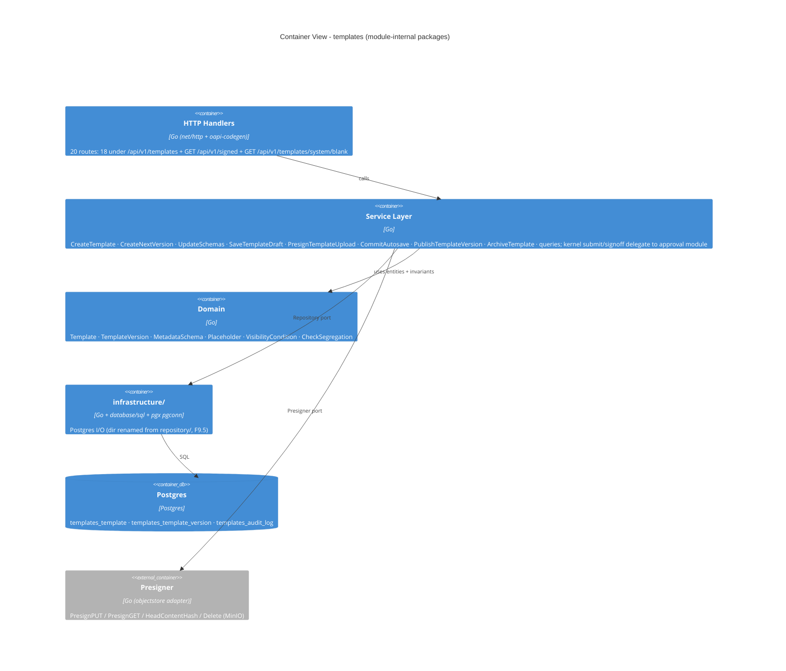

# Module: templates

> Living architecture doc. Arc42 (12 sections) + C4 (Context/Container) Mermaid diagrams + ADR links.
>
> **Naming note:** module dir is `internal/modules/templates/` and routes still mount under `/api/v1/templates`. Plan 2 (commits ae1229e8..c84215f7) flipped *some* modules to `/api/v1/`; templates is **not yet flipped**. This doc reflects on-disk state. Rename to `templates.md` (and `internal/modules/templates/`, `/api/v1/templates`) lands in a single follow-up commit (see `backlog/templates-refactor.md#R-101`).

**Last verified:** 2026-08-04 (ADR 0088 — template version content is always materialized: `CreateTemplate` (`application/create.go:81-169`) now materializes version 1's docx object PRE-TX by copying the system blank asset (`materializeFromSystemBlank`, new `application/system_blank.go`) and constructs the version WITH the resulting verified hash — a template version can no longer exist without content, so §8.9a below is rewritten from "lazy-provision-on-first-autosave" to the store-then-reference contract. `spawnNextDraft` (`application/lifecycle.go:184`) likewise now Confirms its copy and carries the real hash forward instead of leaving `ContentHash` empty. The `content_hash == ""` emptiness gate in `PublishTemplateVersion` (`application/lifecycle.go:52`, was `:51`) is DELETED — a blank or unchanged version now publishes like any other; §6.3's publish sequence note and §11 top-3 debt item 3 are reworded accordingly. `GetDocxURL` (`application/queries.go:69-92`, anchor corrected from stale `:61-80`) keeps its `Presigner.Exists` gate but the gate's meaning changes from "is the lazily-provisioned object there yet" to "detect genuine store-side loss" — the dead empty-`DocxStorageKey` branch it used to sit behind is also deleted (the column is `NOT NULL` and always populated from `templateDocxKey`). DB: migration `0317_template_version_content_hash_always.sql` replaces the conditional CHECK `chk_template_version_content_hash_non_draft` with an unconditional `length(content_hash) = 64` (baseline dump not yet regenerated — see `wiki/database/tables/templates_template_version.md`). See [ADR 0088](../decisions/0088-template-version-content-always-materialized.md). Evidence: commit `2afba713`.) | **Prior:** 2026-07-16 (ROADMAP unit blank-docx Option B, slice B — `GetDocxURL` (`internal/modules/templates/application/queries.go:61-80`) now gates the presigned-GET path on **object existence**, not just a non-empty `DocxStorageKey`: after the existing empty-key branch, it calls the new `Presigner.Exists(ctx, key)` port method (satisfied in production by `*objectstore.VerifiedStore.Exists`, `StatObject`-based, `internal/platform/objectstore/verified_store.go:235`); `Exists` error → fails closed (raw error propagated, mapped to 500, never masked as missing); `exists == false` → `domain.ErrUploadMissing`, mapped to RFC 9457 409 `problem.CodeUploadMissing` by `delivery/http/errors.go:67` (pinned by `errors_test.go:28`); `exists == true` → presigned GET URL as before. Closes the dangling-object gap where a fresh blank template's version 1 row is committed with `DocxStorageKey` already set (`create.go:63`, `templateDocxKey(tenant, id, 1)`) but no object exists in MinIO until the first autosave `Confirm` — the lazy-provision-on-first-autosave contract (see new §8.9a below). Pinned by 5 new application-layer unit tests in `application/queries_test.go` (`TestGetDocxURL_EmptyStorageKey_ErrUploadMissing`, `_ObjectMissing_ErrUploadMissing`, `_ObjectPresent_ReturnsURL`, `_ExistsError_FailsClosed`, `_CrossTenant`). Charter: `docs/superpowers/analysis/2026-06-29-blank-template-docx-provision-system-impact.md` (Option B ratified; Option A outbox-provisioning explicitly rejected as over-engineering). Note: the `docx-url` route's OpenAPI entry (`api/openapi/v1/openapi.yaml:1731-1753`) does not yet declare a `'409'` response (only 401/403/404/500) — an additive contract-lock request for this is pending with the hub; shipping the 409 undeclared is safe today because the `Problem` response schema is generic/unconstrained per-route and no runtime spec-vs-status validator is wired into this stack. Evidence: `docs/superpowers/reports/2026-07-16-unit-blank-docx-b-evidence.md`.) | prior: 2026-07-13 (ROADMAP unit 3.1a, slices S1–S5 — [ADR 0082](../decisions/0082-approval-kernel-extraction.md) "Transitional coexistence" retirement executed: `CreateTemplate` no longer seeds approval roles (S1); `PublishTemplateVersion` is kernel-driven — role-binding gate deleted, capability (`template.publish`) + identity SoD (`CheckSegregation`) only, accepts `draft`/`approved` sources, kernel-stamped `ApprovedAt` preserved (S2); publish is bodyless — `schema_key` server-derived (S2b); FE rebuilt kernel-only (`submitTemplateVersionForApproval`/`signoffTemplateVersion` wrappers), chain display degraded to 3 kernel-truth steps with honest-null actors (S3); legacy path DELETED — 4 routes/ops (`submitTemplateVersion`, `reviewTemplateVersion`, `approveTemplateVersion`, `upsertTemplateApprovalConfig` + its GET), orphan schemas, `VersionDTO.pending_reviewer_role`/`pending_approver_role`, `Service.SubmitForReview`/`Review`/`Approve`, the `ApprovalConfig` domain type, and 3 repo methods all gone (S4); `CapTemplateReview` retired — capability registry 40→39 — and `templates_approval_config` DROPPED behind a pre-drop emptiness assert (migration 0302); 3 seed grant rows removed (S5). The kernel (`submit-for-approval` → `signoff` approve/reject → `publish`) is now the **only** approval path — §5.3/§5.4/§6.3/§8.1 below rewritten accordingly; §5.4a deleted. `pending_reviewer_role`/`pending_approver_role` columns still exist on `templates_template_version` (write-never/read-never, named debt, ratified out of the migration-0302 drop list — see §11 T-004). Evidence: `docs/superpowers/reports/2026-07-13-unit-3.1a-evidence.md`.) | prior: 2026-07-12 (M3 approval-kernel-extraction wiki-sync: two new additive kernel routes `POST .../submit-for-approval` + `POST .../signoff` documented in §5.3 route table + new §5.4a "transitional coexistence" section — the kernel is backend truth for template approval but the 4 legacy role-based routes (`submit`/`review`/`approve`/`approval-config`) are untouched and still the only path the frontend calls; retirement deferred to ROADMAP unit 3.1a per [ADR 0082](../decisions/0082-approval-kernel-extraction.md) "Transitional coexistence"; `CreateTemplate`/`PublishTemplateVersion` confirmed still role-based (`create.go:83`, `lifecycle.go:421-427`) — not touched by M3) | prior: 2026-07-06 (F9.4 doc-truth pass: F9.5 `repository/`→`infrastructure/` rename — `infrastructure/postgres.go` (Repository/New/GetTemplate unchanged line numbers, re-verified), `infrastructure/mappers.go:18` (`scanTemplateRead`); C4 container + §4 Solution Strategy prose relabeled; `routes_mapping.go:122/:147` re-verified unchanged) | prior: 2026-07-03 (ADR 0065 cutover — `TemplateDTO` version pointers are now nested value objects: compact `latest_version`/`published_version` are `TemplateVersionRef {id, number, revision_number, status}`; the four coupled flat scalars `latest_revision_number`/`published_version_id`/`published_version_number`/`current_revision_number` are removed from `TemplateDTO`. `getTemplate`'s detail envelope is unchanged — `GetTemplateResponse.data.latest_version` still carries the full `VersionDTO`. Read/write split: repository now returns `domain.TemplateRead` (`Template` + `Latest domain.VersionRef` + `Published *domain.VersionRef`, new file `domain/read_model.go`); `domain.Template` dropped its projection scalars and is the write aggregate only. `repository/postgres.go` GetTemplate/GetTemplateByKey/ListTemplates now double-join `templates_template_version` (aliases `lv`/`pv`) and scan into the read model via `scanTemplateRead` (`repository/mappers.go:18`). Mapper gained `toAPIVersionRef` (`routes_mapping.go:122`) and `toAPITemplateDTO(*domain.TemplateRead, …)` (`routes_mapping.go:147`). See `wiki/decisions/0065-version-references-are-nested-value-objects.md`.) | **Prior:** 2026-07-01 (DOC-01 drift fix: corrected stale "auto-spawned vN+1 draft after publish" line in §Version chip source-of-truth to reflect ADR 0052 manual versioning) | **Prior:** 2026-06-30 (ADR 0052 + ADR 0053 — manual versioning only: `Approve`/`PublishTemplateVersion` transition status only; `CreateNextVersion` is the sole revision path; `next_draft*` dropped from contract; status `in_review` renamed to `under_review`; templates render through shared controlled-artifact view layer with `TemplateDetailRoute` + `TemplateApprovalRoute`; inline `VersionActionPanel` removed from approval surface; prior: ADR 0050 — `/placeholder-catalog` and `ValidatePlaceholders` both derived from `render/domain.ComputedCatalog()` single source; hand-maintained 7-key slices deleted; `approval_date` now author-visible; templates→render/domain legal edge; prior: 2026-06-28 SP-1 cross-link to tokens module added) | **Prior:** 2026-06-15 (M4/F4.2 — port ADR 0030 cross-link: `TemplateVersionPort` extended with `GetTemplateVersionState`; raw state now exposed to controlled-documents without cross-module SQL) | **Prior:** 2026-06-12 (Wave 2.12: `db==nil` dual-mode branches removed from autosave/create/lifecycle/schema/approval_config application services — single-mode only; `CreateTemplateTx` no longer writes `areas`/`visibility`/`specific_areas` (dropped by migration 0236); nodualmode CI guard. Prior Wave 2: AppendAuditTx before commit; typed CapTemplate* consts; upsertApprovalConfig tier-1 fixed template.admin→CapTemplateEdit; publish route tier-1 aligned to CapTemplatePublish; post-publication role gate fixed phantom admin→system_admin/qms_admin; CompositionConfig deleted; legacy areas/visibility columns removed from CreateTemplate INSERT. Prior: Wave 1: F-07-sub-split — ListAudit reads metaldocs.audit_events; version_id now carried in audit payload) | prior: 2026-06-10 (P2 consolidation: �3/�5 C4 fragments tagged as module-scoped with pointer to canonical diagrams; added Failure modes section) | prior: 2026-05-31 (fix/templates-schema-occ-lock: PUT /schema lock-version CAS � `expected_lock_version` required on the contract, `UpdateVersionSchemaCAS`/`Tx` enforce CAS, 412 `stale_lock_version` on miss; FE useTemplateSchemas holds lockVersion, surfaces staleConflict + refetch � multi-tab last-write-wins closed) | prior: 2026-05-29 (feat/templates-rev-labels: ADR 0013 � first-class `revision_number` column on `templates_template_version` + `current_revision_number` on TemplateDTO; FE renders REV{nn} via shared `formatRevisionCode`; bug/templates-version-chip: honest chip via `published_version_number`; qa/templates-list: empty-state i18n fix + dead `updated_at` cast removal in `TemplatesListPage.tsx`) | **Owner:** unassigned | **Status:** active (production module; generated OpenAPI surface for 22 template routes; Plan 3 tenant-context sweep applied; Plan 5 wired authz.Require + tripwire on lifecycle/create paths; 2026-05-17 wired the autosave/import commit paths to the same tripwire contract and removed creator-scoped template-use visibility from runtime/API selection behavior; 2026-05-26 added optimistic concurrency on lifecycle version updates and aligned local lifecycle capability checks with the route permission table; 2026-05-29 added `published_version_number` to TemplateDTO so the list-page version chip reflects the *published* version, not the auto-spawned draft `latest_version`; 2026-05-29 promoted `revision_number` to a persisted column per ADR 0013 so REV chip labels are backend-canonical and never computed in the FE) | **Maturity:** L3

### Version chip source-of-truth (2026-05-29)

`latest_version` advances on every draft spawn — as of ADR 0052, that is only the explicit `CreateNextVersion` action (`POST /api/v1/templates/{id}/versions`); publish/approve no longer auto-spawn a `vN+1` draft. Per **ADR 0013**, the chip is rendered from a **persisted, backend-canonical `revision_number` column** on `templates_template_version`. As of **ADR 0065**, the wire value is `TemplateDTO.published_version.revision_number` — nested inside the `TemplateVersionRef` object, not a flat `current_revision_number` scalar (removed). `published_version` is required-and-nullable: `null` when nothing is published yet. FE never computes the value — it formats via `formatRevisionCode(n)` → `REV{nn}`. Draft-only templates render **no REV chip** (honesty rule). See:

- `db/migrations/0233_templates_template_version_revision_number.sql` — column + backfill (`version_number - 1`) + `ux_templates_version_revision` unique index per template
- `internal/modules/templates/domain/version.go:39` — `TemplateVersion.RevisionNumber int`
- `internal/modules/templates/domain/read_model.go:7` — `VersionRef.RevisionNumber int` (the nested-ref carrier, ADR 0065); `domain.Template` (`template.go`) no longer carries a revision-number projection field
- `internal/modules/templates/infrastructure/postgres.go:88` — GetTemplate double-joins `templates_template_version` (`lv`/`pv` aliases) and scans `pv.revision_number` into the read model via `scanTemplateRead` (`infrastructure/mappers.go:18`)
- `internal/modules/templates/delivery/http/routes_mapping.go:122` — `toAPIVersionRef` maps `domain.VersionRef` → `templatesapi.TemplateVersionRef`
- `api/openapi/v1/openapi.yaml:5775` — `TemplateVersionRef` schema; `:5788` — `TemplateDTO.published_version`/`latest_version`
- `frontend/apps/web/src/lib/labels/revisionCode.ts` — shared formatter (documents + templates)
- `frontend/apps/web/src/features/templates/TemplatesListPage.tsx` — chip composition
- `frontend/apps/web/src/features/documents/components/wizard/steps/StepTemplate.tsx` + `StepConfirm.tsx` — wizard chip rendering
- `frontend/apps/web/src/features/templates/__tests__/TemplatesListPage.versionChip.test.tsx` — 4-state fixture coverage

> **Plan 12.4 route truth:** `api/openapi/v1/openapi.yaml`, `internal/modules/templates/api/api.gen.go`, and `frontend/apps/web/src/lib/api-types/index.d.ts` include the mounted template route set, including typed `GET /api/v1/templates/placeholder-catalog`. Several generated methods still delegate to existing internal handler bodies.

### Editor variable palette — unified computed + dictionary catalog (2026-06-29, ADR 0050)

The template-editor "Variáveis" panel surfaces **two kinds** of tokens behind one unified model:

- **Computed** (`Preenchido pelo sistema (seguro)`) — the 8 author-visible tokens from `GET /api/v1/templates/placeholder-catalog` (derived from `render/domain.ComputedCatalog()`, incl. `{approval_date}`).
- **Dictionary** (`Definido pela sua organização`) — per-tenant constants from `GET /api/v1/tokens` (`tokens` module). Hidden when the tenant has none.

Frontend wiring (all under `frontend/apps/web/src/features/templates/`):
- `tokens/tokenCatalog.ts` — `Token { key; label; description?; kind: 'computed' | 'dictionary' }` discriminated model + pure `toUnifiedTokens(computed, dictionary)` adapter.
- `tokens/useTokenCatalog.ts` — composes `usePlaceholderCatalogQuery()` + `useTokensQuery()`; returns `{ tokens, computedFailed, dictionaryFailed }`.
- `AvailableTokensPanel.tsx` — renders the two kind-tagged sections.
- `pages/TemplateEditorPage.tsx` — consumes the unified catalog; dictionary keys count as **known** in `lib/tokens.ts` partition, so inserting `{COMPANY_NAME}` is not flagged under "Tokens não reconhecidos".

---

## 1. Introduction & Goals

`templates` owns the lifecycle of DOCX-based document templates: authoring (DOCX upload + placeholder schema), versioning, kernel-driven approval (submit → signoff → publish; ADR 0082), publishing, and obsoletion of the previous published version. Every document instance in MetalDocs is instantiated from a *published* template version — `documents` is the downstream consumer that snapshots `placeholder_schema` at finalize.

### 1.1 Requirements overview

- **Authoring of regulated DOCX templates** with eigenpal-native `{name}` placeholders restricted to the fixed 8-token computed catalog (per `wiki/concepts/placeholders.md`, ADR 0008 amended by ADR 0050; catalog derived from `render/domain.ComputedCatalog()`).
- **Kernel-driven approval lifecycle** (`draft → under_review → approved → published`, with `obsolete` for superseded versions) enforcing ISO segregation of duties (per `wiki/concepts/iso-segregation.md`); the `under_review`-stage decision belongs to the approval kernel module (`internal/modules/approval`), not to `templates` itself — see §5.4.
- **Snapshot contract for downstream consumers** — published `template_version.placeholder_schema` is read by `documents` at instantiation (`wiki/modules/documents.md §8.7`).
- **Authoring identity carried on every version** — `author_id`, `reviewer_id`, `approver_id` columns are the SoD probe surface consumed by `approval` (per `wiki/modules/approval.md` SoD T-003).
- **Per-tenant isolation** — every template scoped by `tenant_id` (origin: `wiki/architecture/data-model.md`).

### 1.2 Quality Goals

| Rank | Goal | How verified |
|---|---|---|
| 1 | Tenant isolation of templates and versions | tripwire on every `templates_*` mutation; query-side tenant guard on `GetVersion*` (currently NOT met — see T-002) |
| 2 | Approval contract correctness (no self-approve, no self-publish) | `domain.CheckSegregation` invoked on every state transition — now met for `PublishTemplateVersion` too; T-004 resolved by retirement, ROADMAP unit 3.1a S2 (see §11) |
| 3 | Placeholder catalog enforcement (no template-injection) | `application.ValidatePlaceholders` rejects non-catalog `PHType` at schema save; resolver registry check on `PHComputed` (resolver registry currently NOT wired — see T-008) |

### 1.3 Stakeholders

| Role | Expectation |
|---|---|
| Author (capability: `template.submit`) | Create draft, upload DOCX, define `placeholder_schema`, submit for approval |
| Approver (capability: `template.approve`) | Kernel signoff decision (approve/reject) on the `under_review` stage — password e-signature; cannot approve own authorship (identity SoD, `CheckSegregation`) |
| Publisher (capability: `template.publish`) | Publish a `draft` (direct) or `approved` (post-signoff) version; obsoletes prior published; cannot publish own authorship (identity SoD) |
| Downstream consumer (`documents`, `approval`, `search`, `controlled_documents` controlled-documents module) | Snapshot `placeholder_schema`, read author identity, FK to `template_version_id` |

---

## 2. Architecture Constraints

- Language / runtime: Go (per repo defaults).
- Persistence: Postgres; tables created in `migrations/0120_templates_init.sql`.
- Authz: two-tier per `wiki/decisions/0007-two-tier-authz.md` — **applied Plan 5 and extended 2026-05-17** (`WithDB` builder + `authz.Require`; DOCX autosave/import commit now sets transaction GUCs before updating `templates_template_version`; DB tripwire on `templates_template` + `templates_template_version`; T-001 closed).
- API contract: OpenAPI 3.0.3 generated via oapi-codegen; Plan 12.4 generated coverage includes the mounted template route set (see T-006 closed).
- Error envelope: RFC 9457 Problem+JSON per `wiki/architecture/api-design-system.md` — **NOT applied** (see T-005).
- Placeholder syntax + catalog: per `wiki/concepts/placeholders.md` (fixed 8-type placeholder catalog) and `wiki/concepts/token-syntax.md` (`{name}` single-brace, eigenpal-native).
- Editor: eigenpal `templatePlugin` for DOCX authoring (per ADR 0001 `wiki/decisions/0001-eigenpal-adoption.md`).

---

## 3. System Scope & Context � module-scoped (C4 Level 1)

> System-level context lives in [`wiki/diagrams/c4-context.md`](../diagrams/c4-context.md). The diagram below is **module-scoped**: it shows templates' consumers (documents, approval, controlled-documents, docx-renderer) and the iam capability namespace it depends on.

```mermaid
C4Context
    title System Context � templates (module-scoped)
    Person(author, "Author", "QMS author / template editor")
    Person(reviewer, "Approver", "Capability-gated workflow actor (template.submit / template.approve / template.publish)")
    System_Boundary(b1, "MetalDocs") {
        System(tpl, "templates", "Template authoring + lifecycle")
        System(docs, "documents", "Instantiates from published templates")
        System(approval, "approval", "Probes template author for SoD")
        System(iam, "iam", "Capabilities: template.view/create/edit/submit/approve/publish")
        System(audit, "audit (canonical)", "metaldocs.audit_events")
        System(controlledDocuments, "controlled-documents", "controlled_documents FK to template_version")
        System(docxrenderer, "docx-renderer", "Reads template DOCX bytes for render")
    }
    System_Ext(pg, "Postgres", "templates_* tables")
    System_Ext(minio, "MinIO", "DOCX object storage (presigned upload/download)")

    Rel(author, tpl, "HTTP /api/v1/templates")
    Rel(reviewer, tpl, "HTTP /api/v1/templates/{id}/versions/{n}/{submit-for-approval,signoff}")
    Rel(tpl, pg, "SQL")
    Rel(tpl, minio, "Presigned PUT/GET via objectstore Presigner")
    Rel(docs, tpl, "Go: template domain types (Placeholder, TemplateVersion)")
    Rel(approval, tpl, "Go: TemplateAuthorChecker (per iam T-003)")
    Rel(controlledDocuments, tpl, "DB FK: controlled_documents.template_version_id")
    Rel(docgenv2, pg, "Raw SQL: templates_template_version (no Go import)")
```

### 3.1 Business Context

Quality teams author DOCX templates that downstream document instances inherit (placeholder schema, layout, content). A template is *not usable* until it is `published` and not yet `obsolete`. Publishing a new version automatically obsoletes the previous. ISO 9001 §7.5 places the audit-trail and approval-segregation burden on this module: who authored, who reviewed, who approved, when published.

### 3.2 Technical Context

Inbound interfaces:
- 20 HTTP routes: 18 under `/api/v1/templates/*`, plus `GET /api/v1/signed` and `GET /api/v1/templates/system/blank` (`handler.go:42-65`); Plan 12.4 routes them through generated oapi-codegen wrapper methods, with some generated methods delegating to existing internal handler bodies (see §5.3).
- Go domain types consumed by `documents` (`Placeholder`, `TemplateVersion`, `TemplateSnapshot`, `PHType` constants).

Outbound interfaces:
- Postgres: 3 owned tables (`templates_template`, `templates_template_version`, `templates_audit_log`); `templates_approval_config` DROPPED (migration 0302, ROADMAP unit 3.1a S5, [ADR 0082](../decisions/0082-approval-kernel-extraction.md)).
- MinIO: presigned PUT for DOCX/schema upload; presigned GET for DOCX retrieval (TTL 10 minutes, max object size 25 MiB hard-coded at `apps/api/cmd/metaldocs-api/main.go:327`).
- iam: capability namespace `template.*` (declared by seed) enforced at HTTP edge and/or service mutation layer for write paths; residual gaps are tracked in T-009 (T-004 resolved by retirement — see §11).
- Canonical `audit` module: `ListAudit` now reads `metaldocs.audit_events` (resource_type='template'), fixing the read-path split (Wave 1, F-07-sub-split). Write path still uses the `templates_audit_log` parallel sink for domain event writes (see T-013 for full consolidation plan). Historical `templates_audit_log` rows are an accepted seam.

---

## 4. Solution Strategy

- **Hexagonal layout** — `domain/` (entities + invariants), `application/` (use-cases + ports), `delivery/http/` (handlers + routing), `infrastructure/` (Postgres I/O; renamed from `repository/`, F9.5). No ADR; same shape as `documents` and `auth` (missing-ADR — see T-014).
- **Approval as state machine on `template_version.status`** — driver: ISO 9001 §7.5 traceability requirement. Transitions enforced by `domain.TemplateVersion.CanTransition` (`internal/modules/templates/domain/version.go`).
- **DOCX bytes via presigned MinIO PUT/GET** — driver: avoid round-tripping multi-MB DOCX through the API. Authored at `application/autosave.go`; `/templates/new` now uses create -> autosave presign -> object-store PUT -> autosave commit before opening Eigenpal for imported `.docx`.
- **Template governance stays role/capability-based** — `template.*` IAM capabilities govern create/edit/approve/publish/archive (`template.review` retired, ROADMAP unit 3.1a S5). Runtime/API selection no longer treats template creator-scoped `visibility`, `areas`, or `specific_areas` as who-can-use-this-template permission gates; document type/profile and lifecycle state drive valid template choices.
- **Placeholder validation as a security boundary** — `application/schema.go ValidatePlaceholders` enforces the fixed 8-token computed catalog (PHType enum) at schema-save. The computed set is derived from `render/domain.ComputedCatalog()` via a `sync.Once` accessor (`computedCatalogSet()`) — a hand-maintained 7-key set was deleted (ADR 0050). Resolver-key validation for `PHComputed` requires `ResolverRegistryReader`, currently nil at wiring (T-008).

  > **Computed catalog single source (ADR 0050):** both `/placeholder-catalog` and `ValidatePlaceholders` now derive their computed set from `render/domain.ComputedCatalog()`. Adding a new computed token to that function automatically updates the palette, the validator, and the parity guard without any change to this module. The computed catalog has a dictionary neighbour: see [tokens module](tokens.md) for SP-1 tenant-defined `name → value` entries (ADR 0049). Both kinds are now architecturally symmetric: each publishes a catalog from its owning module’s domain layer, composed at the editor palette. The `templates → render/domain` import edge is legal per the module boundary law (`scripts/check-module-boundaries.ps1:52`); `templates → render/resolvers` is not permitted.
- **Kernel-driven approval, single publish path (ADR 0082, ROADMAP unit 3.1a)** — `Service.Approve` (the old author-review-approve chain) is deleted; `Service.PublishTemplateVersion` (`lifecycle.go:51`) is the sole publish path, accepting a `draft` (direct-publish) or `approved` (post-kernel-signoff) source. Identity-based SoD (`CheckSegregation`) is enforced on every publish regardless of source status. See T-004 (resolved by retirement).
- **Version pointers are nested value objects, never parallel scalars (ADR 0065)** — the repository read path returns `domain.TemplateRead` (embeds the write-side `domain.Template` + `Latest`/`Published domain.VersionRef`, `domain/read_model.go`), keeping join-projection fields off the write aggregate. The HTTP mapper (`delivery/http/routes_mapping.go`) converts that read model into `TemplateDTO.latest_version`/`published_version`, both `TemplateVersionRef {id, number, revision_number, status}`; `published_version` is required-and-nullable so consumers gate on one object instead of three independently drift-able scalars. See `wiki/decisions/0065-version-references-are-nested-value-objects.md`.

---

## 5. Building Block View - module-scoped (C4 Level 2 - Container)

> System-level container topology lives in [](../diagrams/c4-container-backend.md). The diagram below decomposes the internal Go packages of templates (handlers/service/domain/repository/presigner).

### 5.1 Whitebox - templates



### 5.2 Public surface

Grouped by file. Source of truth: `_artifacts/01-surface.md` §3.

| File | Symbol | Kind | Purpose |
|---|---|---|---|
| `internal/modules/templates/domain/template.go:18` | `Template` | struct | Template write aggregate root; no longer carries join-projection scalars (revision numbers moved to the read model, ADR 0065) |
| `internal/modules/templates/domain/read_model.go:7` | `VersionRef` | struct | Compact version-reference value object (`ID`, `Number`, `RevisionNumber`, `Status`) — ADR 0065 |
| `internal/modules/templates/domain/read_model.go:18` | `TemplateRead` | struct | Read model returned by repository reads: embeds `Template` + `Latest VersionRef` + `Published *VersionRef` |
| `internal/modules/templates/domain/version.go:10` | `VersionStatusDraft`, `VersionStatusUnderReview`, `VersionStatusApproved`, `VersionStatusPublished`, `VersionStatusObsolete` | const | Version state machine (const block line 10; first value `VersionStatusDraft` at line 11) |
| `internal/modules/templates/domain/version.go:18` | `TemplateVersion` | struct | Version entity (owns DOCX key, hashes, schemas, status, identities) |
| `internal/modules/templates/domain/schemas.go:5` | `MetadataSchema` | struct | Per-version metadata schema (DocCodePattern, retention, distribution) |
| `internal/modules/templates/domain/schemas.go:27` | `PHText`, `PHDate`, `PHNumber`, `PHSelect`, `PHUser`, `PHPicture`, `PHComputed`, `PHDictionary` | const | Fixed 8-type placeholder catalog (per `wiki/concepts/placeholders.md`; const block opens at line 26) |
| `internal/modules/templates/domain/schemas.go:55` | `VisibilityCondition` | struct | Conditional placeholder visibility primitive |
| `internal/modules/templates/domain/schemas.go:61` | `Placeholder` | struct | Placeholder entity (id, type, name, options, etc.) |
| `internal/modules/templates/domain/schemas.go:81` | `CompositionConfig` | struct | **DELETED Wave 2** (was deprecated per ADR `wiki/decisions/0008-placeholder-fixed-catalog.md` — composition removed 2026-04-27; struct retained for backward compat) |
| `internal/modules/templates/domain/approval.go:19` | `CheckSegregation` | func | SoD enforcement — actor != author AND actor != reviewer (role="approver"; `SegregationRoleApprover` is the only defined role) |
| `internal/modules/templates/domain/audit.go:10` | `AuditCreated`, `AuditSaved`, `AuditSubmitted`, `AuditReviewed`, `AuditApproved`, `AuditRejected`, `AuditPublished`, `AuditObsoleted`, `AuditArchived`, `AuditRestored` | const | Audit action enum (`AuditReviewed` retained for reading historical rows; nothing writes it post-retirement) |
| `internal/modules/templates/domain/audit.go:25` | `AuditEvent` | struct | Audit row written to `templates_audit_log` |
| `internal/modules/templates/application/ports.go:19` | `Repository` | iface | Persistence port (used by service); `GetTemplate`/`GetTemplateByKey`/`ListTemplates` return `*domain.TemplateRead`/`[]*domain.TemplateRead` (ADR 0065) |
| `internal/modules/templates/application/ports.go:42` | `Presigner` | iface | Object-store port (PresignPUT/GET, HeadContentHash, Delete) |
| `internal/modules/templates/application/ports.go:49` | `Clock`, `UUIDGen`, `ResolverRegistryReader` | iface | Time / id / resolver lookup ports |
| `internal/modules/templates/application/ports.go:53` | `ListFilter` | struct | Filter for `ListTemplates` (tenant, doc_type, status, limit/offset) |
| `internal/modules/templates/application/service.go:5` | `Service` | struct | Use-case orchestrator |
| `internal/modules/templates/application/service.go:14` | `New` | func | Service constructor |
| `internal/modules/templates/application/create.go:11` | `CreateTemplateCmd`, `CreateTemplateResult` | struct | Create-template command + result |
| `internal/modules/templates/application/create.go:81` | `Service.CreateTemplate` | method | Create template + version 1 + audit (no longer seeds approval config/role bindings — ADR 0082 S1); version 1's docx is materialized PRE-TX from the system blank asset before the version struct is built — ADR 0088 |
| `internal/modules/templates/application/create.go:109` | `CreateVersionCmd` + `Service.CreateNextVersion` | struct + method | Spawn next version (clones source schemas) |
| `internal/modules/templates/application/schema.go:12` | `UpdateSchemasCmd` | struct | Schema update command |
| `internal/modules/templates/application/schema.go:84` | `ValidatePlaceholders` | func | Placeholder catalog enforcement (PHType + resolver_key when registry wired) |
| `internal/modules/templates/application/lifecycle.go:14..26` | `ArchiveCmd`, `PublishTemplateVersionCmd`, `PublishTemplateVersionResult` | struct | Lifecycle commands (`SubmitForReviewCmd`/`ReviewCmd`/`ApproveCmd` deleted — ADR 0082 S4) |
| `internal/modules/templates/application/lifecycle.go:52..231` | `Service.PublishTemplateVersion`, `Service.ArchiveTemplate` | method | Lifecycle ops; `PublishTemplateVersion` (lifecycle.go:52) accepts `draft` (direct) or `approved` (post-kernel-signoff) source — the sole publish path since `Service.SubmitForReview`/`Review`/`Approve` were deleted (ADR 0082 S4); the `content_hash == ""` emptiness gate is deleted (ADR 0088 — every version is materialized at creation, so the branch was unreachable); see §4 |
| `internal/modules/templates/application/autosave.go:13..171` | `PresignAutosaveCmd/Result`, `PresignTemplateUploadCmd`, `CommitAutosaveCmd`, `SaveTemplateDraftCmd` + their `Service` methods | struct + method | DOCX upload + autosave path |
| `internal/modules/templates/application/queries.go:51` | `GetDocxURLCmd` | struct | Presigned GET for stored DOCX; `GetDocxURL` method itself now spans `:69-92` (anchor corrected 2026-08-04 — was stale at `:61-80`), its `Exists` gate re-scoped by ADR 0088 to catch only genuine store-side loss, see §8.9a |
| `internal/modules/templates/application/visibility_graph.go:16` | `DetectVisibilityCycle` | func | Cycle check across `VisibilityCondition` graph |
| `internal/modules/templates/delivery/http/handler.go:17` | `AuthzFunc` | type | Authz callback; now wired to real `capabilityService` (T-001 closed Plan 5) |
| `internal/modules/templates/delivery/http/handler.go:19` | `Handler` | struct | HTTP handler |
| `internal/modules/templates/delivery/http/handler.go:24` | `New` | func | Handler constructor |
| `internal/modules/templates/application/service.go:22` | `WithDB` | method | Builder that injects `*sql.DB` enabling tx-backed `authz.Require` calls (added Plan 5) |
| `internal/modules/templates/delivery/http/handler.go:34` | `Handler.Register` | method | Mounts 20 routes on `*http.ServeMux` (`handler.go:34-65`) |
| `internal/modules/templates/delivery/http/errors.go:10` | `MapErr` | func | Domain error → HTTP status + code mapping |
| `internal/modules/templates/infrastructure/postgres.go:42` | `Repository` | struct | Postgres adapter implementing `application.Repository` |
| `internal/modules/templates/infrastructure/postgres.go:48` | `New` | func | Repository constructor |
| `internal/modules/templates/infrastructure/postgres.go:88` | `Repository.GetTemplate` | method | Double-joins `templates_template_version` (`lv`/`pv`) for latest/published refs; returns `*domain.TemplateRead` (ADR 0065) |
| `internal/modules/templates/infrastructure/mappers.go:18` | `scanTemplateRead` | func | Scans the twin-join projection into `domain.TemplateRead` |
| `internal/modules/templates/delivery/http/routes_mapping.go:122` | `toAPIVersionRef` | func | Maps `domain.VersionRef` → `templatesapi.TemplateVersionRef` (ADR 0065) |
| `internal/modules/templates/delivery/http/routes_mapping.go:147` | `toAPITemplateDTO` | func | Maps `*domain.TemplateRead` → `templatesapi.TemplateDTO`; `published_version` stays required-and-nullable (present-and-null) |
| `internal/modules/templates/api/api.gen.go:*` | `ServerInterface`, `StrictServerInterface`, `*RequestObject`, `*ResponseObject`, `Handler*`, `NewStrictHandler*`, `GetSwagger`, `GetSpec`, etc. | iface + struct + func | oapi-codegen generated surface |

`(undocumented)`: every exported symbol above lacks a Go doc comment (per `_artifacts/01-surface.md` §3). See T-014.

### 5.3 HTTP operations

Source: `internal/modules/templates/delivery/http/handler.go` and Plan 12.4 generated contract refresh. All routes mount under `/api/v1/templates` unless noted. Generated wrapper methods are the route entrypoint; several wrapper methods intentionally delegate to pre-existing internal handler bodies.

**Retirement executed (ROADMAP unit 3.1a, 2026-07-13):** the legacy role-based approval path (`submit`/`review`/`approve`/`approval-config`, previously documented here as a "transitional coexistence" alongside the kernel routes) is deleted outright. The kernel path below (`submit-for-approval` -> `signoff`) is the only approval path. See the [ADR 0082](../decisions/0082-approval-kernel-extraction.md) execution note and `docs/superpowers/reports/2026-07-13-unit-3.1a-evidence.md`.

| Method | Path | OperationID | Generated method | Runtime body | Authz / idempotency notes |
|---|---|---|---|---|---|
| GET | `/api/v1/signed` | `redirectSignedUrl` | `RedirectSignedUrl` | generated helper | signed redirect helper |
| GET | `/api/v1/templates` | `listTemplates` | `ListTemplates` | generated query body | read path |
| POST | `/api/v1/templates` | `createTemplate` | `CreateTemplate` | generated create body | `h.idempotent`; HTTP `template.create`; service `CapTemplateCreate` |
| GET | `/api/v1/templates/{id}` | `getTemplate` | `GetTemplate` | delegates to `h.getTemplate` | HTTP `template.view` |
| GET | `/api/v1/templates/{id}/versions/{n}` | `getTemplateVersion` | `GetTemplateVersion` | generated query body | read path |
| POST | `/api/v1/templates/{id}/versions` | `createTemplateVersion` | `CreateTemplateVersion` | delegates to `h.createNextVersion` | HTTP `template.create` |
| PUT | `/api/v1/templates/{id}/versions/{n}/draft` | `saveTemplateDraft` | `SaveTemplateDraft` | generated draft body | HTTP `template.edit` |
| PUT | `/api/v1/templates/{id}/versions/{n}/schema` | `updateTemplateSchema` | `UpdateTemplateSchema` | delegates to `h.updateSchemas` | HTTP `template.edit` |
| POST | `/api/v1/templates/{id}/versions/{n}/docx-upload-url` | `presignTemplateDocxUploadUrl` | `PresignTemplateDocxUploadUrl` | generated presign body | HTTP `template.edit` |
| POST | `/api/v1/templates/{id}/versions/{n}/schema-upload-url` | `presignTemplateSchemaUploadUrl` | `PresignTemplateSchemaUploadUrl` | generated presign body | HTTP `template.edit` |
| POST | `/api/v1/templates/{id}/versions/{n}/autosave/presign` | `presignTemplateAutosave` | `PresignTemplateAutosave` | delegates to `h.presignAutosave` | HTTP `template.edit` |
| POST | `/api/v1/templates/{id}/versions/{n}/autosave/commit` | `commitTemplateAutosave` | `CommitTemplateAutosave` | delegates to `h.commitAutosave` | HTTP `template.edit` |
| POST | `/api/v1/templates/{id}/versions/{n}/publish` | `publishTemplateVersion` | `PublishTemplateVersion` | bodyless (S2b — `schema_key` server-derived, never client input) | `h.idempotent`; HTTP `CapTemplatePublish`; service `CapTemplatePublish` (Tier 2) + identity SoD (`CheckSegregation`) — role-binding gate deleted (T-004 resolved by retirement, ADR 0082 S2); accepts `draft`\|`approved` source |
| POST | `/api/v1/templates/{id}/archive` | `archiveTemplate` | `ArchiveTemplate` | delegates to `h.archiveTemplate` | HTTP `template.archive`; service edit cap |

| POST | `/api/v1/templates/{id}/versions/{n}/submit-for-approval` | `submitTemplateVersionForApproval` | `SubmitTemplateVersionForApproval` (`routes_approval_kernel.go:33`) | delegates to `approvalapp.TemplateSubmitService.SubmitTemplateVersionForReview` | tier-1 `CapTemplateSubmit`; the sole submit route since legacy `submit` was deleted (ADR 0082 S4) |
| POST | `/api/v1/templates/{id}/versions/{n}/signoff` | `signoffTemplateVersion` | `SignoffTemplateVersion` (`routes_approval_kernel.go:87`) | delegates to `approvalapp.DecisionService.RecordSignoff` | tier-1 `CapTemplateApprove`; the sole approval-decision route since legacy `review`/`approve` were deleted (ADR 0082 S4) — no `content_hash` in the request (template versions never freeze; content identity read server-side) |
| GET | `/api/v1/templates/{id}/versions/{n}/docx-url` | `getTemplateDocxUrl` | `GetTemplateDocxUrl` | delegates to `h.getDocxURL` | HTTP `template.view` |
| GET | `/api/v1/templates/{id}/audit` | `listTemplateAudit` | `ListTemplateAudit` | delegates to `h.listAudit` | HTTP `template.view` |
| GET | `/api/v1/templates/placeholder-catalog` | `listTemplatePlaceholderCatalog` | `ListTemplatePlaceholderCatalog` | delegates to `h.listPlaceholderCatalog` | public catalog response typed as `PlaceholderCatalogResponse` |
| GET | `/api/v1/templates/system/blank` | `getSystemBlankTemplate` | `GetSystemBlankTemplate` | generated helper | system-owned blank template lookup (`handler.go:62`) |

Module contract status: Plan 12.4 route/spec/generated coverage refreshed. Remaining debt is behavioral hardening, replay auditing, and stricter response schemas on routes whose wrappers still delegate to legacy bodies.
Owner: leandro

---

## 6. Runtime View (selected scenarios)

### 6.1 ListTemplates (read) — `GET /api/v1/templates`

Source: `_artifacts/02-flow-list.md` + `repository/postgres.go:114-127`.

```mermaid
sequenceDiagram
    autonumber
    participant C as Client
    participant H as Handler
    participant S as Service
    participant R as Repository
    participant DB as Postgres
    C->>H: GET /api/v1/templates
    H->>H: tenantIDFromReq(r) → tenant.FromContext (Plan 3: no longer reads X-Tenant-ID header)
    H->>H: authz(r, tenant, area, action) → real capability check (T-001 closed Plan 5)
    H->>S: List(ctx, ListFilter{TenantID, DocTypeCode, Limit, Offset})
    S->>R: ListTemplates(ctx, filter)
    R->>DB: SELECT FROM templates_template WHERE tenant_id = $1 AND ... LIMIT $3 OFFSET $4 (repository/postgres.go:114-127)
    DB-->>R: rows (bounded by LIMIT/OFFSET from filter)
    R-->>S: []*domain.Template
    S-->>H: list
    H-->>C: 200 JSON {"templates":[...]}
```



Failure modes:

| Condition | HTTP | Body |
|---|---|---|
| empty result | 200 | `{"templates":[]}` |
| db error | 500 | `{"error":{"code":"internal","message":"..."}}` (legacy envelope — T-005) |
| tenant not in context (no active session) | 500 | `INTERNAL_ERROR` — `tenant.FromContext` returns `ErrTenantMissing`; resolved by T-003 fix (Plan 3) |

### 6.2 UpdateSchema (write — placeholder catalog enforcement) — `PUT /api/v1/templates/{id}/versions/{n}/schema`

Source: `_artifacts/02-flow-update-schema.md` + `application/schema.go:84` + `application/lifecycle.go:14`.

```mermaid
sequenceDiagram
    autonumber
    participant C as Client
    participant H as Handler
    participant S as Service
    participant V as ValidatePlaceholders
    participant R as Repository
    participant DB as Postgres
    C->>H: PUT .../schema {metadata, placeholders}
    H->>H: tenantIDFromReq, userIDFromReq, authz no-op
    H->>S: UpdateSchemas(cmd)
    S->>S: GetTemplate(tenant, id) — tenant gate
    S->>S: GetVersion(template_id, n) — NO tenant arg (T-002)
    S->>V: ValidatePlaceholders(placeholders, ResolverRegistryReader)
    Note over V: registry is nil at wiring (T-008) → resolver_key skipped
    V-->>S: ok
    S->>R: UpdateVersion(version)  -- authz.Require-backed tx for autosave/import commit paths
    R->>DB: UPDATE templates_template_version SET ...
    S->>R: AppendAudit(AuditSaved)
    R->>DB: INSERT templates_audit_log
    H-->>C: 204 or legacy error
```



Failure modes:

| Condition | HTTP | Body |
|---|---|---|
| non-catalog `PHType` | 422 | `{"error":{"code":"invalid_placeholder","message":"..."}}` |
| version not in draft | 409 | `{"error":{"code":"invalid_state_transition","message":"..."}}` |
| stale draft save lock | 412/409 equivalent mapped error | `SaveTemplateDraft` uses `UpdateVersionDraftCAS`; legacy `/autosave/commit` remains hash-gated rather than lock-version gated |

### 6.3 Lifecycle state machine + publish

Source: `_artifacts/02-flow-publish.md` + `application/lifecycle.go`.

State transitions on `templates_template_version.status`:

| From | To | Trigger | Authz cap | SoD check |
|---|---|---|---|---|
| draft | under_review | `POST .../submit-for-approval` (kernel) | `template.submit` | -- (no actor restriction at submit) |
| under_review | approved | `POST .../signoff` (approve) | `template.approve` | identity SoD `CheckSegregation(approver, actor, author)` -- actor != author |
| under_review | draft | `POST .../signoff` (reject) | `template.approve` | -- |
| draft | published | `POST .../publish` (`PublishTemplateVersion`, direct source) | `template.publish` (Tier 1 + Tier 2) | identity SoD `CheckSegregation` -- no role-binding (removed 3.1a S2) |
| approved | published | `POST .../publish` (`PublishTemplateVersion`, post-signoff source) | `template.publish` (Tier 1 + Tier 2) | identity SoD `CheckSegregation` |
| published | obsolete | side-effect of `PublishTemplateVersion` (`ObsoletePreviousPublished`) | implicit | -- |
| any | (template.archived_at NOT NULL) | `POST .../archive` | `template.edit`/`template.archive` | -- |

Publish sequence (`Service.PublishTemplateVersion`, `lifecycle.go:52`):

```mermaid
sequenceDiagram
    autonumber
    participant C as Client
    participant H as Handler
    participant S as Service
    participant R as Repository
    participant DB as Postgres
    C->>H: POST .../publish
    H->>S: PublishTemplateVersion(cmd)
    S->>R: GetTemplate(tenant, id)
    S->>R: GetVersion(id, n) — no tenant arg
    Note over S: if status != draft → 409
    Note over S: CheckSegregation(approver) + authz.Require(template.publish) -- identity SoD only, no role-binding (removed 3.1a S2); no content_hash gate -- ADR 0088 deleted it, every version is materialized at creation
    S->>R: ObsoletePreviousPublished(template_id, new_version_id)
    R->>DB: UPDATE templates_template_version SET status='obsolete' WHERE ...
    Note over S,DB: NOT in same tx (T-007) — race window for concurrent publish
    S->>R: UpdateTemplate(template.PublishedVersionID = new)
    R->>DB: UPDATE templates_template
    S->>R: UpdateVersion(version.status = published)
    R->>DB: UPDATE templates_template_version
    S->>R: AppendAudit(AuditPublished)
    R->>DB: INSERT templates_audit_log
    Note over S: AuditObsoleted constant exists; never written for the obsolete side-effect
    S-->>H: PublishTemplateVersionResult{PublishedVersion}
    H-->>C: 200
```

`Service.PublishTemplateVersion` (`lifecycle.go:51`) is now the sole path to `published` — from either a `draft` (direct-publish) or `approved` (post-kernel-signoff) source status. It updates head pointers, appends the audit event, and returns `PublishTemplateVersionResult{PublishedVersion}` only. No next draft is auto-spawned — use `POST /api/v1/templates/{id}/versions` (`CreateNextVersion`) to start a new revision deliberately (ADR 0052).

Failure modes:

| Condition | HTTP | Body |
|---|---|---|
| version not in draft | 409 | `{"error":{"code":"invalid_state_transition","message":"..."}}` |
| concurrent publish race | 200 (both succeed) | DB ends with two `published` rows briefly, then `obsolete`-on-next-write (T-007) |
| Idempotency-Key replay | depends on first-call landing state | create path requires/sends the header; same-key replay audit remains open (T-009) |

---

## 7. Deployment View

- Binary: `apps/api/cmd/metaldocs-api`
- Process: single Go server, port `:8081` (per `wiki/references/local-dev-startup.md`)
- Migrations: applied at startup via the global `migrations/` directory (golang-migrate; per `wiki/architecture/data-model.md`); no module-local `migrations/` subdirectory.
- Environment / config: `MinioClient`, `MinioBucket`, max object size `25*1024*1024` — all consumed at `apps/api/cmd/metaldocs-api/main.go:327`. No env vars or feature flags read inside `internal/modules/templates/**` (per `_artifacts/03-deps.md` §4).

---

## 8. Cross-cutting Concepts

### 8.1 Authentication & Authorization

- Tier 1 (HTTP edge): `CapabilityService` now wired — `AuthzFunc` receives real `capabilityService` check (T-001 closed Plan 5).
- Tier 2 (in-tx): `internal/modules/iam/authz.Require` called in `CreateTemplate`, template lifecycle mutations, `SaveTemplateDraft`, and `CommitAutosave` when `s.db != nil` (injected via `WithDB`). The 2026-05-17 repair added transaction-local tenant/actor GUC setup and `template.edit` assertion around DOCX import/autosave commits so the tripwire accepts `templates_template_version` updates. As of 2026-05-26, local lifecycle mutations are aligned with the route permission table: submit uses `template.submit`, approve uses `template.approve` (kernel signoff), publish uses `template.publish`, and archive uses `template.archive` (`template.review` retired, ROADMAP unit 3.1a S5).
- Postgres tripwire: `db/migrations/0231_db_hardening_tripwire_and_dead_schema.sql:88-93` attaches `trg_require_cap_asserted` to `public.templates_template` and `public.templates_template_version`.
- Capabilities in seed (`migrations/0165_role_capabilities_reseed.sql`): `template.view/create/edit/submit/approve/publish` mapped to `viewer/editor/author/approver/system_admin` — currently advisory only. See T-001.

- **Frontend defense-in-depth gate (2026-05-31, updated ADR 0053)**: `frontend/apps/web/src/features/templates/lib/canActOnVersion.ts` exposes `canSubmit/canApprove/canPublish` returning `{ allowed, reason }`. `TemplateEditorPage` (Submeter) and `TemplateApprovalRoute` (Approve/Reject/Publish — replaces the removed inline `VersionActionPanel`) consume the gate via `disabled + title` so users see why a button is unavailable (status / capability / role-binding mismatch). Backend remains the sole enforcer (`wiki/concepts/authz-tiers.md`); the FE hint is fed by `CurrentUser.capabilities` (added to `/api/v1/auth/me` + `/login`) — `iamapp.CapabilityService.CapsByUserID` resolves the union of direct + group role capabilities, with `system_admin` short-circuiting to `iamdomain.AllCapabilities()`.
### 8.2 Error envelope

- All non-2xx responses: legacy `{"error":{"code","message"}}` via `httpresponse.WriteJSON` (`delivery/http/handler.go:95-102`). RFC 9457 Problem+JSON not adopted. See T-005.

### 8.3 Idempotency

- Generated mutation wrappers include idempotency wiring on the active create path; Plan 12.4 verified `POST /api/v1/templates` with `Idempotency-Key` returning HTTP 201. Same-key replay behavior across create/publish/submit-for-approval/signoff still needs a focused audit. See T-009.

### 8.4 Pagination

- `ListTemplates` accepts `Limit` and `Offset` on `ListFilter` and the repository query applies `LIMIT $3 OFFSET $4` (`repository/postgres.go:114-127`). Handler wires these from query parameters. No cursor / keyset pagination. See T-011.

### 8.5 Logging & Observability

- No structured logging in module code; `MapErr` returns codes consumable by error-UX (`wiki/concepts/error-ux.md`). No metrics, no traces.
- Audit trail: `ListAudit` reads `metaldocs.audit_events` (Wave 1); domain-event writes still go to `templates_audit_log` (T-013 open for full migration). Historical rows in `templates_audit_log` are an accepted seam. **Wave 2:** `AppendAuditTx` called inside commit transaction before `Commit()` — audit row and state transition are now atomic.

### 8.6 Concurrency / Transactions

- Repository methods take `context.Context` and call `*sql.DB.ExecContext` directly — **no `pgx.Tx` parameter, no transactional wrapping at the service layer**.
- Multi-step operations (publish, create) emit 3–5 statements as independent `ExecContext` calls. Partial-failure leaves inconsistent state and missing audit rows. See T-007.
- Draft save optimistic locking is enforced for `SaveTemplateDraft` through `UpdateVersionDraftCAS`; as of 2026-05-26 the shared `UpdateVersion` / `UpdateVersionTx` path also enforces `lock_version` compare-and-swap for lifecycle state changes so stale version transitions fail with `ErrStaleLockVersion` instead of silently clobbering newer state. As of 2026-05-31 (fix/templates-schema-occ-lock), `PUT /api/v1/templates/{id}/versions/{n}/schema` is also lock-version gated: the contract now requires `expected_lock_version`, the service calls `UpdateVersionSchemaCAS` / `UpdateVersionSchemaCASTx`, and CAS misses return HTTP 412 RFC 9457 `code: "stale_lock_version"`. Two concurrent editors can no longer silently last-write-wins each other; the FE surfaces the stale conflict and lets the user refetch. The legacy `/autosave/commit` route remains content-hash gated and does not carry a lock version. See T-010.

### 8.7 Tenant scoping

- `tenantIDFromReq(r)` (handler.go:83) now calls `tenant.FromContext` — Plan 3 resolved T-003 (header trust removed).
- `Repository.GetVersion(ctx, tenantID, templateID, n)` (`repository/postgres.go:258`) and `GetVersionByID(ctx, tenantID, id)` (`repository/postgres.go:279`) both accept a `tenantID` argument; tenant isolation is enforced at the query level. The service layer additionally fronts these with `GetTemplate(tenant, template_id)` as a secondary gate at most call sites — `CreateNextVersion` (`create.go:126`) bypasses the gate when `template.PublishedVersionID` is non-nil, calling `GetVersionByID` directly. See T-002.

### 8.8 Placeholder catalog enforcement

- `application.ValidatePlaceholders` (`schema.go`) is the only catalog gate. It enforces the `PHType` enum (`PHText/Date/Number/Select/User/Picture/Computed/Dictionary`). The valid computed-name set is derived from `render/domain.ComputedCatalog()` via `computedCatalogSet()` (ADR 0050 — replaces the former hand-maintained 7-key `placeholderCatalogSet`).
- For `PHComputed`, the resolver_key string is intended to be checked against `ResolverRegistryReader` — wired `nil` (per `_artifacts/03-deps.md` §3), so the check is skipped at runtime. See T-008.
- **SP-2: `PHDictionary` ("dictionary") placeholder type** (ADR 0049 D2/D5). A template may declare a dictionary reference with `type: "dictionary"` and a `name` field (the dictionary entry name, `^[A-Za-z0-9_]+$`, 1-64 chars). Validation rules at schema-save:
  - The `name` must **not** equal any native/computed resolver key (8 keys including `approval_date`). Violation -> `ErrPlaceholderReservedName` (422).
  - A `PHDictionary` entry must **not** carry `resolver_key` or `computed: true`. Violation -> `ErrPlaceholderDictionaryInvalid` (422).
  - **No dictionary-existence check at template-save** (D6 from ADR 0049): `templates` remains decoupled from `tokens`. SP-3 UI performs a live `GET /tokens` lookup to surface broken references to authors.
  - At document creation, `documents`/`controlleddocuments` resolve `PHDictionary` references off-tx via `DictionaryReader` and pin values into `document_placeholder_values` (`source='dictionary'`). Missing entry -> 422 `DICTIONARY_TOKEN_MISSING`.
- Template-injection blast radius: a malicious resolver_key on a published template propagates to every document instantiated from that version (per `wiki/modules/documents.md §8.7` snapshot path).
---

### 8.9 Frontend view layer (ADR 0053)

Templates now render through the **shared controlled-artifact view layer** (ADR 0053). Clicking a template in the list routes to `TemplateDetailRoute` — the shared `ArtifactDetailView` shell — matching the document detail experience. The eigenpal editor is reached only via an explicit "Editar modelo" action from that screen.

Key files:
- `frontend/apps/web/src/features/templates/pages/TemplateDetailRoute.tsx` — thin route wrapper; calls `useTemplateArtifact`, owns `useState`/dialogs, passes `heroActions`/`aside`/`extras` slots to the shell.
- `frontend/apps/web/src/features/templates/pages/TemplateApprovalRoute.tsx` — thin approval route wrapper; calls `useTemplateApprovalArtifact`.
- `frontend/apps/web/src/features/templates/adapters/useTemplateArtifact.ts` — fetches template data, maps to `ArtifactViewModel`; all template-specific business rules live here.
- `frontend/apps/web/src/features/templates/adapters/useTemplateApprovalArtifact.ts` — approval-surface adapter.
- `frontend/apps/web/src/features/shared/controlled-artifact/` — shell components (`ArtifactDetailView`, `ArtifactDetailLayout`, `ArtifactHero`, `ArtifactHeroCard`, `ArtifactMetaSidebar`, `ArtifactApprovalScreen`, `VersionTimeline`) and `types.ts` (`ArtifactViewModel` contract).

The inline `VersionActionPanel` component (previously embedded in `TemplateEditorPage`) has been removed; approval actions now live in `TemplateApprovalRoute` via the shell's action model. See `wiki/architecture/frontend-structure.md` Section 17 for the four hard rules that govern the shell layer.

### 8.9a Template version content is always materialized (2026-08-04, ADR 0088)

**Superseded design note:** this section previously documented a "blank-template lazy DOCX provisioning" contract — a newly created blank template's version 1 row committed with `DocxStorageKey` populated but no object behind it in MinIO until the author's first autosave `Confirm`. [ADR 0088](../decisions/0088-template-version-content-always-materialized.md) eliminated that state by construction. The premise below is current truth as of 2026-08-04; the retired design is preserved only in the changelog entry below and in ADR 0088's own Context section.

Every template version row is now born carrying the **verified hash of the object it points at** — `content_hash` has exactly one meaning, never "the user has actually edited this". Two creation paths, one store-then-reference shape:

1. **`CreateTemplate` (`application/create.go:81`)** — before the transaction, `s.materializeFromSystemBlank(ctx, tenantID, docxKey)` (`application/system_blank.go`) copies the system-owned blank template's docx object (`Presigner.Copy`) from its reference-data storage key to version 1's own canonical key (`templateDocxKey(tenantID, templateID, 1)`), then `Presigner.Confirm`s it against the source's pinned hash. The returned verified hash is passed into `domain.NewTemplateVersionDraft(...)` — the version struct is constructed *with* its hash, never with an empty one. The system blank's storage key and hash are **not** hardcoded in Go; they are read from the system blank template's own version row (`Repository.GetSystemBlankVersion`) so the deployed asset (`deploy/assets/system-blank.docx`, seeded via `scripts/seed-system-blank-template.ps1` / compose `minio-init`) and its hash keep one source of truth in `db/reference-data`.
2. **`CreateNextVersion` → `spawnNextDraft` (`application/lifecycle.go:184`)** — copies the source version's object to the new draft's own key, then `Confirm`s it against the source's `ContentHash` (`spawnNextDraft` now fails closed with `ErrContentMaterializationFailed` if the source itself has no 64-hex hash — a corrupt/pre-migration row, never a license to spawn another content-less draft). The prior stance ("leave `ContentHash` empty so the publish gate still forces a real edit") is gone with the gate it served.

Both paths funnel through the shared primitive `copyAndConfirm` (`application/system_blank.go`) — copy PRE-TX, `Confirm` read-back, only a successful `Confirm` produces the hash. Every failure inside it — missing source row, failed copy, hash-mismatched or oversized read-back — is `domain.ErrContentMaterializationFailed`, unmapped by `delivery/http/errors.go` → default 500. That is deliberate: both callers copy bytes the server already owns, so no user input reaches this path and no failure inside it is a user error; the old code mapped these failures to the user-facing `ErrUploadMissing` sentinel, telling the user to fix an upload they never made while hiding an object-store outage behind a 4xx.

**No "must edit before submit/publish" gate anywhere.** The `content_hash == ""` emptiness check that used to sit in `PublishTemplateVersion` (`application/lifecycle.go:52`) is deleted, not reworded — a blank or unchanged version submits and publishes like any other; whether it deserves approval is the reviewer's judgment, not a shape the system infers from a null column.

**`Service.GetDocxURL` (`application/queries.go:69-92`)** keeps its `Presigner.Exists(ctx, key)` gate (`application/ports.go`; production impl `*objectstore.VerifiedStore.Exists`, `internal/platform/objectstore/verified_store.go:235`, `StatObject`-based), but the gate's meaning changed: it no longer distinguishes "key set, object not yet provisioned" (that state is unreachable now) — it detects genuine store-side loss (an object deleted or never restored out of band, or a pre-migration-0317 legacy row). `Exists` error → fail closed (raw error, HTTP 500 default); `Exists == false` → `domain.ErrUploadMissing` → RFC 9457 409 `problem.CodeUploadMissing` (`delivery/http/errors.go:67`, pinned by `delivery/http/errors_test.go:28`); `Exists == true` → `PresignGet`. The dead `DocxStorageKey == ""` branch that used to sit ahead of the `Exists` call is also deleted — the column is `NOT NULL` and every writer sets it from `templateDocxKey`, so it was unreachable even before ADR 0088.

**DB is the authoritative line.** Migration `0317_template_version_content_hash_always.sql` replaces the conditional CHECK `chk_template_version_content_hash_non_draft` (`status='draft' OR length(content_hash)=64`) with an unconditional `length(content_hash) = 64` — a content-less version row cannot exist in any status. Pre-migration content-less draft rows (every historical blank template, every draft spawned by the old `spawnNextDraft`) are purged, not repaired (repair would require object-store access SQL doesn't have). See [`wiki/database/tables/templates_template_version.md`](../database/tables/templates_template_version.md).

Pinned by tests: `application/create_test.go` (`TestCreateTemplate_MaterializationFailure_IsServerError` asserts all four failure modes classify as 500, not a user error), `application/queries_test.go` (`TestGetDocxURL_ObjectMissing_ErrUploadMissing`, `TestGetDocxURL_ObjectPresent_ReturnsURL`, `TestGetDocxURL_ExistsError_FailsClosed`, `TestGetDocxURL_CrossTenant` — the former `TestGetDocxURL_EmptyStorageKey_ErrUploadMissing` was deleted with the dead branch it pinned), `internal/test/integration/migrations/migration_0317_test.go`.

Frontend: the dead "treat 404 as blank canvas" branch in `useTemplateDraft.ts` is deleted — every draft has bytes behind it, so a 404 is a real error for every status.

Evidence: commit `2afba713` (ADR 0088 implementation); `cd74e0c3` (re-homed content-hash guard tests, `SeedRouteConfig` stage seeding).


## 9. Architecture Decisions

| Decision | Link / Status |
|---|---|
| Eigenpal as DOCX editor | `wiki/decisions/0001-eigenpal-adoption.md` |
| `{name}` single-brace token syntax | `wiki/decisions/0003-token-syntax-migration.md` |
| Computed-token catalog single source of truth | `wiki/decisions/0008-placeholder-fixed-catalog.md` (amended by ADR 0050); `wiki/decisions/0050-computed-token-catalog-single-source.md` |
| `templates → render/domain` cross-module edge (legal) | ADR 0050 — `templates` imports `render/domain` only; boundary law enforced by `scripts/check-module-boundaries.ps1:52` |
| Two-tier authz | `wiki/decisions/0007-two-tier-authz.md` -- applied Plan 5 (T-001 closed); `PublishTemplateVersion` role-binding gate added 2026-05-31, then REMOVED 2026-07-13 by ROADMAP unit 3.1a S2 (identity SoD via `CheckSegregation` retained) |
| Contract-first via oapi-codegen | `wiki/decisions/0012-contract-first-api.md` (PARTIAL — T-006) |
| Hexagonal layer split (`domain/application/delivery/repository`) | tech-debt: missing-ADR (T-014) |
| Single kernel-driven publish path (`Service.PublishTemplateVersion`, no parallel `Approve` chain) | ADR 0082 / ROADMAP unit 3.1a — T-004 resolved by retirement (legacy `Service.Approve` chain deleted, S4) |
| Module-local audit **write** sink (`templates_audit_log`); `ListAudit` reads `metaldocs.audit_events` (Wave 1 half-fix) | tech-debt: T-013 (full write-path migration pending) |
| `TemplateVersionPort` extended with `GetTemplateVersionState` — templates owns the raw state read; controlled-documents `PostgresTemplateVersionChecker` deleted + `status := "published"` hardcode removed (M4/F4.2) | [`wiki/decisions/0030-template-version-state-port.md`](../decisions/0030-template-version-state-port.md) |
| Manual template versioning — `Approve`/`PublishTemplateVersion` transition status only; `CreateNextVersion` is the sole revision path; `next_draft*` dropped from contract; `in_review` → `under_review` | [`wiki/decisions/0052-template-manual-versioning.md`](../decisions/0052-template-manual-versioning.md) |
| Shared controlled-artifact frontend view layer — one presentational shell renders documents + templates; per-kind adapters + thin route wrappers + four hard rules | [`wiki/decisions/0053-shared-controlled-artifact-view-layer.md`](../decisions/0053-shared-controlled-artifact-view-layer.md) |
| Template version content is always materialized — `content_hash` has exactly one meaning (verified hash of the object this version points at); no "must edit before submit/publish" gate; store-then-reference PRE-TX on every creation path | [`wiki/decisions/0088-template-version-content-always-materialized.md`](../decisions/0088-template-version-content-always-materialized.md) |

---

## 10. Quality Requirements

| Goal | Scenario | Pass criteria |
|---|---|---|
| Tenant isolation | Authn'd user from tenant A calls `GET /api/v1/templates/{id-from-tenant-B}/versions/1` with a known version_id | 404 not found (currently: 200 with the row — T-002) |
| Authz enforcement | Authn'd user without `template.publish` calls `POST /publish` | 403 with Problem `metaldocs.authz.forbidden` (currently: 200 — T-001) |
| Approval SoD | Author calls `POST /publish` on own draft | 403 with `{"code":"sod_violation"}` (T-004 resolved by retirement, ROADMAP unit 3.1a — identity SoD `CheckSegregation` only, no role-binding) |
| Placeholder injection | Template author saves schema with `{type:"computed", resolver_key:"; DROP TABLE …"}` | 422 invalid resolver_key (currently: 204 saved — T-008) |
| Idempotency | Client retries a generated POST route with same `Idempotency-Key` | second response equals first; one audit row/state transition (create path header covered; replay audit still open - T-009) |

---

## 11. Risks & Technical Debt

Pointer-only. Body lives in `wiki/modules/templates-tech-debt.md`.

- Critical: 4
- Major: 8
- Minor: 5

Top 3 (by severity, then blast-radius):

1. **T-001 closed Plan 5, autosave extension 2026-05-17** � `authz.Require` wired through `WithDB`; DOCX import/autosave commit now asserts `template.edit` before updating `templates_template_version`; tripwire on both templates tables (migration 0231).
2. **Tenant sourced from `tenant.FromContext`** (`handler.go:83`) — Plan 3 closed the header-trust gap (T-003 resolved).
3. **`PublishTemplateVersion` hardened, then simplified to kernel-only** (`lifecycle.go:52`) -- identity SoD (`CheckSegregation`) + `authz.Require(CapTemplatePublish)`. The `pending_approver_role` role-binding gate added 2026-05-31 was REMOVED 2026-07-13 (ROADMAP unit 3.1a S2, T-004 resolved by retirement) — see tech-debt §T-004. The `content_hash == ""` gate that used to sit beside SoD was separately DELETED 2026-08-04 by [ADR 0088](../decisions/0088-template-version-content-always-materialized.md) — every version is now materialized at creation, so a never-edited draft publishes like any other

---

## 12. Glossary

| Term | Definition |
|---|---|
| Template | A reusable DOCX skeleton bound to a `doc_type_code` and `tenant_id`. Aggregate root; PK on `templates_template`. Runtime/API use selection is profile/document-type driven, not creator-scoped visibility driven. |
| Template Version | A specific revision of a template (`version_number` per template). Carries the DOCX storage key, content hash, metadata + placeholder schemas, and lifecycle status. |
| Placeholder | A `{name}` token in the DOCX whose `PHType` is one of the fixed 8-type placeholder catalog. Substituted at document finalize. |
| Audit log (templates) | Module-local sink at `templates_audit_log`. Parallel to canonical `metaldocs.audit_events`. |
| Obsolete | Status assigned to the previous published version when a new version is published. |

---

## Failure modes

| Failure | Symptom | Detection | Response |
|---|---|---|---|
| Postgres unavailable | 500 on all template mutating routes; lifecycle / autosave / publish reject | API logs; `/healthz` | Restore Postgres; autosave-uploaded DOCX in MinIO remains until commit |
| MinIO presigned-PUT fails mid-import | Wizard / autosave commit not invoked; template version stays at prior content_hash | Frontend surfaces fetch error; `apps/api/cmd/metaldocs-api/main.go:327` controls 25 MiB cap | User retries; if persistent, MinIO healthcheck + CORS on dev (per 2026-05-17 hardening) |
| Stale `lock_version` on PUT schema / lifecycle UPDATE | 412 `stale_lock_version`; client must refetch | OCC CAS in shared `UpdateVersion`/`UpdateVersionTx` (Wave 5, 2026-05-26) | Frontend `useTemplateSchemas` exposes `staleConflict`; user retries with fresh lock |
| SoD violation on signoff (kernel) | 409 equivalent from approval kernel; cannot approve own authorship | `domain/approval.go CheckSegregation` enforces actor != author | Operator routes to different actor |
| Publish enforces identity SoD (no bypass) | `Service.PublishTemplateVersion` rejects self-publish regardless of source status (`draft` or `approved`) | `CheckSegregation` on every publish (T-004 resolved by retirement, ROADMAP unit 3.1a) | N/A — enforced, not a failure mode; kept for historical trace |
| Missing `template.publish` / `template.approve` capability | 403 `authz.forbidden` from tier-2 | Backend authz check | Operator escalates; never bypass tier-1 |
| Placeholder validation rejects unknown PHType | 422 `template.invalid_placeholder` | `application/schema.go:84 ValidatePlaceholders` enforces fixed 8-type placeholder catalog | Author fixes schema; refer to `wiki/concepts/placeholders.md` |
| `PHComputed` resolver_key unknown (registry wired) | 422 `template.unknown_resolver` | `ResolverRegistryReader` lookup fails | Operator registers the resolver; T-008 � currently nil registry at wiring |
| Tripwire abort on template_version write | 500 (mapped to RFC 9457); INSERT rejected because `metaldocs.asserted_caps` missing | Postgres `RAISE` from template tripwire | Code path bypassed `authz.Require(CapTemplateEdit/...)`; 2026-05-17 CommitAutosave/SaveTemplateDraft hardening wraps writes in `template.edit` tx |
| Idempotency replay on submit-for-approval/signoff/publish | 200 with prior body; lifecycle state unchanged | PR #36 stabilized idempotency key handling | Expected; safe network retry |
| Templates audit split (`ListAudit` fixed Wave 1; write path still `templates_audit_log`) | `ListAudit` reads `metaldocs.audit_events`; domain-event writes still append to `templates_audit_log` | T-013 � known gap | Migrate to canonical sink; current sink remains append-only |
| Obsolete-on-publish race (two near-simultaneous publishes) | Both could attempt to obsolete the same prior published version | `UpdateVersionTx` OCC compares lock_version; loser retries | Loser refetches and rebuilds publish |

## Cross-links

- Related ADRs: `wiki/decisions/0001-eigenpal-adoption.md`, `wiki/decisions/0003-token-syntax-migration.md`, `wiki/decisions/0007-two-tier-authz.md`, `wiki/decisions/0008-placeholder-fixed-catalog.md`, `wiki/decisions/0012-contract-first-api.md`, `wiki/decisions/0050-computed-token-catalog-single-source.md`, `wiki/decisions/0052-template-manual-versioning.md`, `wiki/decisions/0053-shared-controlled-artifact-view-layer.md`, `wiki/decisions/0088-template-version-content-always-materialized.md`
- Related concepts: `wiki/concepts/placeholders.md`, `wiki/concepts/token-syntax.md`, `wiki/concepts/iso-segregation.md`, `wiki/concepts/error-ux.md`, `wiki/concepts/authz-tiers.md`
- Downstream module: `wiki/modules/documents.md` (consumes published versions; snapshots placeholder schema at finalize)
- Taxonomy coupling: `wiki/modules/taxonomy.md` — taxonomy's `TemplateVersionChecker` (`infrastructure/template_version_checker.go:11`) READ-joins `templates_template_version` + `templates_template` to verify `IsPublished` when binding a profile's default template; taxonomy §3.2 documents this IN-edge
- Approval coupling: `wiki/modules/approval.md` (SoD probing of template author identity — iam T-003)
- Editor coupling: `wiki/modules/editor-ui-eigenpal.md`, `wiki/modules/editor-chrome.md`
- Predecessor doc: no orphan wiki file exists on disk (verified 2026-07-02, DOC-07d) — the frontend-heavy predecessor referenced here was the `internal/modules/templates_v2/` code module (renamed to `internal/modules/templates/` in commit `801e8541`, 2026-05-13); no separate `templates_v2.md` wiki page was ever committed. R-100 closed as moot — see `backlog/templates-refactor.md#R-100`.
- See also: [`modules/controlled-documents.md`](controlled-documents.md) � controlled-documents holds a FK (`controlled_documents.template_version_id`) to published template versions (legacy literal filename/module id: `registry`); registry T-008 tracks the shared taxonomy audit-sink coupling that also affects this module
- Backlog: `wiki/backlog/templates-refactor.md`
- Tech debt: `wiki/modules/templates-tech-debt.md`

## Changelog

- 2026-08-04 - [ADR 0088](../decisions/0088-template-version-content-always-materialized.md): template version content is always materialized. `CreateTemplate` materializes version 1's docx PRE-TX from the system blank asset (`materializeFromSystemBlank`, new `application/system_blank.go`) and constructs the version with its verified hash; `spawnNextDraft` likewise Confirms its copy and carries the real hash forward instead of leaving `ContentHash` empty. The `content_hash == ""` emptiness gate in `PublishTemplateVersion` is deleted — no path forces an edit before submit/publish. `GetDocxURL`'s `Exists` gate is re-scoped from "lazy-provisioning not done yet" to "genuine store-side loss"; the dead empty-`DocxStorageKey` branch ahead of it is deleted. DB: migration 0317 replaces the conditional CHECK `chk_template_version_content_hash_non_draft` with an unconditional `length(content_hash)=64`, purging pre-existing content-less draft rows. §8.9a rewritten (was "blank-template lazy DOCX provisioning"); §5.2/§6.3/§9/§11 anchors and prose updated. Commit `2afba713`.
- 2026-07-16 - ROADMAP unit blank-docx Option B (slice B, docs sync): `GetDocxURL` gated on object existence via new `Presigner.Exists` port method — blank-template dangling-object read path (URL-to-nowhere) closed; new §8.9a documents the lazy-provision-on-first-autosave contract; §5.2 `GetDocxURLCmd` anchor corrected `:41`→`:51`. See slice A commit `291bce1c` and `docs/superpowers/reports/2026-07-16-unit-blank-docx-b-evidence.md`.
- 2026-07-13 - ROADMAP unit 3.1a (ADR 0082 retirement executed): legacy 4-route role-based approval path deleted (`submit`/`review`/`approve`/`approval-config` handlers, `Service.SubmitForReview`/`Review`/`Approve`/`UpsertApprovalConfig`, `domain.ApprovalConfig`, `VersionDTO.pending_reviewer_role`/`pending_approver_role` wire fields, `ErrForbiddenRole`/`ErrInvalidApprovalConfig`, 3 repo methods); `CreateTemplate` no longer seeds approval roles (S1); `PublishTemplateVersion` is kernel-driven — role-binding gate deleted, capability + identity SoD (`CheckSegregation`) only, accepts `draft`/`approved` sources (S2); publish is bodyless, `schema_key` server-derived (S2b); frontend rebuilt onto kernel routes (`submitTemplateVersionForApproval`/`signoffTemplateVersion`, S3); `CapTemplateReview` retired (capability registry 40→39) and `templates_approval_config` dropped via migration 0302 behind a pre-drop emptiness assert (S5). `pending_reviewer_role`/`pending_approver_role` DB columns retained as named debt (write-never/read-never, ratified out of the 0302 drop list). §5.4a ("transitional coexistence") removed — kernel is now the sole approval path. See [ADR 0082](../decisions/0082-approval-kernel-extraction.md) execution note and `docs/superpowers/reports/2026-07-13-unit-3.1a-evidence.md`.
- 2026-07-12 - M3 (approval-remediation, [ADR 0082](../decisions/0082-approval-kernel-extraction.md)): two additive kernel routes wired (`POST /templates/{id}/versions/{n}/submit-for-approval`, `POST /templates/{id}/versions/{n}/signoff`, `internal/modules/templates/delivery/http/routes_approval_kernel.go`), thin adapters delegating to the newly-promoted top-level `approval` module's subject-generic `TemplateSubmitService`/`DecisionService`. The 4 legacy role-based routes and `templates_approval_config` are untouched — new §5.4a documents the transitional coexistence and the ROADMAP 3.1a retirement plan.
- 2026-06-30 - ADR 0052 + ADR 0053: manual versioning (no auto-next-draft on approve/publish); `CreateNextVersion` is the sole revision path; `next_draft*` dropped from OpenAPI contract (regen, no drift); status renamed `in_review` to `under_review` (DB migration + contract + FE literals in `canActOnVersion.ts`); `Approve` returns `ApproveResult{Version}` only; `PublishTemplateVersion` returns `PublishTemplateVersionResult{PublishedVersion}` only. Templates now render through the shared controlled-artifact view layer: `TemplateDetailRoute` + `TemplateApprovalRoute` route wrappers; per-kind adapters `useTemplateArtifact` + `useTemplateApprovalArtifact`; inline `VersionActionPanel` removed.
- 2026-06-29 - ADR 0050: computed-token catalog single source of truth. Hand-maintained 7-key `placeholderCatalog` slice (routes_catalog.go) and `placeholderCatalogSet` (schema.go) both deleted; both consumers now derive from `render/domain.ComputedCatalog()`. `approval_date` is now author-visible (was absent from both copies). Bidirectional parity guard added in render module (`catalog_parity_test.go`). `templates → render/domain` legal edge per `check-module-boundaries.ps1`.
- 2026-06-12 - Wave 2 structural refresh: `AppendAuditTx` before commit (audit + state transition atomic); tier-1 literal capability strings replaced with typed `iamdomain.CapTemplate*` consts; `upsertApprovalConfig` tier-1 fixed from phantom `template.admin` to `CapTemplateEdit` (route was permanently locked — now functional); publish route tier-1 aligned to `CapTemplatePublish`; post-publication role gate fixed from phantom `admin` to system_admin/qms_admin; `CompositionConfig` deleted from domain; legacy `areas/visibility/specific_areas` columns removed from `CreateTemplate` INSERT (`CreateTemplateTx` still writes them — residual, tracked as debt).

- 2026-05-26 - Wave 5 search/templates correctness: lifecycle version writes now use optimistic concurrency (`lock_version` compare-and-swap) across the shared `UpdateVersion`/`UpdateVersionTx` path, so stale review/approve/archive transitions fail closed instead of silently overwriting newer state. Local lifecycle capability checks were also aligned with the route permission table (`template.submit`, `template.review`, `template.approve`, `template.archive`).
- 2026-05-17 - Template wizard DOCX import + permission simplification: `/templates/new` is now a four-step wizard with no template-use permissions step. `TemplateDTO` and runtime create/list behavior no longer expose or filter by creator-scoped template visibility fields. Existing DB columns are left inert for baseline/reference-data compatibility. Wizard DOCX import now creates the template, uploads the selected DOCX via autosave presign, commits the SHA-256 hash, and opens Eigenpal with the imported document rendered.
- 2026-05-17 - DOCX import runtime repair: Docker local MinIO signing now uses a host-resolvable endpoint and MinIO CORS is enabled for the Vite origins; minio-init creates the attachments bucket. CommitAutosave and SaveTemplateDraft now run template-version writes and audit rows inside a 	emplate.edit authz transaction, fixing tripwire failures during Eigenpal .docx import.
- 2026-05-16 - module-doc-sync (Plan 12.4 template wizard stabilization): `POST /api/v1/templates` contract now returns `data.template` + `data.version`; partial/bundled OpenAPI, backend generated API, and frontend generated API types were regenerated; placeholder catalog canonical path is `/api/v1/templates/placeholder-catalog`; template rename migration refreshes the authz tripwire function for renamed tables; startup script gained a local Windows `go run` fallback when repo-local `.exe` launch is denied.
- 2026-05-14 - module-doc-sync (Plan 12.1 templates screen): frontend templates list integration moved to real API wiring on the web screen and design-source notes/backlog sync; no backend route, persistence, or contract change in this module.
- 2026-05-10 — initial publish (Arc42 + C4); supersedes the earlier `internal/modules/templates_v2/` code module (renamed to `internal/modules/templates/` in commit `801e8541`, 2026-05-13) — no separate wiki stub file existed to retire (R-100 closed as moot, DOC-07d 2026-07-02). Path-rename `templates_v2/ → templates/` + `/api/v1/templates_v2 → /api/v1/templates` deferred to a single follow-up commit (R-101).
