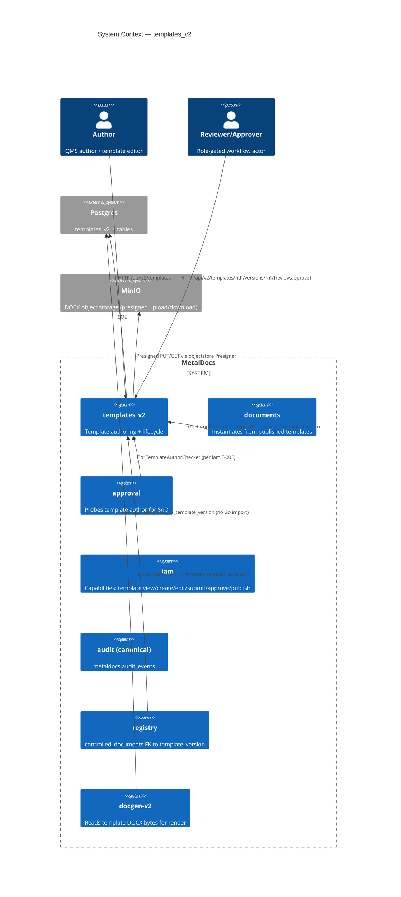
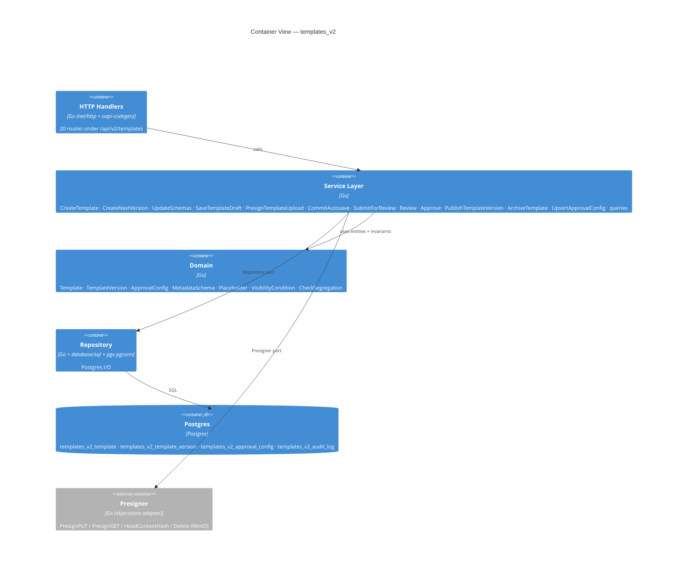
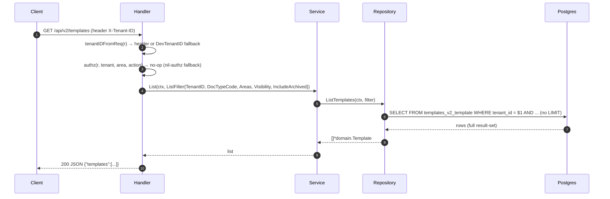
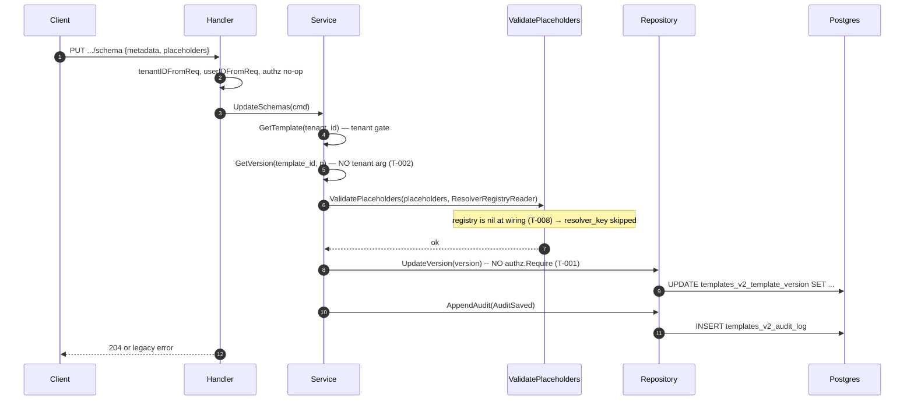

# Module: templates_v2

> Living architecture doc. Arc42 (12 sections) + C4 (Context/Container) Mermaid diagrams + ADR links.
>
> **Naming note:** module dir is `internal/modules/templates_v2/` and routes still mount under `/api/v2/templates`. Plan 2 (commits ae1229e8..c84215f7) flipped *some* modules to `/api/v1/`; templates_v2 is **not yet flipped**. This doc reflects on-disk state. Rename to `templates.md` (and `internal/modules/templates/`, `/api/v1/templates`) lands in a single follow-up commit (see `backlog/templates_v2-refactor.md#R-101`).

**Last verified:** 2026-05-11 · **Owner:** unassigned · **Status:** active (production module; partial Plan 2 alignment)

---

## 1. Introduction & Goals

`templates_v2` owns the lifecycle of DOCX-based document templates: authoring (DOCX upload + placeholder schema), versioning, two-stage approval (review → approve), publishing, and obsoletion of the previous published version. Every document instance in MetalDocs is instantiated from a *published* template version — `documents` is the downstream consumer that snapshots `placeholder_schema` at finalize.

### 1.1 Requirements overview

- **Authoring of regulated DOCX templates** with eigenpal-native `{name}` placeholders restricted to the fixed 7-token catalog (per `wiki/concepts/placeholders.md`, ADR 0008).
- **Two-stage approval lifecycle** (`draft → in_review → approved → published`, with `obsolete` for superseded versions) enforcing ISO segregation of duties (per `wiki/concepts/iso-segregation.md`).
- **Snapshot contract for downstream consumers** — published `template_version.placeholder_schema` is read by `documents` at instantiation (`wiki/modules/documents.md §8.7`).
- **Authoring identity carried on every version** — `author_id`, `reviewer_id`, `approver_id` columns are the SoD probe surface consumed by `approval` (per `wiki/modules/approval.md` SoD T-003).
- **Per-tenant isolation** — every template scoped by `tenant_id` (origin: `wiki/architecture/data-model.md`).

### 1.2 Quality Goals

| Rank | Goal | How verified |
|---|---|---|
| 1 | Tenant isolation of templates and versions | tripwire on every `templates_v2_*` mutation; query-side tenant guard on `GetVersion*` (currently NOT met — see T-002) |
| 2 | Approval contract correctness (no self-approve, no self-publish) | `domain.CheckSegregation` invoked on every state transition (currently NOT met for `PublishTemplateVersion` — see T-004) |
| 3 | Placeholder catalog enforcement (no template-injection) | `application.ValidatePlaceholders` rejects non-catalog `PHType` at schema save; resolver registry check on `PHComputed` (resolver registry currently NOT wired — see T-008) |

### 1.3 Stakeholders

| Role | Expectation |
|---|---|
| Author (role: `author`) | Create draft, upload DOCX, define `placeholder_schema`, submit for review |
| Reviewer (role: `editor`/`approver`) | Accept or reject submitted draft; cannot review own authorship |
| Approver (role: `approver`/`system_admin`) | Sign off; cannot approve own authorship or own review |
| Publisher (role: `system_admin`) | Publish approved version; obsoletes prior published |
| Downstream consumer (`documents`, `approval`, `search`, `controlled_documents` registry) | Snapshot `placeholder_schema`, read author identity, FK to `template_version_id` |

---

## 2. Architecture Constraints

- Language / runtime: Go (per repo defaults).
- Persistence: Postgres; tables created in `migrations/0120_templates_v2_init.sql`.
- Authz: two-tier per `wiki/decisions/0007-two-tier-authz.md` — **NOT applied** (see T-001).
- API contract: OpenAPI 3.0.3 generated via oapi-codegen — **partial** (8 of 20 routes generated; see T-006).
- Error envelope: RFC 9457 Problem+JSON per `wiki/architecture/api-design-system.md` — **NOT applied** (see T-005).
- Placeholder syntax + catalog: per `wiki/concepts/placeholders.md` (fixed 7-token) and `wiki/concepts/token-syntax.md` (`{name}` single-brace, eigenpal-native).
- Editor: eigenpal `templatePlugin` for DOCX authoring (per ADR 0001 `wiki/decisions/0001-eigenpal-adoption.md`).

---

## 3. System Scope & Context (C4 Level 1)



### 3.1 Business Context

Quality teams author DOCX templates that downstream document instances inherit (placeholder schema, layout, content). A template is *not usable* until it is `published` and not yet `obsolete`. Publishing a new version automatically obsoletes the previous. ISO 9001 §7.5 places the audit-trail and approval-segregation burden on this module: who authored, who reviewed, who approved, when published.

### 3.2 Technical Context

Inbound interfaces:
- 20 HTTP routes mounted at `/api/v2/templates/*` (8 generated via oapi-codegen, 12 hand-rolled — see §5.3).
- Go domain types consumed by `documents` (`Placeholder`, `TemplateVersion`, `TemplateSnapshot`, `PHType` constants).

Outbound interfaces:
- Postgres: 4 owned tables (`templates_v2_template`, `templates_v2_template_version`, `templates_v2_approval_config`, `templates_v2_audit_log`).
- MinIO: presigned PUT for DOCX/schema upload; presigned GET for DOCX retrieval (TTL 10 minutes, max object size 25 MiB hard-coded at `apps/api/cmd/metaldocs-api/main.go:327`).
- iam: capability namespace `template.*` (declared by seed) — currently unenforced (T-001).
- Canonical `audit` module: **not used**; templates_v2 writes its own `templates_v2_audit_log` parallel sink (see T-013).

---

## 4. Solution Strategy

- **Hexagonal layout** — `domain/` (entities + invariants), `application/` (use-cases + ports), `delivery/http/` (handlers + routing), `repository/` (Postgres I/O). No ADR; same shape as `documents` and `auth` (missing-ADR — see T-014).
- **Approval as state machine on `template_version.status`** — driver: ISO 9001 §7.5 traceability requirement. Transitions enforced by `domain.TemplateVersion.CanTransition` (`internal/modules/templates_v2/domain/version.go`).
- **DOCX bytes via presigned MinIO PUT/GET** — driver: avoid round-tripping multi-MB DOCX through the API. Authored at `application/autosave.go`.
- **Placeholder validation as a security boundary** — `application/schema.go:84 ValidatePlaceholders` enforces the fixed 7-token catalog (PHType enum) at schema-save. Resolver-key validation for `PHComputed` requires `ResolverRegistryReader`, currently nil at wiring (T-008).
- **Two parallel publish paths** — `Service.Approve` (lifecycle.go:159, the canonical author-review-approve chain) and `Service.PublishTemplateVersion` (lifecycle.go:265, a direct draft → published path used by `POST /publish`). Different invariants — Approve enforces SoD, Publish does not. See T-004.

---

## 5. Building Block View (C4 Level 2 — Container)

### 5.1 Whitebox — templates_v2



### 5.2 Public surface

Grouped by file. Source of truth: `_artifacts/01-surface.md` §3.

| File | Symbol | Kind | Purpose |
|---|---|---|---|
| `internal/modules/templates_v2/domain/template.go:10` | `VisibilityPublic`, `VisibilityInternal`, `VisibilitySpecific` | const | Template visibility scope enum |
| `internal/modules/templates_v2/domain/template.go:16` | `Template` | struct | Template aggregate root |
| `internal/modules/templates_v2/domain/version.go:10` | `VersionStatusDraft`, `VersionStatusInReview`, `VersionStatusApproved`, `VersionStatusPublished`, `VersionStatusObsolete` | const | Version state machine |
| `internal/modules/templates_v2/domain/version.go:18` | `TemplateVersion` | struct | Version entity (owns DOCX key, hashes, schemas, status, identities) |
| `internal/modules/templates_v2/domain/schemas.go:3` | `MetadataSchema` | struct | Per-version metadata schema (DocCodePattern, retention, distribution) |
| `internal/modules/templates_v2/domain/schemas.go:12` | `PHText`, `PHDate`, `PHNumber`, `PHSelect`, `PHUser`, `PHPicture`, `PHComputed` | const | Fixed 7-token catalog (per `wiki/concepts/placeholders.md`) |
| `internal/modules/templates_v2/domain/schemas.go:22` | `VisibilityCondition` | struct | Conditional placeholder visibility primitive |
| `internal/modules/templates_v2/domain/schemas.go:28` | `Placeholder` | struct | Placeholder entity (id, type, name, options, etc.) |
| `internal/modules/templates_v2/domain/schemas.go:48` | `CompositionConfig` | struct | (Deprecated per ADR `wiki/decisions/0008-placeholder-fixed-catalog.md` — composition removed 2026-04-27; struct retained for backward compat) |
| `internal/modules/templates_v2/domain/approval.go:3` | `ApprovalConfig` | struct | Reviewer/approver role binding per template |
| `internal/modules/templates_v2/domain/approval.go:17` | `CheckSegregation` | func | SoD enforcement (author ≠ reviewer ≠ approver) |
| `internal/modules/templates_v2/domain/audit.go:7` | `AuditCreated`, `AuditSaved`, `AuditSubmitted`, `AuditReviewed`, `AuditApproved`, `AuditRejected`, `AuditPublished`, `AuditObsoleted`, `AuditArchived`, `AuditRestored`, `AuditApprovalConfigUpdated` | const | Audit action enum |
| `internal/modules/templates_v2/domain/audit.go:21` | `AuditEvent` | struct | Audit row written to `templates_v2_audit_log` |
| `internal/modules/templates_v2/application/ports.go:10` | `Repository` | iface | Persistence port (used by service) |
| `internal/modules/templates_v2/application/ports.go:30` | `Presigner` | iface | Object-store port (PresignPUT/GET, HeadContentHash, Delete) |
| `internal/modules/templates_v2/application/ports.go:37` | `Clock`, `UUIDGen`, `ResolverRegistryReader` | iface | Time / id / resolver lookup ports |
| `internal/modules/templates_v2/application/ports.go:41` | `ListFilter` | struct | Filter for `ListTemplates` (tenant, doc_type, areas, visibility, includeArchived) |
| `internal/modules/templates_v2/application/service.go:3` | `Service` | struct | Use-case orchestrator |
| `internal/modules/templates_v2/application/service.go:11` | `New` | func | Service constructor |
| `internal/modules/templates_v2/application/create.go:11` | `CreateTemplateCmd`, `CreateTemplateResult` | struct | Create-template command + result |
| `internal/modules/templates_v2/application/create.go:30` | `Service.CreateTemplate` | method | Create template + version 1 + approval config + audit |
| `internal/modules/templates_v2/application/create.go:109` | `CreateVersionCmd` + `Service.CreateNextVersion` | struct + method | Spawn next version (clones source schemas) |
| `internal/modules/templates_v2/application/schema.go:12` | `UpdateSchemasCmd` | struct | Schema update command |
| `internal/modules/templates_v2/application/schema.go:84` | `ValidatePlaceholders` | func | Placeholder catalog enforcement (PHType + resolver_key when registry wired) |
| `internal/modules/templates_v2/application/lifecycle.go:9..264` | `SubmitForReviewCmd`, `ReviewCmd`, `ApproveCmd`, `ArchiveCmd`, `PublishTemplateVersionCmd`, `PublishTemplateVersionResult` | struct | Lifecycle commands |
| `internal/modules/templates_v2/application/lifecycle.go:14..316` | `Service.SubmitForReview`, `Service.Review`, `Service.Approve`, `Service.PublishTemplateVersion`, `Service.ArchiveTemplate` | method | Lifecycle ops; `Approve` (lifecycle.go:159) and `PublishTemplateVersion` (lifecycle.go:265) are two parallel publish paths (see §4) |
| `internal/modules/templates_v2/application/autosave.go:13..171` | `PresignAutosaveCmd/Result`, `PresignTemplateUploadCmd`, `CommitAutosaveCmd`, `SaveTemplateDraftCmd` + their `Service` methods | struct + method | DOCX upload + autosave path |
| `internal/modules/templates_v2/application/approval_config.go:9` | `UpsertApprovalConfigCmd` | struct | Approval-config command |
| `internal/modules/templates_v2/application/queries.go:41` | `GetDocxURLCmd` | struct | Presigned GET for stored DOCX |
| `internal/modules/templates_v2/application/visibility_graph.go:16` | `DetectVisibilityCycle` | func | Cycle check across `VisibilityCondition` graph |
| `internal/modules/templates_v2/delivery/http/handler.go:17` | `AuthzFunc` | type | Authz callback (wired nil — T-001) |
| `internal/modules/templates_v2/delivery/http/handler.go:19` | `Handler` | struct | HTTP handler |
| `internal/modules/templates_v2/delivery/http/handler.go:24` | `New` | func | Handler constructor; nil-authz fallback at lines 25-27 |
| `internal/modules/templates_v2/delivery/http/handler.go:31` | `Handler.Register` | method | Mounts 20 routes on `*http.ServeMux` |
| `internal/modules/templates_v2/delivery/http/errors.go:10` | `MapErr` | func | Domain error → HTTP status + code mapping |
| `internal/modules/templates_v2/repository/postgres.go:21` | `Repository` | struct | Postgres adapter implementing `application.Repository` |
| `internal/modules/templates_v2/repository/postgres.go:25` | `New` | func | Repository constructor |
| `internal/modules/templates_v2/api/api.gen.go:*` | `ServerInterface`, `StrictServerInterface`, `*RequestObject`, `*ResponseObject`, `Handler*`, `NewStrictHandler*`, `GetSwagger`, `GetSpec`, etc. | iface + struct + func | oapi-codegen generated surface |

`(undocumented)`: every exported symbol above lacks a Go doc comment (per `_artifacts/01-surface.md` §3). See T-014.

### 5.3 HTTP operations

Source: `_artifacts/01-surface.md` §1a + §1b. **All routes still mount under `/api/v2/templates` — Plan 2 has not yet flipped this module to `/api/v1/`.**

| Method | Path | OperationID | Handler | Authz cap (intended) |
|---|---|---|---|---|
| GET | `/api/v2/signed` | `RedirectSignedUrlV2` | `generated.RedirectSignedUrlV2` | (none) |
| GET | `/api/v2/templates` | `ListTemplatesV2` | `generated.ListTemplatesV2` | `template.view` |
| POST | `/api/v2/templates` | `CreateTemplateV2` | `generated.CreateTemplateV2` | `template.create` |
| GET | `/api/v2/templates/{id}` | — (hand-rolled) | `Handler.getTemplate` | `template.view` |
| GET | `/api/v2/templates/{id}/versions/{n}` | `GetTemplateVersionV2` | `generated.GetTemplateVersionV2` | `template.view` |
| POST | `/api/v2/templates/{id}/versions` | — (hand-rolled) | `Handler.createNextVersion` | `template.edit` |
| PUT | `/api/v2/templates/{id}/versions/{n}/draft` | `SaveTemplateDraftV2` | `generated.SaveTemplateDraftV2` | `template.edit` |
| PUT | `/api/v2/templates/{id}/versions/{n}/schema` | — (hand-rolled) | `Handler.updateSchemas` | `template.edit` |
| POST | `/api/v2/templates/{id}/versions/{n}/docx-upload-url` | `PresignTemplateDocxUploadUrlV2` | `generated.PresignTemplateDocxUploadUrlV2` | `template.edit` |
| POST | `/api/v2/templates/{id}/versions/{n}/schema-upload-url` | `PresignTemplateSchemaUploadUrlV2` | `generated.PresignTemplateSchemaUploadUrlV2` | `template.edit` |
| POST | `/api/v2/templates/{id}/versions/{n}/autosave/presign` | — (hand-rolled) | `Handler.presignAutosave` | `template.edit` |
| POST | `/api/v2/templates/{id}/versions/{n}/autosave/commit` | — (hand-rolled) | `Handler.commitAutosave` | `template.edit` |
| POST | `/api/v2/templates/{id}/versions/{n}/submit` | — (hand-rolled) | `Handler.submitForReview` | `template.submit` |
| POST | `/api/v2/templates/{id}/versions/{n}/review` | — (hand-rolled) | `Handler.review` | `template.approve` |
| POST | `/api/v2/templates/{id}/versions/{n}/approve` | — (hand-rolled) | `Handler.approve` | `template.approve` |
| POST | `/api/v2/templates/{id}/versions/{n}/publish` | `PublishTemplateVersionV2` | `generated.PublishTemplateVersionV2` | `template.publish` |
| POST | `/api/v2/templates/{id}/archive` | — (hand-rolled) | `Handler.archiveTemplate` | `template.edit` |
| PUT | `/api/v2/templates/{id}/approval-config` | — (hand-rolled) | `Handler.upsertApprovalConfig` | `template.edit` |
| GET | `/api/v2/templates/{id}/versions/{n}/docx-url` | — (hand-rolled) | `Handler.getDocxURL` | `template.view` |
| GET | `/api/v2/templates/{id}/audit` | — (hand-rolled) | `Handler.listAudit` | `template.view` |
| GET | `/api/v2/templates/v2/placeholder-catalog` | — (hand-rolled) | `Handler.listPlaceholderCatalog` | (none) |

Hand-rolled rows (12 of 20) are absent from the OpenAPI spec → spec/handler drift (T-006). All "intended" caps in the rightmost column are advisory; **no route enforces them at runtime** (T-001).

---

## 6. Runtime View (selected scenarios)

### 6.1 ListTemplates (read) — `GET /api/v2/templates`

Source: `_artifacts/02-flow-list.md` + `repository/postgres.go:88`.



Failure modes:

| Condition | HTTP | Body |
|---|---|---|
| empty result | 200 | `{"templates":[]}` |
| db error | 500 | `{"error":{"code":"internal","message":"..."}}` (legacy envelope — T-005) |
| forged `X-Tenant-ID` header | 200 | rows from any tenant the header names (T-003) |

### 6.2 UpdateSchema (write — placeholder catalog enforcement) — `PUT /api/v2/templates/{id}/versions/{n}/schema`

Source: `_artifacts/02-flow-update-schema.md` + `application/schema.go:84` + `application/lifecycle.go:14`.



Failure modes:

| Condition | HTTP | Body |
|---|---|---|
| non-catalog `PHType` | 422 | `{"error":{"code":"invalid_placeholder","message":"..."}}` |
| version not in draft | 409 | `{"error":{"code":"invalid_state_transition","message":"..."}}` |
| concurrent autosave (no opt-lock) | 200 | last-write-wins; `ExpectedLockVersion` field carried but unverified (T-010) |

### 6.3 Lifecycle state machine + publish

Source: `_artifacts/02-flow-publish.md` + `application/lifecycle.go`.

State transitions on `templates_v2_template_version.status`:

| From | To | Trigger | Authz cap (intended / actual) | SoD check |
|---|---|---|---|---|
| draft | in_review | `POST .../submit` | `template.submit` / **bypassed (T-001)** | — (no actor restriction at submit) |
| in_review | approved | `POST .../review` (Accept) | `template.approve` / bypassed | `CheckSegregation("reviewer", actor, author, nil)` ✓ |
| in_review | draft | `POST .../review` (Reject) | `template.approve` / bypassed | — |
| approved | published | `POST .../approve` (Accept, hasReviewer) | `template.approve` / bypassed | `CheckSegregation("approver", actor, author, reviewer)` ✓ |
| in_review | published | `POST .../approve` (Accept, no reviewer) | `template.approve` / bypassed | `CheckSegregation("approver", actor, author, nil)` ✓ |
| draft | published | `POST .../publish` (`PublishTemplateVersion`) | `template.publish` / bypassed | **NONE — author can self-publish (T-004)** |
| approved | draft | `POST .../approve` (Reject) | `template.approve` / bypassed | — |
| published | obsolete | side-effect of `Approve(Accept)` or `PublishTemplateVersion` (`ObsoletePreviousPublished`) | implicit | — |
| any | (template.archived_at NOT NULL) | `POST .../archive` | `template.edit` / bypassed | — |

Publish sequence (`Service.PublishTemplateVersion`, `lifecycle.go:265`):

```mermaid
sequenceDiagram
    autonumber
    participant C as Client
    participant H as Handler
    participant S as Service
    participant R as Repository
    participant DB as Postgres
    C->>H: POST .../publish
    H->>S: PublishTemplateVersion(cmd)
    S->>R: GetTemplate(tenant, id)
    S->>R: GetVersion(id, n) — no tenant arg
    Note over S: if status != draft → 409
    Note over S: NO CheckSegregation (T-004); NO content_hash check
    S->>R: ObsoletePreviousPublished(template_id, new_version_id)
    R->>DB: UPDATE templates_v2_template_version SET status='obsolete' WHERE ...
    Note over S,DB: NOT in same tx (T-007) — race window for concurrent publish
    S->>R: UpdateTemplate(template.PublishedVersionID = new)
    R->>DB: UPDATE templates_v2_template
    S->>R: UpdateVersion(version.status = published)
    R->>DB: UPDATE templates_v2_template_version
    S->>R: AppendAudit(AuditPublished)
    R->>DB: INSERT templates_v2_audit_log
    Note over S: AuditObsoleted constant exists; never written for the obsolete side-effect
    S->>S: CreateNextVersion(...)  — auto-spawn draft v(n+1)
    S-->>H: PublishTemplateVersionResult{Published, NextDraft}
    H-->>C: 200
```

Failure modes:

| Condition | HTTP | Body |
|---|---|---|
| version not in draft | 409 | `{"error":{"code":"invalid_state_transition","message":"..."}}` |
| concurrent publish race | 200 (both succeed) | DB ends with two `published` rows briefly, then `obsolete`-on-next-write (T-007) |
| Idempotency-Key replay | depends on first-call landing state | no Idempotency-Key support (T-009) |

---

## 7. Deployment View

- Binary: `apps/api/cmd/metaldocs-api`
- Process: single Go server, port `:8081` (per `wiki/references/local-dev-startup.md`)
- Migrations: applied at startup via the global `migrations/` directory (golang-migrate; per `wiki/architecture/data-model.md`); no module-local `migrations/` subdirectory.
- Environment / config: `MinioClient`, `MinioBucket`, max object size `25*1024*1024` — all consumed at `apps/api/cmd/metaldocs-api/main.go:327`. No env vars or feature flags read inside `internal/modules/templates_v2/**` (per `_artifacts/03-deps.md` §4).

---

## 8. Cross-cutting Concepts

### 8.1 Authentication & Authorization

- Tier 1 (HTTP edge): `CapabilityService` per `wiki/architecture/api-design-system.md` — **NOT applied**; `AuthzFunc` arg is `nil` at wiring (`apps/api/cmd/metaldocs-api/main.go:329`).
- Tier 2 (in-tx): `internal/platform/authz.Require` — **never imported** by templates_v2.
- Postgres tripwire: `metaldocs.asserted_caps` GUC — **no trigger installed** on `templates_v2_*` tables (per `_artifacts/04-persistence.md` §3).
- Capabilities in seed (`migrations/0165_role_capabilities_reseed.sql`): `template.view/create/edit/submit/approve/publish` mapped to `viewer/editor/author/approver/system_admin` — currently advisory only. See T-001.

### 8.2 Error envelope

- All non-2xx responses: legacy `{"error":{"code","message"}}` via `httpresponse.WriteJSON` (`delivery/http/handler.go:95-102`). RFC 9457 Problem+JSON not adopted. See T-005.

### 8.3 Idempotency

- **None.** No `Idempotency-Key` header parsing on any route. Replays of `POST /templates`, `POST /publish`, `POST /submit` either succeed twice (duplicate audit rows) or fail with `ErrInvalidStateTransition` after the first transition lands. See T-009.

### 8.4 Pagination

- **None.** `ListTemplates` returns the full filtered set (no LIMIT/OFFSET/cursor). Single-tenant deployments with low template counts hide the gap; latent at scale. See T-011.

### 8.5 Logging & Observability

- No structured logging in module code; `MapErr` returns codes consumable by error-UX (`wiki/concepts/error-ux.md`). No metrics, no traces.
- Audit trail uses module-local `templates_v2_audit_log` (parallel to canonical `metaldocs.audit_events`). Two sinks of record. See T-013.

### 8.6 Concurrency / Transactions

- Repository methods take `context.Context` and call `*sql.DB.ExecContext` directly — **no `pgx.Tx` parameter, no transactional wrapping at the service layer**.
- Multi-step operations (publish, approve, create) emit 3–5 statements as independent `ExecContext` calls. Partial-failure leaves inconsistent state and missing audit rows. See T-007.
- No optimistic locking: `SaveTemplateDraftCmd.ExpectedLockVersion` field exists on the command but is never compared against the row before `UpdateVersion`. See T-010.

### 8.7 Tenant scoping

- `tenantIDFromReq(r)` (handler.go:84) trusts `X-Tenant-ID` header with `tenant.DevTenantID` fallback. See T-003.
- `Repository.GetVersion(template_id, version_number)` and `GetVersionByID(version_id)` accept no tenant argument. The service layer fronts these with `GetTemplate(tenant, template_id)` as a "tenant gate" at most call sites — `CreateNextVersion` (`create.go:126`) bypasses the gate when `template.PublishedVersionID` is non-nil, calling `GetVersionByID` directly. See T-002.

### 8.8 Placeholder catalog enforcement

- `application.ValidatePlaceholders` (`schema.go:84`) is the only catalog gate. It enforces the `PHType` enum (`PHText/Date/Number/Select/User/Picture/Computed`).
- For `PHComputed`, the resolver_key string is intended to be checked against `ResolverRegistryReader` — wired `nil` (per `_artifacts/03-deps.md` §3), so the check is skipped at runtime. See T-008.
- Template-injection blast radius: a malicious resolver_key on a published template propagates to every document instantiated from that version (per `wiki/modules/documents.md §8.7` snapshot path).

---

## 9. Architecture Decisions

| Decision | Link / Status |
|---|---|
| Eigenpal as DOCX editor | `wiki/decisions/0001-eigenpal-adoption.md` |
| `{name}` single-brace token syntax | `wiki/decisions/0003-token-syntax-migration.md` |
| Fixed 7-token placeholder catalog | `wiki/decisions/0008-placeholder-fixed-catalog.md` |
| Two-tier authz (intended) | `wiki/decisions/0007-two-tier-authz.md` (NOT applied here — T-001) |
| Contract-first via oapi-codegen | `wiki/decisions/0012-contract-first-api.md` (PARTIAL — T-006) |
| Hexagonal layer split (`domain/application/delivery/repository`) | tech-debt: missing-ADR (T-014) |
| Two parallel publish paths (`Approve` vs `PublishTemplateVersion`) | tech-debt: missing-ADR (T-004) |
| Module-local audit sink (`templates_v2_audit_log`) instead of canonical `metaldocs.audit_events` | tech-debt: missing-ADR (T-013) |

---

## 10. Quality Requirements

| Goal | Scenario | Pass criteria |
|---|---|---|
| Tenant isolation | Authn'd user from tenant A calls `GET /api/v2/templates/{id-from-tenant-B}/versions/1` with a known version_id | 404 not found (currently: 200 with the row — T-002) |
| Authz enforcement | Authn'd user without `template.publish` calls `POST /publish` | 403 with Problem `metaldocs.authz.forbidden` (currently: 200 — T-001) |
| Approval SoD | Author calls `POST /publish` on own draft | 409 with `{"code":"sod_violation"}` (currently: 200 — T-004) |
| Placeholder injection | Template author saves schema with `{type:"computed", resolver_key:"; DROP TABLE …"}` | 422 invalid resolver_key (currently: 204 saved — T-008) |
| Idempotency | Client retries `POST /publish` with same `Idempotency-Key` | second response equals first; one audit row (currently: header ignored, two audit rows or 409 — T-009) |

---

## 11. Risks & Technical Debt

Pointer-only. Body lives in `wiki/modules/templates_v2-tech-debt.md`.

- Critical: 4
- Major: 6
- Minor: 4

Top 3 (by severity, then blast-radius):

1. **Authz wired `nil` everywhere** (`handler.go:25-27` + `main.go:329`) — every route is open. All seven repo mutations land without capability assertion. — see tech-debt §T-001
2. **`X-Tenant-ID` header trusted with `DevTenantID` fallback** (`handler.go:84-89`) — any client picks the tenant for read or write. Multi-tenant cutover ships an open door. — see tech-debt §T-003
3. **`PublishTemplateVersion` bypasses the entire approval lifecycle** (`lifecycle.go:265`) — draft → published in one call, no role check, no SoD, no content_hash gate. Published rows can lack the regulated approval chain ISO 9001 §7.5 requires. — see tech-debt §T-004

---

## 12. Glossary

| Term | Definition |
|---|---|
| Template | A reusable DOCX skeleton bound to a `doc_type_code`, `tenant_id`, and visibility scope. Aggregate root; PK on `templates_v2_template`. |
| Template Version | A specific revision of a template (`version_number` per template). Carries the DOCX storage key, content hash, metadata + placeholder schemas, and lifecycle status. |
| Placeholder | A `{name}` token in the DOCX whose `PHType` is one of the fixed 7-token catalog. Substituted at document finalize. |
| Approval Config | Per-template binding of `reviewer_role` (optional) and `approver_role` (required). Drives `pending_*_role` on each new version. |
| ApprovalConfig.HasReviewer | Boolean derived from `reviewer_role != nil`. Determines whether `Approve` requires `status == approved` (with reviewer) or `status == in_review` (without). |
| Audit log (templates_v2) | Module-local sink at `templates_v2_audit_log`. Parallel to canonical `metaldocs.audit_events`. |
| Obsolete | Status assigned to the previous published version when a new version is published. |

---

## Cross-links

- Related ADRs: `wiki/decisions/0001-eigenpal-adoption.md`, `wiki/decisions/0003-token-syntax-migration.md`, `wiki/decisions/0007-two-tier-authz.md`, `wiki/decisions/0008-placeholder-fixed-catalog.md`, `wiki/decisions/0012-contract-first-api.md`
- Related concepts: `wiki/concepts/placeholders.md`, `wiki/concepts/token-syntax.md`, `wiki/concepts/iso-segregation.md`, `wiki/concepts/error-ux.md`, `wiki/concepts/authz-tiers.md`
- Downstream module: `wiki/modules/documents.md` (consumes published versions; snapshots placeholder schema at finalize)
- Taxonomy coupling: `wiki/modules/taxonomy.md` — taxonomy's `TemplateVersionChecker` (`infrastructure/template_version_checker.go:11`) READ-joins `templates_v2_template_version` + `templates_v2_template` to verify `IsPublished` when binding a profile's default template; taxonomy §3.2 documents this IN-edge
- Approval coupling: `wiki/modules/approval.md` (SoD probing of template author identity — iam T-003)
- Editor coupling: `wiki/modules/editor-ui-eigenpal.md`, `wiki/modules/editor-chrome.md`
- Predecessor wiki stub: `wiki/modules/templates-v2.md` (kebab dash) — frontend-heavy; will be retired (see `backlog/templates_v2-refactor.md#R-100`).
- See also: [`modules/registry.md`](registry.md) — registry holds a FK (`controlled_documents.template_version_id`) to published template versions; registry T-008 tracks the shared taxonomy audit-sink coupling that also affects this module
- Backlog: `wiki/backlog/templates_v2-refactor.md`
- Tech debt: `wiki/modules/templates_v2-tech-debt.md`

## Changelog

- 2026-05-10 — initial publish (Arc42 + C4); supersedes the frontend-heavy `templates-v2.md` (kebab) stub (retire scheduled in same backlog row R-100). Path-rename `templates_v2/ → templates/` + `/api/v2/ → /api/v1/` deferred to a single follow-up commit (R-101).
