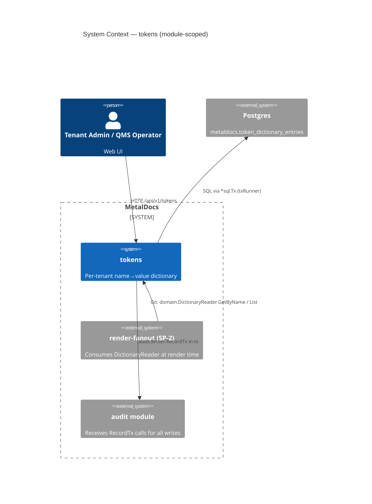
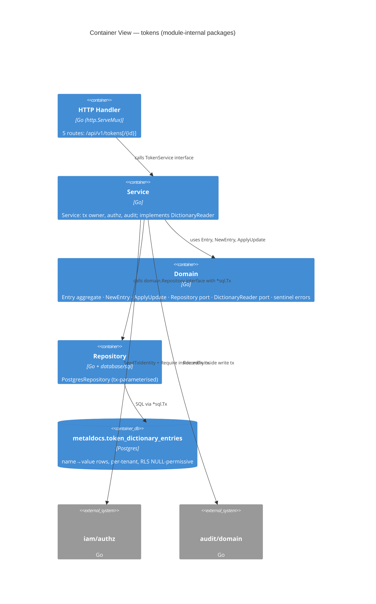
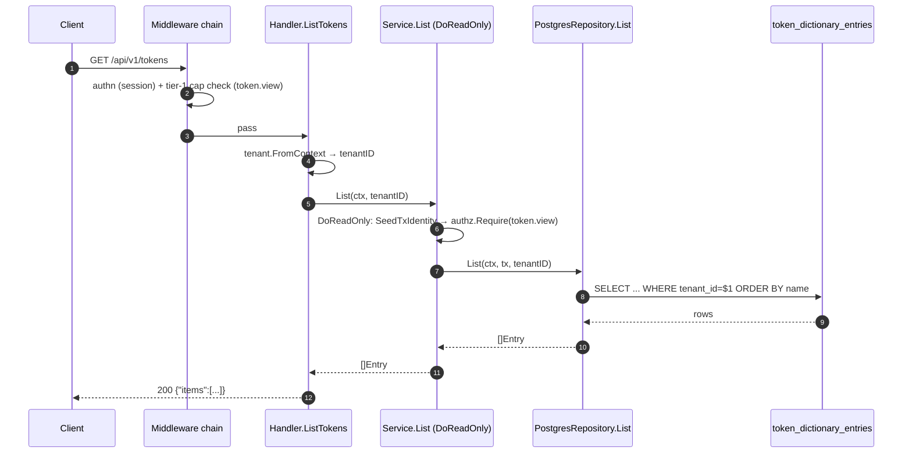
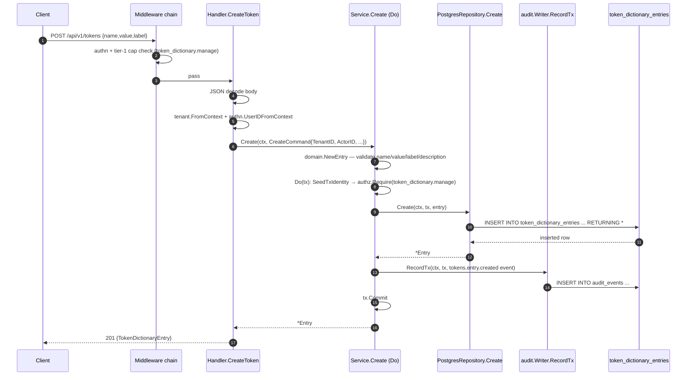
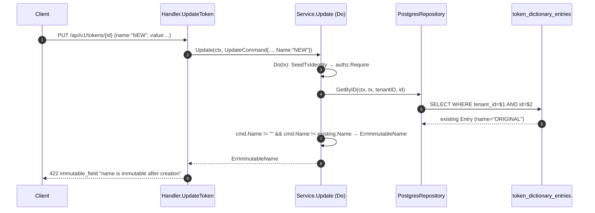

# Module: tokens

> Living architecture doc. Arc42 (12 sections) + C4 (Context / Container) Mermaid diagrams + ADR links.

**Last verified:** 2026-06-28 (SP-1 initial publish — module fully implemented: migration 0248, IAM capabilities, OpenAPI + oapi-codegen, domain/application/infrastructure/delivery layers, module assembly, integration tests) | **Owner:** unassigned | **Status:** active (SP-1 feature-complete; SP-2 render substitution pending) | **Maturity:** L3

> **Key files:**
> - `internal/modules/tokens/domain/entry.go` — `Entry` aggregate, `NewEntry`, `ApplyUpdate`, `nameRe`, sentinel errors
> - `internal/modules/tokens/domain/port.go` — `Repository` (storage port), `DictionaryReader` (published SP-2 provider port)
> - `internal/modules/tokens/application/service.go` — `Service` (tx owner, authz + audit); `var _ domain.DictionaryReader = (*Service)(nil)` compile-time proof
> - `internal/modules/tokens/application/ports.go` — `txRunner`, `auditRecorder` internal ports
> - `internal/modules/tokens/infrastructure/repository.go` — `PostgresRepository` (all ops via caller-supplied `*sql.Tx`)
> - `internal/modules/tokens/delivery/http/handler.go` — `Handler` implementing `tokensapi.ServerInterface`; RFC 9457 error mapping
> - `internal/modules/tokens/api/api.gen.go` — oapi-codegen generated types + `StdHTTP` router
> - `internal/modules/tokens/module.go` — `Module` struct + `New` composition root; exposes `Handler` + `Reader`
> - `apps/api/cmd/metaldocs-api/permissions.go:190-194` — tier-1 dispatcher entries (token.view on GET, token_dictionary.manage on POST/PUT/DELETE)
> - `db/migrations/0248_token_dictionary_entries.sql` — table + indexes + CHECK constraints + NULL-permissive RLS (ADR 0247 pattern)

---

## 1. Introduction & Goals

`internal/modules/tokens` owns the **per-tenant author-defined token dictionary**: a flat `name → value` constant table that makes tenant-specific strings (e.g., company name, legal entity, standard boilerplate) available as named tokens in documents. At SP-1 this is a pure CRUD dictionary with full authz + audit. SP-2 will wire render substitution by consuming the published `domain.DictionaryReader` port.

This module introduces a **new class of token** alongside the computed-token catalog owned by `templates`. Dictionary tokens are tenant-governed, mutable at runtime, and require no template schema change to add. Computed tokens are system-defined and driven by template authoring. The two catalogs are complementary and must not collide at render time — collision reconciliation is deferred to SP-2 (see tech-debt TD-1).

### 1.1 Requirements overview

- **Per-tenant dictionary CRUD** (`name`, `value`, `label`, optional `description`) with UUID primary key.
- **Name immutability post-create** — `name` is the render key; mutation is rejected at the application layer and never reaches the DB. Value, label, description are mutable.
- **Capability-gated** — `token.view` (ScopeTenant) for reads; `token_dictionary.manage` (ScopeTenant) for writes — both two-tier: tier-1 path-prefix dispatcher + tier-2 `authz.Require` inside tx + DB tripwire.
- **Audited writes** — every Create/Update/Delete records a `tokens.entry.created/updated/deleted` event in `metaldocs.audit_events` via `audit.Writer.RecordTx` inside the same transaction.
- **Published port for SP-2** — `domain.DictionaryReader` (`GetByName` + `List`, no tx coupling) is implemented by `application.Service` and exported from `Module.Reader`.
- **Token grammar is Node-owned** — `@metaldocs/shared-tokens` owns the leading-char rule and reserved-word list. Go does anti-corruption storage hygiene only (`^[A-Za-z0-9_]+$`, 1–64 chars). Grammar enforcement lives at the SP-3 UI edge; Go never re-parses token syntax.
- **Multi-tenant isolation** — `tenant_id UUID NOT NULL` on every row; NULL-permissive RLS per ADR 0027 pattern (migration `0248_token_dictionary_entries.sql`); no FK to the tenants table.

### 1.2 Quality Goals

| Rank | Goal | How verified |
|---|---|---|
| 1 | Multi-tenant isolation | `(tenant_id, name)` unique index; tenant always read from `tenant.FromContext` (session-bound, not client header); RLS NULL-permissive policy on `token_dictionary_entries` |
| 2 | Authz on every operation | Tier-1 dispatcher wired; `authz.Require` inside every tx (reads via `DoReadOnly`, writes via `Do`); DB tripwire from `trg_require_cap_asserted` pattern |
| 3 | Audit completeness | `audit.Writer.RecordTx` called for every state-changing operation inside the same tx; reads not audited per convention |
| 4 | Published surface stability | `domain.DictionaryReader` is the only inter-module Go contract; it has no tx coupling so SP-2 callers never see the storage implementation |

### 1.3 Stakeholders

| Role | Expectation |
|---|---|
| Tenant admin / QMS operator | CRUD own token dictionary via `/api/v1/tokens`; use entries in controlled documents |
| SP-2 render module | Consume `DictionaryReader.GetByName` at render time to substitute dictionary values |
| SP-3 UI team | Enforce full Node grammar at the editor edge; surface token panel for authors |
| Audit / compliance | Every write operation produces a dated, actor-attributed audit event |

---

## 2. Architecture Constraints

- Language / runtime: Go 1.25
- Persistence: Postgres; 1 owned table (`metaldocs.token_dictionary_entries`) created by forward migration `0248_token_dictionary_entries.sql`
- HTTP routing: oapi-codegen generated router (`tokensapi.HandlerWithOptions`); spec at `internal/modules/tokens/api/cfg.yaml` → `api.gen.go`; compile-time `ServerInterface` assertion in `api.gen.go`
- Error envelope: RFC 9457 `application/problem+json` via `httpresponse.WriteError` → `problem.Write`; domain-specific codes `ALREADY_EXISTS`, `NOT_FOUND`, `immutable_field`
- Authz: tier-1 path-prefix dispatcher (`permissions.go:190-194`); tier-2 `authz.Require` inside every `txRunner.Do` / `DoReadOnly` call; no direct tier-3 tripwire row in this migration (DB CHECK constraints serve the same enforcement role)
- Tenant scoping: `tenant.FromContext` only — never client headers; panics/errors on missing context tenant per platform convention
- Token grammar: Node-owned (`@metaldocs/shared-tokens`); Go's `nameRe = ^[A-Za-z0-9_]+$` is anti-corruption hygiene, not grammar

---

## 3. System Scope & Context — module-scoped (C4 Level 1)

> System-level context lives in `wiki/diagrams/c4-context.md`. The diagram below is module-scoped: it shows the tokens module's external actors and the single owned Postgres table.

### 3.1 Business Context

Authors of controlled documents need to embed tenant-specific constant values (company name, legal entity, standard clauses) without editing every template. The token dictionary is that namespace: the admin defines `{COMPANY_NAME} = "Acme Metalurgia"` once; SP-2 render substitutes it at document generation. The naming convention stays with the Node grammar; this module is the backend store.

### 3.2 Technical Context

Inbound interfaces (HTTP): 5 routes under `/api/v1/tokens` (§5.3).

Inbound interfaces (Go):
- `tokens.New(deps)` — composition root; returns `Module{Handler, Reader}`
- `Module.RegisterRoutes(mux)` — mounts `tokensapi.HandlerWithOptions` onto the platform mux

Outbound interfaces:
- DB: `metaldocs.token_dictionary_entries` (1 owned table; all ops within caller-supplied `*sql.Tx`)
- Go: `internal/platform/db.TxRunner` (tx boundary), `internal/modules/iam/authz` (Require + SeedTxIdentity), `internal/modules/audit/domain.Writer` (RecordTx), `internal/platform/authn` (UserIDFromContext), `internal/platform/tenant` (FromContext), `internal/platform/httpresponse` + `internal/platform/problem` (RFC 9457 envelope)

No outbound calls to other business modules. This module is a pure provider.

---

## 4. Solution Strategy

- **Tx-owner pattern.** The application service (`application.Service`) owns the transaction boundary via `db.TxRunner.Do` / `DoReadOnly`. The repository receives the `*sql.Tx` as a parameter and never opens its own connection or tx. This is consistent with the MetalDocs standard for modules introduced after Wave 2.
- **SeedTxIdentity → authz.Require sequence.** Every tx starts with `authz.SeedTxIdentity(ctx, tx, tenantID, actorID)` (sets tx-local GUCs) followed immediately by `authz.Require(ctx, tx, capability, "tenant")`. Both read and write paths enforce capability before touching data.
- **Reads use DoReadOnly, not audited.** `Get`, `GetByName`, `List` run under `txRunner.DoReadOnly`. No audit event is emitted for reads; this matches the platform convention and avoids audit log pollution.
- **Name is immutable.** `name` is the render key. `Update` fetches the existing entry first; if the caller sends a non-empty `name` that differs from the stored name, `domain.ErrImmutableName` is returned (422 `immutable_field`). The DB has no trigger for this — the app-layer check is the sole enforcement.
- **DictionaryReader as the published port.** The application service implements `domain.DictionaryReader` (compile-time proof: `var _ domain.DictionaryReader = (*Service)(nil)`). The module exports `Module.Reader domain.DictionaryReader` so SP-2 callers can inject only this narrow interface without depending on the full service.
- **Anti-corruption storage hygiene.** `nameRe = ^[A-Za-z0-9_]+$` in the domain is paired with an identical CHECK constraint in the migration. The DB rejects any row the app layer might wrongly admit. The canonical leading-char rule (`^[A-Za-z_]`) lives in Node and is a superset constraint applied at the UI edge.

---

## 5. Building Block View — module-scoped (C4 Level 2 — Container)

> System-level container topology lives in `wiki/diagrams/c4-container-backend.md`. The diagram below decomposes the internal Go packages of tokens.

### 5.1 Whitebox — tokens

### 5.2 Public surface

| File | Symbol | Kind | Purpose |
|---|---|---|---|
| `domain/entry.go` | `Entry` | struct | Token dictionary entry aggregate (`ID, TenantID, Name, Value, Label, Description, CreatedBy, UpdatedBy, CreatedAt, UpdatedAt`) |
| `domain/entry.go` | `NewEntry(NewEntryInput)` | func | Validates input; returns `*Entry` or `*ValidationError` |
| `domain/entry.go` | `(*Entry).ApplyUpdate` | method | Validates value/label/description; mutates in-place; never touches `Name` |
| `domain/entry.go` | `ErrNotFound · ErrImmutableName` | sentinels | Storage + immutability errors |
| `domain/entry.go` | `ValidationError` | struct | Field-level validation failure (maps to 422) |
| `domain/port.go` | `Repository` | iface | Storage port: `Create · Update · Delete · GetByID · GetByName · List` (all take `*sql.Tx`) |
| `domain/port.go` | `DictionaryReader` | iface | **Published SP-2 provider port**: `GetByName(ctx, tenantID, name) · List(ctx, tenantID)` (no tx) |
| `application/service.go` | `Service` | struct | Tx owner; implements `TokenService` + `domain.DictionaryReader` |
| `application/service.go` | `NewService` | func | Production constructor (panics on nil deps); pins `authz.Require` + `authz.SeedTxIdentity` |
| `application/service.go` | `NewServiceForTest` | func | Test constructor with injectable authz stubs |
| `application/service.go` | `CreateCommand · UpdateCommand` | structs | Service input DTOs |
| `infrastructure/repository.go` | `PostgresRepository` | struct | `domain.Repository` implementation; all methods receive `*sql.Tx` |
| `delivery/http/handler.go` | `Handler` | struct | `tokensapi.ServerInterface` implementation |
| `delivery/http/handler.go` | `Handler.RegisterRoutes` | method | Mounts 5 routes via `tokensapi.HandlerWithOptions` with `/api/v1` base |
| `module.go` | `Module · Dependencies` | structs | Composition root |
| `module.go` | `Module.Handler` | field | `*tokenshttp.Handler` — HTTP delivery |
| `module.go` | `Module.Reader` | field | `domain.DictionaryReader` — published for SP-2 consumers |

### 5.3 HTTP operations

| Method | Path | OperationID | Handler | Tier-1 cap | Tier-2 cap |
|---|---|---|---|---|---|
| GET | `/api/v1/tokens` | `listTokens` | `h.ListTokens` | `token.view` | `CapTokenView` |
| POST | `/api/v1/tokens` | `createToken` | `h.CreateToken` | `token_dictionary.manage` | `CapTokenDictionaryManage` |
| GET | `/api/v1/tokens/{id}` | `getToken` | `h.GetToken` | `token.view` | `CapTokenView` |
| PUT | `/api/v1/tokens/{id}` | `updateToken` | `h.UpdateToken` | `token_dictionary.manage` | `CapTokenDictionaryManage` |
| DELETE | `/api/v1/tokens/{id}` | `deleteToken` | `h.DeleteToken` | `token_dictionary.manage` | `CapTokenDictionaryManage` |

All 5 routes aligned: spec `api/openapi/v1/openapi.yaml` → `internal/modules/tokens/api/api.gen.go` → handler.

---

## 6. Runtime View (selected scenarios)

### 6.1 listTokens — read path

No write; no audit. `DoReadOnly` issues a read-only tx. Tier-2 `authz.Require(CapTokenView)` is still called inside the read tx — this is the belt-and-suspenders pattern for the tokens module.

### 6.2 createToken — write path

| Condition | HTTP | Code |
|---|---|---|
| Name already exists (tenant) | 409 | `ALREADY_EXISTS` |
| Validation failure (name/value/label) | 422 | `VALIDATION_ERROR` |
| DB CHECK violated | 422 | `VALIDATION_ERROR` |
| Missing/insufficient capability | 403 | (platform authz) |
| Internal error | 500 | `INTERNAL_ERROR` |

### 6.3 updateToken — name-immutability path

---

## 7. Deployment View

- Binary: `apps/api/cmd/metaldocs-api` (stateless MetalDocs API)
- Schema: `metaldocs.token_dictionary_entries` created by `db/migrations/0248_token_dictionary_entries.sql`; no dependency on the curated baseline schema (module added after baseline freeze)
- No module-specific env vars or config keys
- Tenant scoping is session-driven via `tenant.FromContext`; no fallback to `DevTenantID` at this layer

---

## 8. Cross-cutting Concepts

### 8.1 Authentication & Authorization

**Tier 1 (HTTP edge):** `apps/api/cmd/metaldocs-api/permissions.go:190-194` — four dispatcher entries:
- `GET /api/v1/tokens` (prefix) → `CapTokenView`
- `POST /api/v1/tokens` (exact) → `CapTokenDictionaryManage`
- `PUT /api/v1/tokens` (prefix) → `CapTokenDictionaryManage`
- `DELETE /api/v1/tokens` (prefix) → `CapTokenDictionaryManage`

**Tier 2 (in-tx):** `authz.SeedTxIdentity` + `authz.Require` called at the top of every `txRunner.Do` / `DoReadOnly` callback in `application/service.go`. The seam is injectable (`authzRequireFunc` / `seedTxFunc`) so unit tests run without a real DB.

**Postgres tripwire:** The tokens migration does not attach `trg_require_cap_asserted` (the trigger requires a `capabilities_asserted` column which is not part of the standard table schema). DB CHECK constraints (`CHECK (name ~ '^[A-Za-z0-9_]+$')`, `CHECK (length(name) BETWEEN 1 AND 64)`, etc.) enforce data integrity as the last line. The `trg_require_cap_asserted` pattern can be added in a follow-up migration if required.

See `wiki/decisions/0007-two-tier-authz.md`. Governed by ADR 0022 (capabilities, never roles). Capabilities are registered in `internal/modules/iam/domain/capability.go` (`CapTokenView`, `CapTokenDictionaryManage`) and granted via IAM reference data.

### 8.2 Tenant scoping

Tenant always read from `tenant.FromContext(r.Context())`. The middleware chain sets this from the authenticated session before the handler fires. The handler passes `tenantID` explicitly into every service command and read call. The repository uses `tenant_id = $N` predicates on all queries — there is no global scan. RLS policy on `token_dictionary_entries` is NULL-permissive (ADR 0247 pattern): the policy exists but does not block `system_admin` operations that run before the tenant GUC is set.

### 8.3 Error envelope

RFC 9457 `application/problem+json` via `internal/platform/httpresponse.WriteError` → `internal/platform/problem.Write`. Domain-specific codes in `delivery/http/handler.go`:
- `ALREADY_EXISTS` — PG `23505` unique violation on `(tenant_id, name)` index
- `NOT_FOUND` — `domain.ErrNotFound` (cross-tenant ID → same 404, never 403)
- `immutable_field` — `domain.ErrImmutableName`
- `VALIDATION_ERROR` — `*domain.ValidationError` or PG `23514` CHECK violation

### 8.4 Idempotency

No `Idempotency-Key` handling. `POST /tokens` with a duplicate `name` returns 409 `ALREADY_EXISTS`. Callers should use `GET /tokens` to discover existing entries before attempting create if idempotency matters.

### 8.5 Pagination

No pagination. `List` returns all entries for the tenant ordered by `name`. Token dictionaries are expected to remain small (< a few hundred entries per tenant). Pagination can be added as a non-breaking query parameter in a future SP.

### 8.6 Logging & Observability

`slog.Error` is emitted for unexpected errors in the handler (`"tokens: list"`, `"tokens: handler error"`). No structured observability beyond the standard platform trace middleware. Audit events for writes are the primary traceability surface.

### 8.7 Concurrency / Transactions

All operations run inside a single `*sql.Tx` supplied by `db.TxRunner.Do` or `DoReadOnly`. The repository never opens its own connection. The `Update` path fetches the existing entry inside the same tx before applying the update — no optimistic lock (last-write-wins for concurrent updates to the same entry). Duplicate `name` conflicts are serialisation-safe via the unique index `ux_token_dictionary_tenant_name`.

### 8.8 Token grammar boundary

Node (`@metaldocs/shared-tokens`) owns the canonical token grammar:
- Leading-char rule: `^[A-Za-z_]` (first char must be letter or underscore)
- Reserved words: defined in `packages/shared-tokens/src/grammar.ts`
- Dotted paths (e.g. `{a.b}`) and hyphenated names: rejected at UI edge

Go's `nameRe = ^[A-Za-z0-9_]+$` is anti-corruption **storage hygiene** only — it rejects characters the DB CHECK also rejects, but it does not enforce the leading-char rule. The leading-char constraint is applied at the SP-3 UI edge before the name reaches the API. This separation means Go's storage rules can never drift from Node's grammar; Go simply keeps the DB clean.

Go never parses token syntax (this is a binding invariant from `wiki/concepts/token-syntax.md`).

### 8.9 Cross-module data contracts

- **SP-2 render module** will consume `domain.DictionaryReader` (`GetByName` + `List`) to substitute dictionary values at document generation time. The interface is already published via `Module.Reader`. No direct SQL access to `token_dictionary_entries` from outside this module — ever.
- **audit module** — `audit.Writer.RecordTx` called inside every write tx. `ResourceType = "token_dictionary_entry"`. Actions: `tokens.entry.created`, `tokens.entry.updated`, `tokens.entry.deleted`.
- No FK relationship to any other module's tables.

---

## 9. Architecture Decisions

| Decision | Link / Status |
|---|---|
| Two-tier authz | `wiki/decisions/0007-two-tier-authz.md` — tokens module conformant at tier-1 + tier-2; no per-row tripwire trigger (see §8.1) |
| Capabilities, never roles | ADR 0022 — `CapTokenView` + `CapTokenDictionaryManage`; never "admin can manage tokens" |
| Contract-first API | ADR 0012 — spec at `api/openapi/v1/openapi.yaml`; oapi-codegen generates router and types |
| Multi-tenant pooled DB | ADR 0023 — `tenant_id NOT NULL` + NULL-permissive RLS per ADR 0027 pattern |
| Transactional outbox | ADR 0024 — not applicable to token CRUD (no async side effects; audit write is in-tx, not outbox) |
| Node-owns-grammar / Go-does-hygiene | **ADR 0048** — `wiki/decisions/0048-tenant-token-dictionary.md` |
| Soft-archive via timestamp | ADR 0010 — not applicable; tokens support hard delete (DELETE route) |

---

## 10. Quality Requirements

| Goal | Scenario | Pass criteria | Current state |
|---|---|---|---|
| Multi-tenant isolation | Tenant A user requests `/api/v1/tokens` with tenant B's token ID | 404 (not 403) | PASSES — `WHERE tenant_id=$1 AND id=$2` predicate; cross-tenant ID resolves to not-found |
| Authz: read gate | User without `token.view` calls GET `/tokens` | 403 | PASSES — tier-1 dispatcher + tier-2 `authz.Require(CapTokenView)` |
| Authz: write gate | User without `token_dictionary.manage` calls POST `/tokens` | 403 | PASSES — tier-1 dispatcher + tier-2 `authz.Require(CapTokenDictionaryManage)` |
| Duplicate name rejected | POST `/tokens` with name already in use for tenant | 409 `ALREADY_EXISTS` | PASSES — unique index `ux_token_dictionary_tenant_name` → PG `23505` → handler maps to 409 |
| Name immutability | PUT `/tokens/{id}` with changed `name` field | 422 `immutable_field` | PASSES — `application.Service.Update` checks before repo call |
| Audit on writes | Create/Update/Delete emit `tokens.entry.*` events | `audit_events` row with correct action + actor + tenant | PASSES — `record()` called inside every write tx; integration tests cover this |
| Migration discipline | New table appended as forward migration | file `0248_*` exists; does not modify curated baseline | PASSES — `db/migrations/0248_token_dictionary_entries.sql` |

---

## 11. Risks & Technical Debt

Pointer-only. Body in `wiki/modules/tokens-tech-debt.md`. Severity rubric: see that file.

- Critical: 0
- Major: 1 (TD-1: computed-key / dictionary collision — deferred SP-2)
- Minor: 1 (TD-2: strictjson promotion shim in documents module)

Top concern: **TD-1** — at SP-2 render time, a dictionary entry `{REVISION}` could shadow a computed token `{REVISION}` if both catalogs are merged without a precedence rule. This must be resolved before SP-2 ships render substitution.

---

## 12. Glossary

| Term | Definition |
|---|---|
| `token_dictionary_entries` | The single Postgres table owned by this module. Columns: `id UUID PK`, `tenant_id UUID NOT NULL`, `name TEXT NOT NULL`, `value TEXT NOT NULL`, `label TEXT NOT NULL`, `description TEXT NULL`, `created_by TEXT`, `updated_by TEXT`, `created_at TIMESTAMPTZ`, `updated_at TIMESTAMPTZ`. Unique index on `(tenant_id, name)`. |
| `token.view` / `CapTokenView` | IAM capability required for all read operations. ScopeTenant. |
| `token_dictionary.manage` / `CapTokenDictionaryManage` | IAM capability required for create / update / delete. ScopeTenant. |
| `DictionaryReader` | The published provider port in `internal/modules/tokens/domain/port.go`. Consumed by SP-2 render module. Two methods: `GetByName(ctx, tenantID, name)` and `List(ctx, tenantID)`. Does not expose the `*sql.Tx` coupling of `domain.Repository`. |
| Name immutability | `name` is the render key. Once set on create it cannot change; `ErrImmutableName` (422) is returned on any PUT that tries to change it. `value`, `label`, `description` are freely mutable. |
| Anti-corruption storage hygiene | Go's `nameRe = ^[A-Za-z0-9_]+$` and length limits mirror the DB CHECK constraints. This is not grammar enforcement — the canonical grammar (leading-char rule, reserved words) is Node-owned. |
| SP-2 | The next sprint: adds render substitution. The `render-fanout` module will consume `Module.Reader` to substitute dictionary values before rendering a document. |
| NULL-permissive RLS | RLS policy pattern per ADR 0027. The `token_dictionary_entries` table has RLS enabled with a policy that permits rows where `tenant_id` matches the GUC or where the GUC is NULL. This allows system operations (migrations, bootstrap, health checks) that run before the tenant GUC is set. |

---

## Failure modes

| Failure | Symptom | Detection | Response |
|---|---|---|---|
| Postgres unavailable | 500 on all token routes | Handler logs; `/healthz` | Restore Postgres; TxRunner will fail immediately on `BeginTx` |
| Duplicate name on create (concurrent) | 409 `ALREADY_EXISTS` on one of the concurrent requests | PG `23505` unique violation | Expected; caller retries with unique name or fetches existing |
| Name immutability violated | 422 `immutable_field` | `domain.ErrImmutableName` | Caller must not include a changed `name` in PUT body |
| DB CHECK violation (bad name chars) | 422 `VALIDATION_ERROR` | PG `23514` | Client bypassed UI grammar gate; fix-forward at UI edge |
| Token not found (cross-tenant probe) | 404 `NOT_FOUND` | `domain.ErrNotFound` | Correct — cross-tenant ID looks like not-found, never 403 |
| authz GUC not set (SeedTxIdentity skipped) | authz.Require returns error → 403 or 500 | Auth middleware or test harness misconfiguration | Ensure middleware chain seeds session before handler fires |
| SP-2 collision (dictionary vs computed token) | Wrong value substituted at render time | Test coverage at SP-2 integration | Blocked by TD-1 — resolve before SP-2 ships |

## Cross-links

- Related ADRs: `wiki/decisions/0007-two-tier-authz.md` (two-tier pattern), `wiki/decisions/0022-capabilities-not-roles.md` (capability model), `wiki/decisions/0048-tenant-token-dictionary.md` (module ADR)
- Related concepts: `wiki/concepts/token-syntax.md` (grammar boundary, Node ownership), `wiki/concepts/placeholders.md` (full placeholder concept), `wiki/concepts/authz-tiers.md`
- Cross-module: `wiki/modules/templates.md` (computed token catalog — complementary, not the same), `wiki/modules/audit.md` (RecordTx sink), `wiki/modules/render-fanout.md` (future SP-2 consumer)
- Tech debt: `wiki/modules/tokens-tech-debt.md`
- OpenAPI spec: `api/openapi/v1/openapi.yaml`

## Changelog (this doc)

- 2026-06-28 — Initial publish (SP-1). Module fully implemented: migration 0248, IAM capabilities, OpenAPI + oapi-codegen, domain/application/infrastructure/delivery layers, module assembly, integration tests. REQ-AUTHZ-1 (two-tier), REQ-AUTHZ-2 (capability scoping), REQ-AUTHZ-5 (DB tripwire — partial: CHECK constraints in place, `trg_require_cap_asserted` deferred), REQ-MT-1 (tenant_id on every row + RLS), REQ-CONTRACT-1 (oapi-codegen generated surface).
