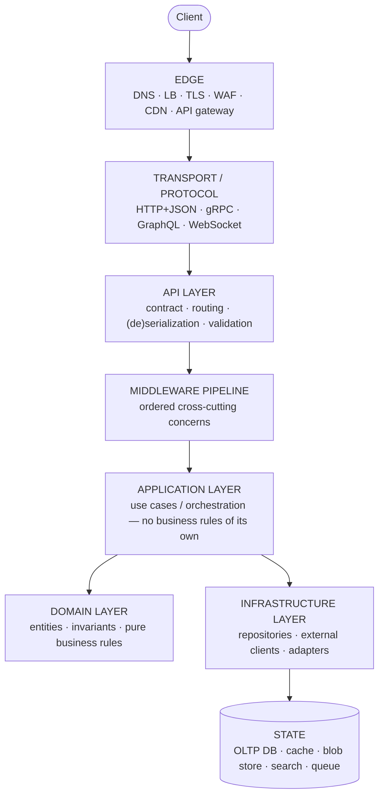
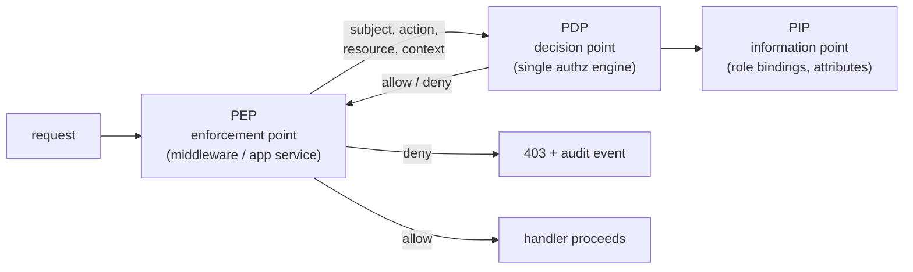
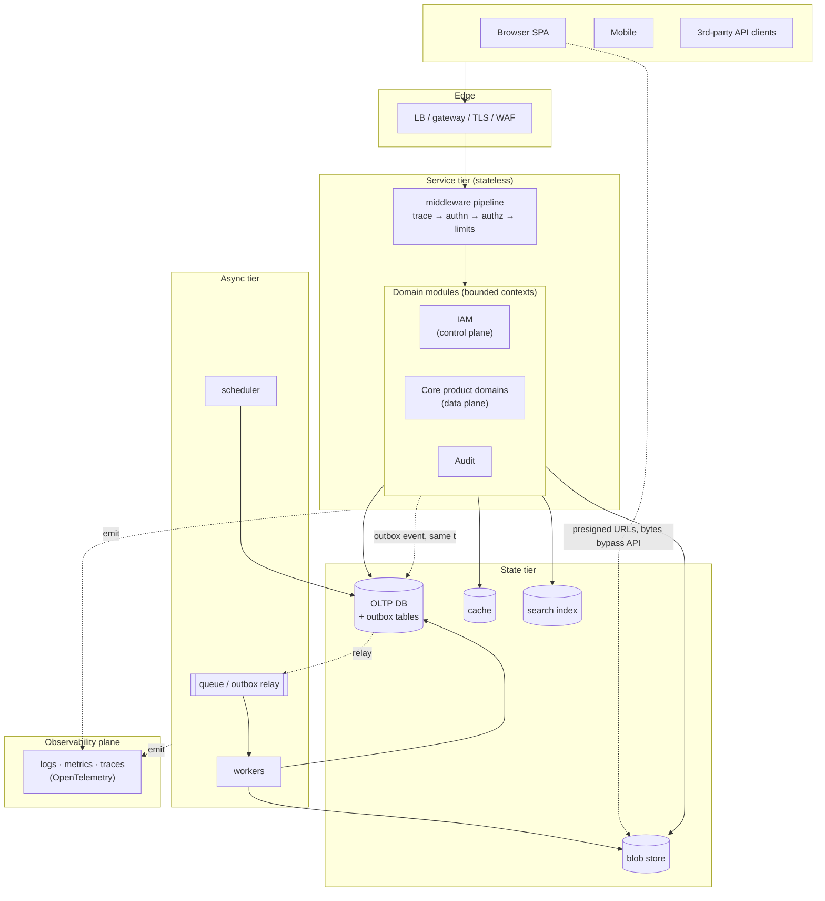

# Backend Canon — What a Backend Is Composed Of

> **Last verified:** 2026-06-10
> **Scope:** Implementation-independent reference. Defines what a production backend is, what it is composed of, and the exact vocabulary professionals use for each part. No MetalDocs specifics here — the mapping of *our* system onto this canon lives in [../architecture/backend-blueprint.md](../architecture/backend-blueprint.md).
> **Audience:** Anyone designing, reviewing, or refactoring backend systems. Written the way a senior engineer at a large SaaS company would teach it.

---

## 1. What a backend *is*

A backend is **the set of services that own state and enforce rules on behalf of untrusted clients**. Everything else follows from that sentence:

- Clients are untrusted → every input is validated, every request is authenticated and authorized server-side.
- It owns state → durability, consistency, and migration of data are backend problems, never client problems.
- It enforces rules → business invariants live in the backend; the UI may *duplicate* them for UX, but only the backend's enforcement counts.

Professionals decompose a backend along three orthogonal axes. Confusing them is the #1 source of architectural mess:

| Axis | Question | Example decomposition |
|---|---|---|
| **Planes** | What kind of traffic is this? | data plane / control plane / management plane |
| **Layers** | How does a single request flow? | edge → API → middleware → application → domain → infrastructure |
| **Domains** | What business capability is this? | identity, billing, documents, notifications… |

### 1.1 The three planes

- **Data plane** — the hot path. Requests from end users doing the product's job (read a document, save an edit). Optimized for latency, availability, horizontal scale.
- **Control plane** — configures the data plane. Admin operations: manage users, roles, tenants, templates, settings. Lower volume, higher correctness requirements, almost always audit-logged.
- **Management plane** — operates the system itself: deployment, migrations, feature flags, monitoring, on-call tooling. Users never touch it.

A capable backend keeps these separable even when they share a binary. IAM is a control-plane domain consumed by the data plane on every request — which is exactly why it needs caching and a strict consistency story.

### 1.2 The fundamental layering (one request, top to bottom)

The dependency rule (hexagonal / clean / onion architecture — different names, same idea): **dependencies point inward**. Domain knows nothing about HTTP or SQL. Application knows domain but not transport. Infrastructure implements interfaces the inner layers define ("ports and adapters"). Transport is replaceable.

---

## 2. The canonical concern catalog

Every production backend, regardless of language or company, is composed of the following concerns. This is the checklist a senior engineer carries in their head.

### 2.1 Edge

| Concern | Definition |
|---|---|
| **Load balancer** | Distributes traffic across instances; L4 (TCP) or L7 (HTTP-aware). |
| **TLS termination** | Where encrypted transport ends. Everything behind it must define its trust boundary explicitly. |
| **Reverse proxy / API gateway** | Single ingress: routing, header normalization, sometimes coarse auth and rate limiting. |
| **WAF** | Pattern-based filtering of known-bad traffic before it costs you compute. |
| **Trusted-proxy policy** | Which hops may set `X-Forwarded-For` / `X-Forwarded-Proto`. Never trust client-settable headers blindly. |

### 2.2 API layer

| Concern | Definition |
|---|---|
| **Contract** | Machine-readable source of truth for every endpoint, parameter, schema, error. OpenAPI (REST), protobuf (gRPC), SDL (GraphQL). **Contract-first** = spec is authored, code is generated/validated from it — the professional default for public surfaces. |
| **Versioning** | Strategy for breaking change: URL version (`/v1/`), header version, or additive-only evolution. Pick one, enforce in CI. |
| **Serialization & validation** | Decode bytes → typed request, reject anything malformed *at the boundary*. Inner layers receive only valid, typed input. |
| **Conventions** | Resource naming, casing, pagination (cursor for unbounded sets), filtering, sorting, partial responses, ETags/`If-Match` for optimistic concurrency. Uniform across the whole API or clients suffer. |
| **Error model** | One machine-readable error shape everywhere. The standard: RFC 9457 `application/problem+json` with a closed vocabulary of error codes. |
| **Idempotency** | Mutating endpoints accept an `Idempotency-Key`; replays return the original result. Mandatory for anything money-grade or retried by clients. |

### 2.3 Middleware pipeline

An **ordered** chain of cross-cutting request processing. Order is architecture, not detail. The canonical order:

```mermaid
flowchart LR
    R([request]) --> P1[recovery /<br/>panic guard]
    P1 --> P2[request ID +<br/>trace context]
    P2 --> P3[access logging /<br/>metrics start]
    P3 --> P4[CORS +<br/>origin checks]
    P4 --> P5[rate limit<br/>pre-auth, IP-keyed]
    P5 --> P6[authentication<br/>identity → context]
    P6 --> P7[authorization<br/>coarse, route-level]
    P7 --> P8[rate limit<br/>post-auth, identity-keyed]
    P8 --> P9[idempotency /<br/>body limits / timeouts]
    P9 --> H[handler]
```

Invariants every reviewer should defend:

1. Recovery and tracing outermost — you want a request ID even on a panic.
2. Cheap rejection before expensive work — CORS/IP-rate-limit before token verification.
3. AuthN strictly before AuthZ — you cannot decide *may* before you know *who*.
4. Anything identity-keyed (per-user rate limit, presence, quotas) after AuthN.
5. Fine-grained authorization (resource-level) does **not** belong in middleware — it belongs in the application layer where the resource is loaded. Middleware does route-level coarse checks only.

### 2.4 Identity — the domain everyone gets wrong

Identity splits into two distinct problems plus a directory. Professionals never blur them:

**Authentication (AuthN)** — *who are you?*
- Credential verification: passwords (Argon2id/bcrypt — never reversible encryption), passkeys/WebAuthn, MFA/TOTP.
- Session establishment: server-side sessions (opaque cookie → session store) or tokens (JWT per RFC 7519, hardened per RFC 8725).
- Federation: OAuth 2.0 (RFC 6749, authorization framework — *not* an authn protocol) and OIDC (the identity layer on top); SAML in enterprise; SSO.
- Lifecycle: login, refresh, logout, revocation, step-up/re-authentication for sensitive operations.
- Standards body: NIST SP 800-63 (digital identity guidelines — assurance levels for identity proofing and authenticators).

**Authorization (AuthZ)** — *what may you do?* The models, in increasing expressiveness:

| Model | Idea | Use when |
|---|---|---|
| **ACL** | Per-resource list of (subject, permission). | Simple sharing (file systems). |
| **RBAC** | Subjects get **roles**; roles bundle **permissions**. NIST RBAC is the reference model. | Org-shaped products. The default. |
| **ABAC** | Policy evaluates **attributes** of subject, resource, action, environment. | Conditions RBAC can't express ("only during business hours", "only own department"). |
| **ReBAC** | Permissions derive from a **relationship graph** ("viewer of folder containing doc"). Google's Zanzibar paper is the canon; OpenFGA/SpiceDB are open implementations. | Deep sharing/nesting semantics. |

Most real SaaS systems run **RBAC + scoping** — roles for the verb set, an org/area/project dimension for the noun set. That hybrid is a deliberate, standard choice.

**Vocabulary — exact meanings (this table settles arguments):**

| Term | Meaning |
|---|---|
| **Principal / subject** | The authenticated actor: user, service account, or API client. |
| **Permission** | One allowed (action, resource-type) pair, e.g. `documents.approve`. The atom of authz. |
| **Capability** | In RBAC products: synonym for permission, often the *effective computed set* on a principal. (Strict capability-*based security* — unforgeable handle tokens — is a different, rarer model; don't conflate.) |
| **Role** | Named bundle of permissions assigned to principals. Roles are for admins; permissions are for code. Code checks permissions, never role names. |
| **Scope** | Boundary the grant applies within: tenant, org, project, area. Also: OAuth token scopes (a *delegation* restriction — what the *token* allows, distinct from what the *user* may do). |
| **Policy** | Declarative rule mapping (principal, action, resource, context) → allow/deny. Deny by default, always. |
| **Grant / binding** | The assignment edge: principal × role × scope. |
| **PEP / PDP** | Policy Enforcement Point (where code asks "may they?") vs Policy Decision Point (the engine that answers). Keep ONE PDP — scattered decision logic is how systems rot. |

**IAM (Identity & Access Management)** — the control-plane domain that *administers* both: identity lifecycle (provision, deprovision, SCIM in enterprise), role/permission catalogs, grant management, group membership, and the audit trail of all of it. AuthN/AuthZ are runtime; IAM is their management surface.

**Multi-tenancy** — hard isolation of customer data:
- Models: **pooled** (shared tables + `tenant_id` column — the SaaS default), **siloed** (DB per tenant), **bridged** (schema per tenant).
- Rule: tenant resolved once at the edge, carried in request context, enforced in *every* query path. Tenant check failures are bugs of the highest severity class.

### 2.5 Application & domain layers

The vocabulary here comes from Domain-Driven Design (Evans) — industry lingua franca:

| Term | Definition |
|---|---|
| **Bounded context** | A domain boundary inside which terms have one precise meaning. Maps 1:1 to a module/service. |
| **Entity** | Object with identity over time (`Document #42`). |
| **Value object** | Immutable, identity-free value (`Money`, `DateRange`). |
| **Aggregate** | Cluster of entities with one root enforcing invariants; the transaction boundary. |
| **Domain service** | Business rule that spans entities, still pure (no I/O). |
| **Application service / use case** | One user intention end-to-end: load → check authz → invoke domain → persist → emit events. Orchestrates; contains no business rules itself. |
| **Repository** | Collection-like interface for aggregate persistence; defined by the domain, implemented by infrastructure. |
| **Anti-corruption layer** | Translation boundary protecting your model from an external system's model. |

Deployment shape is orthogonal to this: **modular monolith** (modules in one binary, in-process calls — the correct default until scale forces otherwise) vs **microservices** (modules as network services — buys independent scaling/deploys, costs distributed-systems failure modes). Google-grade advice: get module boundaries right first; extraction later is mechanical if boundaries are clean.

### 2.6 Data layer

| Concern | Definition / standard |
|---|---|
| **OLTP database** | Authoritative state. Relational + ACID is the default; you opt out per-dataset with a reason. |
| **Migrations** | Versioned, forward-only, in VCS, run with rollout. Expand→migrate→contract for zero-downtime changes. |
| **Constraints in the DB** | Invariants that must never break (uniqueness, FK, state-machine guards) live in the database itself, not only app code — the DB is the last line of defense. |
| **Caching** | Cache-aside with TTL is the default. Hard rules: cache failure degrades to source-of-truth (never to wrong answers); every cache has a written invalidation contract; two hard problems, this is one of them. |
| **Blob storage** | Large binaries in S3-compatible object store, never in the RDBMS. Presigned URLs so bytes bypass your API. Content hashes for integrity. |
| **Search index** | Derived, rebuildable read model (Elasticsearch / PG full-text). Never authoritative. |
| **Analytics / OLAP** | Separate store fed by ETL/CDC. Never run analytics on the OLTP primary. |
| **Data lifecycle** | Retention, soft-delete vs hard-delete semantics, GDPR-class erasure, backups **with tested restore**. |

### 2.7 Async & background processing

Anything that can't or shouldn't run inside a request:

| Concern | Definition |
|---|---|
| **Job queue + workers** | Durable queue, dedicated worker processes, bounded concurrency. |
| **Transactional outbox** | THE pattern for atomic "write state + publish event": event row committed in the same DB transaction as the state change; a relay delivers it. Solves dual-write inconsistency. |
| **Pub/sub** | Fan-out of domain events to decoupled consumers. At-least-once delivery is the realistic default → consumers must be **idempotent**. |
| **Scheduler / cron** | Recurring work: janitors, publishers, reminders. Needs distributed locking or single-runner semantics. |
| **Retry policy** | Exponential backoff + jitter, capped attempts, then **DLQ** (dead-letter queue) + alert. Retries without idempotency = data corruption. |
| **Saga** | Multi-service "transaction" as a sequence of local transactions with compensating actions. The distributed-transaction answer (2PC is dead in practice). |
| **Watchdogs** | Detect stuck/zombie work and recover it. Every async system needs one. |

### 2.8 Reliability (resilience engineering)

The SRE-canon toolkit — every inter-service call gets:

- **Timeouts** — always, on everything. No unbounded waits.
- **Retries** — with backoff + jitter, idempotent operations only, retry budget capped.
- **Circuit breaker** — stop hammering a failing dependency; fail fast, recover gradually.
- **Bulkheads** — isolate resource pools so one dependency's failure can't starve all the others.
- **Backpressure & load shedding** — when overloaded, reject early with 429/503 + `Retry-After` rather than melting down.
- **Graceful degradation** — predefined reduced-functionality modes.
- **Graceful shutdown** — drain in-flight requests on SIGTERM; required for zero-downtime deploys.

Measured by: **SLI** (the metric) → **SLO** (the target) → **error budget** (allowed unreliability; spend it on velocity). SLA = the contractual version with penalties. From the Google SRE book — the industry's reliability canon.

### 2.9 Observability

The three pillars + correlation:

| Pillar | Standard practice |
|---|---|
| **Structured logs** | JSON/key-value, leveled, every line carries `request_id`, `tenant_id`, `principal_id`. No `printf` debugging in prod paths. No PII/secrets in logs. |
| **Metrics** | **RED** per endpoint (Rate, Errors, Duration) + **USE** per resource (Utilization, Saturation, Errors). Histograms for latency — you alert on p99, not averages. |
| **Distributed traces** | One trace ID propagated across every hop (API → worker → third service) via W3C `traceparent`. OpenTelemetry is the vendor-neutral standard for all three pillars. |
| **Health endpoints** | **Liveness** ("process alive — restart me if not") vs **readiness** ("dependencies OK — route traffic to me"). Distinct endpoints, distinct semantics. |
| **Alerting** | Alert on symptoms (SLO burn rate), not causes. Every alert actionable; everything else is a dashboard. |

### 2.10 Security (cross-cutting)

Checklist standard: **OWASP ASVS** (verification requirements) + OWASP Top 10 (threat awareness).

- **Secrets** — env/secret-manager only, never in VCS, rotated, fail-fast at startup if missing.
- **Encryption** — TLS everywhere in transit; at-rest for the data stores; application-layer crypto only for fields that need it.
- **Input validation** — at the boundary, schema-driven, allowlist over denylist.
- **Injection immunity by construction** — parameterized queries always; identifier escaping where parameters can't apply.
- **Rate limiting & abuse controls** — token bucket per IP pre-auth + per principal post-auth; login endpoints throttled hardest.
- **Security headers / CSRF** — origin validation for cookie-session APIs; standard header set (HSTS, nosniff, frame-deny).
- **Audit logging** — immutable who-did-what-when for every control-plane and sensitive data-plane action. A compliance feature (SOC 2 / ISO 27001), distinct from ops logs.
- **Service-to-service auth** — internal calls authenticate too: mTLS, signed service tokens, or platform identity. "It's inside the network" is not a trust model (zero-trust principle).
- **Supply chain** — locked dependencies, vulnerability scanning, SBOM in regulated contexts.

### 2.11 Configuration, delivery, runtime

The 12-Factor App remains the baseline vocabulary:

- **Config** — from environment; one immutable artifact promoted across dev/staging/prod; typed + validated at startup, fail-fast.
- **Feature flags** — runtime toggles decoupling deploy from release. Lifecycle discipline mandatory: named owner, ramp plan, cleanup date — flags without expiry become permanent config.
- **CI quality gates** — build, unit + integration tests, race detection, linters, contract lint, security scan. Green gates are the merge contract.
- **Delivery** — blue/green or rolling deploys, automated rollback, DB migrations sequenced expand→migrate→contract.
- **Stateless compute** — instances hold no precious local state; all state in the data layer. This single property is what makes horizontal scaling and zero-downtime deploys possible.

### 2.12 Integration surface

- **Outbound third-party clients** — timeouts/retries/circuit breakers (per 2.8), credential isolation, sandbox vs prod separation.
- **Inbound webhooks** — signature verification (HMAC), replay protection (timestamp + nonce), fast-ack + async processing.
- **Outbound webhooks** — at-least-once with backoff, signed payloads, per-endpoint failure isolation.
- **Internal RPC** — tuned shared clients; retry ownership decided once (caller vs client), never duplicated in both.

---

## 3. How the pieces compose — reference anatomy

Reading order for the whole picture: a request crosses **edge → middleware → module → state**; side effects leave via **outbox → queue → worker**; everything emits to the **observability plane**; IAM sits as control plane consulted (via cache) on every data-plane request.

---

## 4. The canon — sources professionals actually cite

| Source | What it's canon for |
|---|---|
| *Designing Data-Intensive Applications* (Kleppmann) | Data layer, replication, consistency, async |
| *Site Reliability Engineering* (Google) | SLI/SLO/error budgets, reliability, ops |
| *Domain-Driven Design* (Evans) / *Implementing DDD* (Vernon) | Domain layer vocabulary |
| microservices.io (Richardson) | Outbox, saga, service patterns catalog |
| Google Zanzibar paper (2019) | ReBAC authorization at scale |
| NIST SP 800-63 | Digital identity assurance |
| NIST RBAC model / XACML PEP-PDP vocabulary | Authorization architecture terms |
| OWASP ASVS + Top 10 | Security verification |
| OAuth 2.0 (RFC 6749) + OIDC + JWT BCP (RFC 8725) | Federation & tokens |
| RFC 9457 | API error model |
| OpenAPI 3.x / AIP (Google API Improvement Proposals) | API contract & conventions |
| 12-Factor App | Config & runtime discipline |
| C4 model (Brown) + ADRs (Nygard) | How to document all of the above |

---

## 5. Litmus tests (senior-engineer smell checks)

Quick questions that expose whether a backend is industry-grade:

1. Can you point at the **one** place authorization decisions are made? (Scattered = rot.)
2. Does every mutating endpoint behave safely when the client retries it?
3. Can you follow one request ID from edge log → handler → worker → third service?
4. Does anything write state *and* call the network in the same operation without an outbox?
5. Will the DB itself reject an invalid state transition if app code has a bug?
6. Is there any query path where `tenant_id` is not enforced?
7. Does a cache outage produce errors (acceptable) or wrong data (never acceptable)?
8. Can you deploy at noon on Friday? If not, name the missing piece (graceful shutdown? migrations? rollback?).
9. Does code check *permissions* or *role names*? (Role-name checks = RBAC done wrong.)
10. If the spec and the running router disagree, does CI catch it?

---

## 6. Relationship to MetalDocs docs

This document defines the universal model. The MetalDocs-specific mapping — which of these concerns we implement where, with what maturity grade — is [../architecture/backend-blueprint.md](../architecture/backend-blueprint.md). When refactoring, the flow is: **canon defines the target → blueprint locates the gap → ADR records the decision → program executes it.**
